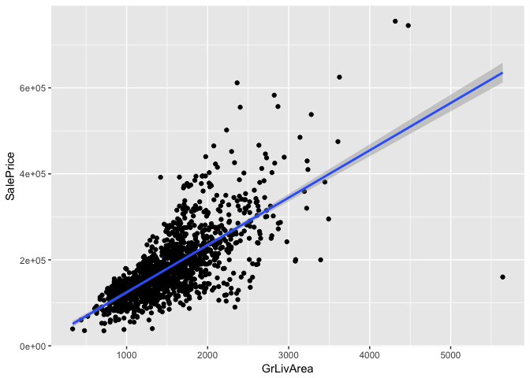

Kaggle AmesHousing
================
Vilhelm Stiernstedt
18/02/2018

## Dataset Introduction

The experimental dataset used is the Ames House Price Dataset. It
includes 79 explanatory variables of residential homes. For more details
on the dataset and the competition see
<https://www.kaggle.com/c/house-prices-advanced-regression-techniques>.

## Project Goal

  - Predict the final price of each home with the lowest RMSE score
    possible by novel feature engineering and general linear regression
    models inc. Ridge, Lasso and ElasticNet model techniques.

## Data Ingestion & Cleaning

In this section we will ingest, inspect and clean data. Cleaning process
includes: 1) Dropping uninformative features  
2\) Refactorize known features 3) Dropping low level features 4) NA
imputation -\> by using data description notes, data analysis and LM for
prediction.

``` r
### Data Ingestion ----

### Data Ingestion
dt_train <- data.table(read.csv("train.csv"))
dt_test <- data.table(read.csv("test.csv"))

# ---- Initial Data Inspection ----
### Columns same for Test and Train data
colnames(dt_train)
```

    ##  [1] "Id"            "MSSubClass"    "MSZoning"      "LotFrontage"  
    ##  [5] "LotArea"       "Street"        "Alley"         "LotShape"     
    ##  [9] "LandContour"   "Utilities"     "LotConfig"     "LandSlope"    
    ## [13] "Neighborhood"  "Condition1"    "Condition2"    "BldgType"     
    ## [17] "HouseStyle"    "OverallQual"   "OverallCond"   "YearBuilt"    
    ## [21] "YearRemodAdd"  "RoofStyle"     "RoofMatl"      "Exterior1st"  
    ## [25] "Exterior2nd"   "MasVnrType"    "MasVnrArea"    "ExterQual"    
    ## [29] "ExterCond"     "Foundation"    "BsmtQual"      "BsmtCond"     
    ## [33] "BsmtExposure"  "BsmtFinType1"  "BsmtFinSF1"    "BsmtFinType2" 
    ## [37] "BsmtFinSF2"    "BsmtUnfSF"     "TotalBsmtSF"   "Heating"      
    ## [41] "HeatingQC"     "CentralAir"    "Electrical"    "X1stFlrSF"    
    ## [45] "X2ndFlrSF"     "LowQualFinSF"  "GrLivArea"     "BsmtFullBath" 
    ## [49] "BsmtHalfBath"  "FullBath"      "HalfBath"      "BedroomAbvGr" 
    ## [53] "KitchenAbvGr"  "KitchenQual"   "TotRmsAbvGrd"  "Functional"   
    ## [57] "Fireplaces"    "FireplaceQu"   "GarageType"    "GarageYrBlt"  
    ## [61] "GarageFinish"  "GarageCars"    "GarageArea"    "GarageQual"   
    ## [65] "GarageCond"    "PavedDrive"    "WoodDeckSF"    "OpenPorchSF"  
    ## [69] "EnclosedPorch" "X3SsnPorch"    "ScreenPorch"   "PoolArea"     
    ## [73] "PoolQC"        "Fence"         "MiscFeature"   "MiscVal"      
    ## [77] "MoSold"        "YrSold"        "SaleType"      "SaleCondition"
    ## [81] "SalePrice"

``` r
colnames(dt_test) # test data missing SalePrice as assumed
```

    ##  [1] "Id"            "MSSubClass"    "MSZoning"      "LotFrontage"  
    ##  [5] "LotArea"       "Street"        "Alley"         "LotShape"     
    ##  [9] "LandContour"   "Utilities"     "LotConfig"     "LandSlope"    
    ## [13] "Neighborhood"  "Condition1"    "Condition2"    "BldgType"     
    ## [17] "HouseStyle"    "OverallQual"   "OverallCond"   "YearBuilt"    
    ## [21] "YearRemodAdd"  "RoofStyle"     "RoofMatl"      "Exterior1st"  
    ## [25] "Exterior2nd"   "MasVnrType"    "MasVnrArea"    "ExterQual"    
    ## [29] "ExterCond"     "Foundation"    "BsmtQual"      "BsmtCond"     
    ## [33] "BsmtExposure"  "BsmtFinType1"  "BsmtFinSF1"    "BsmtFinType2" 
    ## [37] "BsmtFinSF2"    "BsmtUnfSF"     "TotalBsmtSF"   "Heating"      
    ## [41] "HeatingQC"     "CentralAir"    "Electrical"    "X1stFlrSF"    
    ## [45] "X2ndFlrSF"     "LowQualFinSF"  "GrLivArea"     "BsmtFullBath" 
    ## [49] "BsmtHalfBath"  "FullBath"      "HalfBath"      "BedroomAbvGr" 
    ## [53] "KitchenAbvGr"  "KitchenQual"   "TotRmsAbvGrd"  "Functional"   
    ## [57] "Fireplaces"    "FireplaceQu"   "GarageType"    "GarageYrBlt"  
    ## [61] "GarageFinish"  "GarageCars"    "GarageArea"    "GarageQual"   
    ## [65] "GarageCond"    "PavedDrive"    "WoodDeckSF"    "OpenPorchSF"  
    ## [69] "EnclosedPorch" "X3SsnPorch"    "ScreenPorch"   "PoolArea"     
    ## [73] "PoolQC"        "Fence"         "MiscFeature"   "MiscVal"      
    ## [77] "MoSold"        "YrSold"        "SaleType"      "SaleCondition"

``` r
length(dt_train$Id) == nrow(dt_train) # all rows unique Id thuis no duplicates and Id can be dropped
```

    ## [1] TRUE

``` r
### Drop Columns
dt_train$Id <- NULL

# Merge test and training data
dt_All <- rbind(dt_train[, !"SalePrice"], dt_test[, !"Id"])

# ---- Variable Identification ----
table(sapply(dt_train, class))
```

    ## 
    ##  factor integer 
    ##      43      37

``` r
table(sapply(dt_test, class))
```

    ## 
    ##  factor integer 
    ##      43      37

``` r
# ---- Refactorize Known Features ----
### Change class of variables
# MSSubClass: The building class -> not numerical -> factor
dt_train[, MSSubClass := as.factor(MSSubClass)]
dt_test[, MSSubClass := as.factor(MSSubClass)]

# MoSold: Month Sold -> not numerical -> factor
dt_train[, MoSold := as.factor(MoSold)]
dt_test[, MoSold := as.factor(MoSold)]

# --- Factor Level Anlysis ----
### Get Factor variables from training split
train_factor_columns <- names(which(sapply(dt_train, is.factor)))
test_factor_columns <- names(which(sapply(dt_test, is.factor)))
### Show number of factor levels per variable
sort(sapply(lapply(dt_train[, train_factor_columns, with = F], droplevels), nlevels), decreasing = F)
```

    ##        Street         Alley     Utilities    CentralAir     LandSlope 
    ##             2             2             2             2             3 
    ##  GarageFinish    PavedDrive        PoolQC      LotShape   LandContour 
    ##             3             3             3             4             4 
    ##    MasVnrType     ExterQual      BsmtQual      BsmtCond  BsmtExposure 
    ##             4             4             4             4             4 
    ##   KitchenQual         Fence   MiscFeature      MSZoning     LotConfig 
    ##             4             4             4             5             5 
    ##      BldgType     ExterCond     HeatingQC    Electrical   FireplaceQu 
    ##             5             5             5             5             5 
    ##    GarageQual    GarageCond     RoofStyle    Foundation  BsmtFinType1 
    ##             5             5             6             6             6 
    ##  BsmtFinType2       Heating    GarageType SaleCondition    Functional 
    ##             6             6             6             6             7 
    ##    Condition2    HouseStyle      RoofMatl    Condition1      SaleType 
    ##             8             8             8             9             9 
    ##        MoSold    MSSubClass   Exterior1st   Exterior2nd  Neighborhood 
    ##            12            15            15            16            25

``` r
sort(sapply(lapply(dt_test[, test_factor_columns, with = F], droplevels), nlevels), decreasing = F)
```

    ##     Utilities        Street         Alley    CentralAir        PoolQC 
    ##             1             2             2             2             2 
    ##     LandSlope  GarageFinish    PavedDrive   MiscFeature      LotShape 
    ##             3             3             3             3             4 
    ##   LandContour      RoofMatl    MasVnrType     ExterQual      BsmtQual 
    ##             4             4             4             4             4 
    ##      BsmtCond  BsmtExposure       Heating    Electrical   KitchenQual 
    ##             4             4             4             4             4 
    ##    GarageQual         Fence      MSZoning     LotConfig    Condition2 
    ##             4             4             5             5             5 
    ##      BldgType     ExterCond     HeatingQC   FireplaceQu    GarageCond 
    ##             5             5             5             5             5 
    ##     RoofStyle    Foundation  BsmtFinType1  BsmtFinType2    GarageType 
    ##             6             6             6             6             6 
    ## SaleCondition    HouseStyle    Functional    Condition1      SaleType 
    ##             6             7             7             9             9 
    ##        MoSold   Exterior1st   Exterior2nd    MSSubClass  Neighborhood 
    ##            12            13            15            16            25

``` r
### Utilites -> remove all properties that doesn't have all public utilities -> only one reaming -> drop feature
dt_train$Utilities <- NULL
dt_test$Utilities <- NULL

# --- Inspection of Noteworthy Variables ----
### MSZoning -> C (meaning commercial) properties?
summary(dt_train$MSZoning) # 10 commerical properties
```

    ## C (all)      FV      RH      RL      RM 
    ##      10      65      16    1151     218

``` r
summary(dt_test$MSZoning) # 15 commerical properties
```

    ## C (all)      FV      RH      RL      RM    NA's 
    ##      15      74      10    1114     242       4

``` r
# Plot relationship with SalePrice
ggplot(dt_train, aes(x = reorder(MSZoning, SalePrice, FUN = mean), y = SalePrice)) + geom_boxplot() 
```

<!-- -->

``` r
# Mean price by type
dt_train[, mean(SalePrice), by = MSZoning]
```

    ##    MSZoning       V1
    ## 1:       RL 191005.0
    ## 2:       RM 126316.8
    ## 3:  C (all)  74528.0
    ## 4:       FV 214014.1
    ## 5:       RH 131558.4

``` r
# Remove or keep? -> Keep, as it might be good regressor for test data. 


# ---- Missing Values Treatment ----
# Count NAs per colums and subset for columns with NAs > 0
list_NAs <- sapply(dt_train, function(x) sum(is.na(x)))
list_NAs <- sort(list_NAs[list_NAs > 0], decreasing = T)
list_NAs
```

    ##       PoolQC  MiscFeature        Alley        Fence  FireplaceQu 
    ##         1453         1406         1369         1179          690 
    ##  LotFrontage   GarageType  GarageYrBlt GarageFinish   GarageQual 
    ##          259           81           81           81           81 
    ##   GarageCond BsmtExposure BsmtFinType2     BsmtQual     BsmtCond 
    ##           81           38           38           37           37 
    ## BsmtFinType1   MasVnrType   MasVnrArea   Electrical 
    ##           37            8            8            1

``` r
paste("Number of variables in training data that contains NA: ", ifelse(length(list_NAs)>0, length(list_NAs), 0))
```

    ## [1] "Number of variables in training data that contains NA:  19"

``` r
# Save column names
NA_columns <- names(list_NAs)

# Check NAs for test data
list_NAs_test <- sapply(dt_test, function(x) sum(is.na(x)))
list_NAs_test <- sort(list_NAs_test[list_NAs_test > 0], decreasing = T)
list_NAs_test
```

    ##       PoolQC  MiscFeature        Alley        Fence  FireplaceQu 
    ##         1456         1408         1352         1169          730 
    ##  LotFrontage  GarageYrBlt GarageFinish   GarageQual   GarageCond 
    ##          227           78           78           78           78 
    ##   GarageType     BsmtCond     BsmtQual BsmtExposure BsmtFinType1 
    ##           76           45           44           44           42 
    ## BsmtFinType2   MasVnrType   MasVnrArea     MSZoning BsmtFullBath 
    ##           42           16           15            4            2 
    ## BsmtHalfBath   Functional  Exterior1st  Exterior2nd   BsmtFinSF1 
    ##            2            2            1            1            1 
    ##   BsmtFinSF2    BsmtUnfSF  TotalBsmtSF  KitchenQual   GarageCars 
    ##            1            1            1            1            1 
    ##   GarageArea     SaleType 
    ##            1            1

``` r
paste("Number of variables in test data that contains NA: ", ifelse(length(list_NAs_test)>0, length(list_NAs_test), 0))
```

    ## [1] "Number of variables in test data that contains NA:  32"

``` r
### Treat NAs per variable
# LotFrontace (Linear feet of street connected to property)
summary(dt_train$LotFrontage) # -> Predict values based on LotArea, LotShape and neighbourhood
```

    ##    Min. 1st Qu.  Median    Mean 3rd Qu.    Max.    NA's 
    ##   21.00   59.00   69.00   70.05   80.00  313.00     259

``` r
# LotArea: Plot relationship -> Relationship analysis reveal log is optimal.
ggplot(dt_train, aes(x=log(LotArea), y=log(LotFrontage))) + geom_point() + geom_smooth(method=lm)
```

    ## Warning: Removed 259 rows containing non-finite values (stat_smooth).

    ## Warning: Removed 259 rows containing missing values (geom_point).

<!-- -->

``` r
# LotShape -> Plot relationship -> IR3 higher mean
ggplot(dt_train, aes(x = LotShape, y = LotFrontage)) + geom_boxplot()
```

    ## Warning: Removed 259 rows containing non-finite values (stat_boxplot).

<!-- -->

``` r
summary(dt_train$LotShape)
```

    ## IR1 IR2 IR3 Reg 
    ## 484  41  10 925

``` r
summary(dt_test$LotShape)
```

    ## IR1 IR2 IR3 Reg 
    ## 484  35   6 934

``` r
# LotConfig -> Plot relationship -> CulDSac lower mean
ggplot(dt_train, aes(x = LotConfig, y = LotFrontage)) + geom_boxplot()
```

    ## Warning: Removed 259 rows containing non-finite values (stat_boxplot).

<!-- -->

``` r
summary(dt_train$LotConfig)
```

    ##  Corner CulDSac     FR2     FR3  Inside 
    ##     263      94      47       4    1052

``` r
summary(dt_test$LotConfig)
```

    ##  Corner CulDSac     FR2     FR3  Inside 
    ##     248      82      38      10    1081

``` r
# Neighbourhood: -> Mean varies across different hoods -> strong enough to use?
ggplot(dt_train, aes(x = LotConfig, y = LotFrontage)) + geom_boxplot()
```

    ## Warning: Removed 259 rows containing non-finite values (stat_boxplot).

<!-- -->

``` r
dt_train[, median(LotFrontage, na.rm = T), by = Neighborhood]
```

    ##     Neighborhood   V1
    ##  1:      CollgCr 70.0
    ##  2:      Veenker 68.0
    ##  3:      Crawfor 74.0
    ##  4:      NoRidge 91.0
    ##  5:      Mitchel 73.0
    ##  6:      Somerst 73.5
    ##  7:       NWAmes 80.0
    ##  8:      OldTown 60.0
    ##  9:      BrkSide 52.0
    ## 10:       Sawyer 71.0
    ## 11:      NridgHt 88.5
    ## 12:        NAmes 73.0
    ## 13:      SawyerW 66.5
    ## 14:       IDOTRR 60.0
    ## 15:      MeadowV 21.0
    ## 16:      Edwards 65.5
    ## 17:       Timber 85.0
    ## 18:      Gilbert 65.0
    ## 19:      StoneBr 61.5
    ## 20:      ClearCr 80.0
    ## 21:      NPkVill 24.0
    ## 22:      Blmngtn 43.0
    ## 23:       BrDale 21.0
    ## 24:        SWISU 60.0
    ## 25:      Blueste 24.0
    ##     Neighborhood   V1

``` r
# Build model
LotFrontage_lm <- lm(data = dt_All, log(LotFrontage) ~ log(LotArea) + LotShape + LotConfig)

# Predict NAs using model -> LotFrontage is integer
predict_LotFrontage_train <- as.integer(exp(predict(LotFrontage_lm, newdata = dt_train[is.na(LotFrontage), ])))
predict_LotFrontage_test <- as.integer(exp(predict(LotFrontage_lm, newdata = dt_test[is.na(LotFrontage), ])))

# See distrubution of prediction for traning and test
hist(predict_LotFrontage_train, breaks = 50)
```

<!-- -->

``` r
hist(predict_LotFrontage_test, breaks = 50)
```

<!-- -->

``` r
# Impute NAs for Train and Test data
dt_train[is.na(LotFrontage), LotFrontage := predict_LotFrontage_train]
dt_test[is.na(LotFrontage), LotFrontage := predict_LotFrontage_test]

### Alley (alley access)
summary(dt_train$Alley)
```

    ## Grvl Pave NA's 
    ##   50   41 1369

``` r
# -- Notes states NA = No alley access. 
dt_train[is.na(Alley), Alley := "None"]
dt_test[is.na(Alley), Alley := "None"]

### MasVnrType (Masonry veneer type)
summary(dt_train$MasVnrType)
```

    ##  BrkCmn BrkFace    None   Stone    NA's 
    ##      15     445     864     128       8

``` r
# -- 4 levels: BrkCmn / BrkFace / Stone / None -> NA probably means None
dt_train[is.na(MasVnrType), MasVnrType := "None"]
dt_test[is.na(MasVnrType), MasVnrType := "None"]

### MasVnrArea (Masonry veneer area in square feet)
summary(dt_train$MasVnrArea)
```

    ##    Min. 1st Qu.  Median    Mean 3rd Qu.    Max.    NA's 
    ##     0.0     0.0     0.0   103.7   166.0  1600.0       8

``` r
# -- If MasVnrType = None, MasVnrArea NAs = 0
dt_train[is.na(MasVnrArea), MasVnrArea := 0]
dt_test[is.na(MasVnrArea), MasVnrArea := 0]

### BsmtQual (Evaluates the height of the basement)
summary(dt_train$BsmtQual)
```

    ##   Ex   Fa   Gd   TA NA's 
    ##  121   35  618  649   37

``` r
# -- Notes states NA = No Basement
dt_train[is.na(BsmtQual), BsmtQual := "None"]
dt_test[is.na(BsmtQual), BsmtQual := "None"]

### BsmtCond (Evaluates the general condition of the basement)
summary(dt_train$BsmtCond)
```

    ##   Fa   Gd   Po   TA NA's 
    ##   45   65    2 1311   37

``` r
# -- Notes states NA = No Basement
dt_train[is.na(BsmtCond), BsmtCond := "None"]
dt_test[is.na(BsmtCond), BsmtCond := "None"]

### BsmtExposure (Refers to walkout or garden level walls)
summary(dt_train$BsmtExposure)
```

    ##   Av   Gd   Mn   No NA's 
    ##  221  134  114  953   38

``` r
# -- Notes states NA = No Basement
dt_train[is.na(BsmtExposure), BsmtExposure := "None"]
dt_test[is.na(BsmtExposure), BsmtExposure := "None"]

### BsmtFinType1 (Rating of basement finished area)
summary(dt_train$BsmtFinSF1)
```

    ##    Min. 1st Qu.  Median    Mean 3rd Qu.    Max. 
    ##     0.0     0.0   383.5   443.6   712.2  5644.0

``` r
# -- Notes states NA = No Basement
dt_train[is.na(BsmtFinType1), BsmtFinType1 := "None"]
dt_test[is.na(BsmtFinType1), BsmtFinType1 := "None"]

### BsmtFinType2 (Rating of basement finished area (if multiple types))
summary(dt_train$BsmtFinSF2)
```

    ##    Min. 1st Qu.  Median    Mean 3rd Qu.    Max. 
    ##    0.00    0.00    0.00   46.55    0.00 1474.00

``` r
# -- Notes states NA = No Basement
dt_train[is.na(BsmtFinType2), BsmtFinType2 := "None"]
dt_test[is.na(BsmtFinType2), BsmtFinType2 := "None"]

### Electrical (Electrical system)
summary(dt_train$Electrical)
```

    ## FuseA FuseF FuseP   Mix SBrkr  NA's 
    ##    94    27     3     1  1334     1

``` r
# -- 1 NA, categorical mode imputation
dt_train[is.na(Electrical), Electrical := "SBrkr"]
dt_test[is.na(Electrical), Electrical := "SBrkr"]

### FireplaceQu (Fireplace quality)
summary(dt_train$FireplaceQu)
```

    ##   Ex   Fa   Gd   Po   TA NA's 
    ##   24   33  380   20  313  690

``` r
# -- Notes states NA = No fireplace
dt_train[is.na(FireplaceQu), FireplaceQu := "None"]
dt_test[is.na(FireplaceQu), FireplaceQu := "None"]

### GarageType (Garage location)
summary(dt_train$GarageType)
```

    ##  2Types  Attchd Basment BuiltIn CarPort  Detchd    NA's 
    ##       6     870      19      88       9     387      81

``` r
# -- Notes states NA = No Garage
dt_train[is.na(GarageType), GarageType := "None"]
dt_test[is.na(GarageType), GarageType := "None"]

### GarageYrBlt (Year garage was built)
summary(dt_train$GarageYrBlt)
```

    ##    Min. 1st Qu.  Median    Mean 3rd Qu.    Max.    NA's 
    ##    1900    1961    1980    1979    2002    2010      81

``` r
# -- NA probably means no garage, however we assume garage was built same year as house
dt_train[is.na(GarageYrBlt), GarageYrBlt := YearBuilt]
dt_test[is.na(GarageYrBlt), GarageYrBlt := YearBuilt]

### GarageFinish (Interior finish of the garage)
summary(dt_train$GarageFinish)
```

    ##  Fin  RFn  Unf NA's 
    ##  352  422  605   81

``` r
# -- Notes states NA = No Garage
dt_train[is.na(GarageFinish), GarageFinish := "None"]
dt_test[is.na(GarageFinish), GarageFinish := "None"]

### GarageQual (Garage quality)
summary(dt_train$GarageQual)
```

    ##   Ex   Fa   Gd   Po   TA NA's 
    ##    3   48   14    3 1311   81

``` r
# -- Notes states NA = No Garage
dt_train[is.na(GarageQual), GarageQual := "None"]
dt_test[is.na(GarageQual), GarageQual := "None"]

### GarageCond (Garage quality)
summary(dt_train$GarageCond)
```

    ##   Ex   Fa   Gd   Po   TA NA's 
    ##    2   35    9    7 1326   81

``` r
# -- Notes states NA = No Garage
dt_train[is.na(GarageCond), GarageCond := "None"]
dt_test[is.na(GarageCond), GarageCond := "None"]

### PoolQC (Pool quality)
summary(dt_train$PoolQC)
```

    ##   Ex   Fa   Gd NA's 
    ##    2    2    3 1453

``` r
# -- Notes states NA = No Pool. Majoirty NAs -> drop variable?
dt_train[is.na(PoolQC), PoolQC := "None"]
dt_test[is.na(PoolQC), PoolQC := "None"]

### Fence (Fence quality)
summary(dt_train$Fence)
```

    ## GdPrv  GdWo MnPrv  MnWw  NA's 
    ##    59    54   157    11  1179

``` r
# -- Notes states NA = No Fence. Majoirty NAs -> drop variable?
dt_train[is.na(Fence), Fence := "None"]
dt_test[is.na(Fence), Fence := "None"]

### MiscFeature (Miscellaneous feature not covered in other categories)
summary(dt_train$MiscFeature)
```

    ## Gar2 Othr Shed TenC NA's 
    ##    2    2   49    1 1406

``` r
# -- Notes states NA = None extra comments. Majoirty NAs -> drop variable?
dt_train[is.na(MiscFeature), MiscFeature := "None"]
dt_test[is.na(MiscFeature), MiscFeature := "None"]


### Re-check training data NA columns
list_NAs <- sapply(dt_train, function(x) sum(is.na(x)))
list_NAs <- sort(list_NAs[list_NAs > 0], decreasing = T)
list_NAs
```

    ## named integer(0)

``` r
paste("Number of variables in training data that contains NA: ", ifelse(length(list_NAs)>0, length(list_NAs), 0))
```

    ## [1] "Number of variables in training data that contains NA:  0"

``` r
# ---- Unique Missing Values Treatment for Test Data ----
list_NAs_test <- sapply(dt_test, function(x) sum(is.na(x)))
list_NAs_test <- sort(list_NAs_test[list_NAs_test > 0], decreasing = T)
list_NAs_test
```

    ##     MSZoning BsmtFullBath BsmtHalfBath   Functional  Exterior1st 
    ##            4            2            2            2            1 
    ##  Exterior2nd   BsmtFinSF1   BsmtFinSF2    BsmtUnfSF  TotalBsmtSF 
    ##            1            1            1            1            1 
    ##  KitchenQual   GarageCars   GarageArea     SaleType 
    ##            1            1            1            1

``` r
paste("Number of variables in test data that contains NA: ", ifelse(length(list_NAs_test)>0, length(list_NAs_test), 0))
```

    ## [1] "Number of variables in test data that contains NA:  14"

``` r
### MSZoning
summary(dt_test$MSZoning)
```

    ## C (all)      FV      RH      RL      RM    NA's 
    ##      15      74      10    1114     242       4

``` r
ggplot(dt_train, aes(x = reorder(MSZoning, SalePrice, FUN = mean), y = SalePrice)) + geom_boxplot() 
```

<!-- -->

``` r
# Find Characteristics of MSZoning Commerical -> Pattern in Neighborhood (IDOTRR), GrLivArea (Relatively Smaller)
dt_test[MSZoning == "C (all)", ]
```

    ##       Id MSSubClass MSZoning LotFrontage LotArea Street Alley LotShape
    ##  1: 1559         70  C (all)          55    6449   Pave  None      IR1
    ##  2: 1603         30  C (all)          66    8712   Grvl  None      Reg
    ##  3: 1820         30  C (all)          37    3300   Pave  None      Reg
    ##  4: 1823         30  C (all)          72    9392   Pave  None      Reg
    ##  5: 1914         30  C (all)          60   10200   Pave  Grvl      Reg
    ##  6: 2218         70  C (all)          60    5280   Pave  None      Reg
    ##  7: 2219         50  C (all)          52    5150   Pave  None      Reg
    ##  8: 2220         70  C (all)          60    9000   Grvl  None      Reg
    ##  9: 2580        190  C (all)          75    8250   Pave  None      Reg
    ## 10: 2581         20  C (all)          65    6565   Pave  None      Reg
    ## 11: 2582         30  C (all)          60    6060   Pave  None      Reg
    ## 12: 2792         50  C (all)          63    4761   Pave  None      Reg
    ## 13: 2892         30  C (all)          69   12366   Pave  None      Reg
    ## 14: 2893        190  C (all)          50    9000   Pave  None      Reg
    ## 15: 2894         50  C (all)          60    8520   Grvl  None      Reg
    ##     LandContour LotConfig LandSlope Neighborhood Condition1 Condition2
    ##  1:         Lvl    Inside       Gtl        SWISU       Norm       Norm
    ##  2:         Lvl    Corner       Gtl       IDOTRR       Norm       Norm
    ##  3:         Lvl    Inside       Gtl      OldTown       Norm       Norm
    ##  4:         Lvl    Corner       Gtl       IDOTRR       Norm       Norm
    ##  5:         Lvl    Inside       Gtl       IDOTRR       Norm       Norm
    ##  6:         Lvl    Corner       Gtl       IDOTRR      Feedr       Norm
    ##  7:         Lvl    Corner       Gtl       IDOTRR      Feedr       Norm
    ##  8:         Bnk    Inside       Gtl       IDOTRR       Norm       Norm
    ##  9:         Lvl    Inside       Gtl       IDOTRR      Feedr       Norm
    ## 10:         Lvl    Corner       Gtl       IDOTRR       Norm       Norm
    ## 11:         Lvl    Inside       Gtl       IDOTRR       Norm       Norm
    ## 12:         Lvl    Corner       Gtl       IDOTRR       Norm       Norm
    ## 13:         Lvl    Inside       Gtl       IDOTRR      Feedr       Norm
    ## 14:         Lvl    Inside       Gtl       IDOTRR       Norm       Norm
    ## 15:         Bnk    Inside       Gtl       IDOTRR       Norm       Norm
    ##     BldgType HouseStyle OverallQual OverallCond YearBuilt YearRemodAdd
    ##  1:     1Fam     2Story           4           1      1907         1950
    ##  2:     1Fam     1Story           4           7      1896         1950
    ##  3:     1Fam     1Story           4           3      1910         1950
    ##  4:     1Fam     1Story           3           3      1900         1950
    ##  5:     1Fam     1Story           4           6      1925         1950
    ##  6:     1Fam     2Story           4           7      1895         1950
    ##  7:     1Fam     1.5Fin           4           7      1910         2000
    ##  8:     1Fam     2Story           4           6      1920         1950
    ##  9:   2fmCon     2Story           5           6      1895         2006
    ## 10:     1Fam     1Story           4           6      1957         1980
    ## 11:     1Fam     1Story           5           9      1930         2007
    ## 12:     1Fam     1.5Unf           3           3      1918         1950
    ## 13:     1Fam     1Story           3           5      1945         1950
    ## 14:   2fmCon     1.5Fin           5           6      1951         1951
    ## 15:     1Fam     1.5Fin           3           5      1916         1950
    ##     RoofStyle RoofMatl Exterior1st Exterior2nd MasVnrType MasVnrArea
    ##  1:   Gambrel  CompShg     Wd Sdng      Stucco       None          0
    ##  2:       Hip  CompShg     Wd Sdng     Wd Sdng       None          0
    ##  3:     Gable  CompShg      Stucco      Stucco       None          0
    ##  4:   Mansard  CompShg     AsbShng     AsbShng       None          0
    ##  5:     Gable  CompShg     MetalSd     MetalSd       None          0
    ##  6:     Gable  CompShg     Wd Sdng     Wd Sdng       None          0
    ##  7:     Gable  CompShg     Plywood     Plywood       None          0
    ##  8:     Gable  CompShg     MetalSd     MetalSd       None          0
    ##  9:     Gable  CompShg     VinylSd     VinylSd       None          0
    ## 10:     Gable  CompShg     MetalSd     MetalSd       None          0
    ## 11:       Hip  CompShg     MetalSd     MetalSd       None          0
    ## 12:     Gable  CompShg     Wd Sdng     Wd Sdng       None          0
    ## 13:     Gable  CompShg     Wd Sdng     Wd Sdng       None          0
    ## 14:     Gable  CompShg     WdShing     Wd Shng       None          0
    ## 15:     Gable  CompShg     MetalSd     MetalSd       None          0
    ##     ExterQual ExterCond Foundation BsmtQual BsmtCond BsmtExposure
    ##  1:        TA        TA     CBlock       TA       TA           No
    ##  2:        Fa        Fa     CBlock       TA       TA           No
    ##  3:        TA        TA     BrkTil       TA       TA           No
    ##  4:        TA        Fa     CBlock       Fa       TA           No
    ##  5:        TA        TA     BrkTil       TA       TA           No
    ##  6:        TA        TA      Stone     None       Fa           No
    ##  7:        TA        TA      PConc     None       TA           No
    ##  8:        TA        TA      Stone       Fa       Fa           Mn
    ##  9:        TA        Gd     CBlock       TA       TA           No
    ## 10:        TA        TA     CBlock       TA       TA           No
    ## 11:        Gd        TA     BrkTil       TA       TA           No
    ## 12:        Fa        Fa     BrkTil       TA       Fa           No
    ## 13:        TA        TA       Slab     None     None         None
    ## 14:        Fa        Fa     CBlock       TA       TA           Mn
    ## 15:        TA        TA      PConc       Fa       Fa           No
    ##     BsmtFinType1 BsmtFinSF1 BsmtFinType2 BsmtFinSF2 BsmtUnfSF TotalBsmtSF
    ##  1:          Rec         73          Unf          0       634         707
    ##  2:          Unf          0          Unf          0       756         756
    ##  3:          Unf          0          Unf          0       624         624
    ##  4:          Unf          0          Unf          0       245         245
    ##  5:          Unf          0          Unf          0       572         572
    ##  6:          Unf          0          Unf          0       173         173
    ##  7:          Unf          0          Unf          0       356         356
    ##  8:          Unf          0          Unf          0       592         592
    ##  9:          Unf          0          Unf          0       957         957
    ## 10:          GLQ        967          Unf          0       106        1073
    ## 11:          ALQ        737          Unf          0       100         837
    ## 12:          Unf          0          Unf          0      1020        1020
    ## 13:         None          0         None          0         0           0
    ## 14:          Unf          0          Unf          0       660         660
    ## 15:          Unf          0          Unf          0       216         216
    ##     Heating HeatingQC CentralAir Electrical X1stFlrSF X2ndFlrSF
    ##  1:    GasW        TA          N      SBrkr       942       942
    ##  2:    GasA        Gd          Y      SBrkr       952         0
    ##  3:    GasA        Ex          Y      SBrkr       816         0
    ##  4:    GasA        TA          N      SBrkr       797         0
    ##  5:    GasA        Fa          N      FuseP       572         0
    ##  6:    GasA        Ex          N      SBrkr       825       536
    ##  7:    GasA        TA          N      FuseA       671       378
    ##  8:    GasA        Ex          Y      SBrkr       432       432
    ##  9:    GasA        Fa          N      SBrkr      1034       957
    ## 10:    GasA        Gd          Y      FuseA      1073         0
    ## 11:    GasA        Ex          Y      SBrkr      1001         0
    ## 12:    GasA        Fa          N      FuseP      1020         0
    ## 13:    GasA        TA          N      SBrkr       729         0
    ## 14:    GasA        TA          N      SBrkr      1060       336
    ## 15:    GasA        Fa          N      SBrkr       576       360
    ##     LowQualFinSF GrLivArea BsmtFullBath BsmtHalfBath FullBath HalfBath
    ##  1:            0      1884            0            0        1        1
    ##  2:            0       952            0            0        1        0
    ##  3:            0       816            0            0        1        0
    ##  4:            0       797            0            0        1        0
    ##  5:            0       572            0            0        1        0
    ##  6:            0      1361            0            0        1        0
    ##  7:            0      1049            0            0        1        0
    ##  8:            0       864            0            0        1        1
    ##  9:            0      1991            0            0        2        0
    ## 10:            0      1073            1            0        1        0
    ## 11:            0      1001            0            0        1        0
    ## 12:            0      1020            0            0        1        0
    ## 13:            0       729            0            0        1        0
    ## 14:            0      1396            0            0        2        0
    ## 15:            0       936            0            0        1        0
    ##     BedroomAbvGr KitchenAbvGr KitchenQual TotRmsAbvGrd Functional
    ##  1:            4            1          TA            7        Typ
    ##  2:            3            1          TA            5        Typ
    ##  3:            2            1          TA            5        Typ
    ##  4:            2            1          TA            5        Typ
    ##  5:            2            1          TA            4        Typ
    ##  6:            2            1          TA            6        Typ
    ##  7:            2            1          TA            5        Typ
    ##  8:            3            1          Fa            5       Min2
    ##  9:            4            2          TA            9        Typ
    ## 10:            3            1          TA            6        Typ
    ## 11:            2            1          Gd            5        Typ
    ## 12:            2            1          Fa            5        Typ
    ## 13:            2            1          TA            5        Mod
    ## 14:            4            2          TA            8       Min2
    ## 15:            2            1          TA            6        Typ
    ##     Fireplaces FireplaceQu GarageType GarageYrBlt GarageFinish GarageCars
    ##  1:          0        None       None        1907         None          0
    ##  2:          0        None     Detchd        1896          RFn          1
    ##  3:          1          Gd       None        1910         None          0
    ##  4:          0        None       None        1900         None          0
    ##  5:          0        None     Detchd        1940          Unf          1
    ##  6:          0        None     Detchd        1895          Unf          1
    ##  7:          0        None     Detchd        1910          Unf          1
    ##  8:          0        None     Detchd        1920          Unf          1
    ##  9:          0        None       None        1895         None          0
    ## 10:          0        None     Detchd        1985          Unf          2
    ## 11:          0        None     Detchd        1930          Unf          1
    ## 12:          0        None       None        1918         None          0
    ## 13:          0        None       None        1945         None          0
    ## 14:          0        None       None        1951         None          0
    ## 15:          0        None       None        1916         None          0
    ##     GarageArea GarageQual GarageCond PavedDrive WoodDeckSF OpenPorchSF
    ##  1:          0       None       None          N          0           0
    ##  2:        330         TA         TA          N          0           0
    ##  3:          0       None       None          N          0          33
    ##  4:          0       None       None          N          0          36
    ##  5:        200         TA         TA          N          0           0
    ##  6:        185         Fa         TA          Y          0         123
    ##  7:        195         Po         Fa          N          0           0
    ##  8:        216         Fa         Fa          N          0          30
    ##  9:          0       None       None          N          0           0
    ## 10:        720         TA         TA          Y          0         444
    ## 11:        216         TA         Po          N        154           0
    ## 12:          0       None       None          N          0           0
    ## 13:          0       None       None          N          0           0
    ## 14:          0       None       None          Y          0           0
    ## 15:          0       None       None          N          0           0
    ##     EnclosedPorch X3SsnPorch ScreenPorch PoolArea PoolQC Fence MiscFeature
    ##  1:           239          0           0        0   None  None        None
    ##  2:           265          0           0        0   None  None        None
    ##  3:             0          0           0        0   None  None        None
    ##  4:            94          0           0        0   None  None        None
    ##  5:            72          0           0        0   None  None        None
    ##  6:             0          0           0        0   None  None        None
    ##  7:             0          0           0        0   None  None        None
    ##  8:           160          0           0        0   None  None        None
    ##  9:           133          0           0        0   None  None        None
    ## 10:             0          0           0        0   None  None        None
    ## 11:            42         86           0        0   None  None        None
    ## 12:           105          0           0        0   None  None        None
    ## 13:            23          0           0        0   None  None        None
    ## 14:             0          0           0        0   None  None        None
    ## 15:             0          0           0        0   None  None        None
    ##     MiscVal MoSold YrSold SaleType SaleCondition
    ##  1:       0      3   2010       WD       Abnorml
    ##  2:       0      6   2010       WD        Alloca
    ##  3:       0      6   2009       WD        Normal
    ##  4:       0      9   2009       WD       Abnorml
    ##  5:       0      5   2009       WD        Normal
    ##  6:       0      7   2008       WD        Normal
    ##  7:       0      5   2008       WD        Normal
    ##  8:       0      6   2008       WD        Normal
    ##  9:       0      6   2007       WD        Normal
    ## 10:       0      8   2007       WD       Abnorml
    ## 11:       0     11   2007       WD        Normal
    ## 12:       0     10   2006    ConLD        Normal
    ## 13:       0     10   2006       WD       Abnorml
    ## 14:       0     10   2006       WD       Abnorml
    ## 15:       0      4   2006       WD        Normal

``` r
# GrLivArea (Relatively Smaller) -> by median yes!
dt_test[, median(GrLivArea), by = MSZoning]
```

    ##    MSZoning     V1
    ## 1:       RH 1337.0
    ## 2:       RL 1458.0
    ## 3:       RM 1277.5
    ## 4:       FV 1539.5
    ## 5:  C (all) 1001.0
    ## 6:       NA 1205.0

``` r
# Neighborhood (IDOTRR) -> 13/53 Commerical for IDOTRR, but it hold 13/15 of all commercial
table(dt_test[, Neighborhood, by = MSZoning])
```

    ##          Neighborhood
    ## MSZoning  Blmngtn Blueste BrDale BrkSide ClearCr CollgCr Crawfor Edwards
    ##   C (all)       0       0      0       0       0       0       0       0
    ##   FV            0       0      0       0       0       0       0       0
    ##   RH            0       0      0       0       0       0       0       0
    ##   RL            9       0      0      15      16     113      45      90
    ##   RM            2       8     14      35       0       4       7       4
    ##          Neighborhood
    ## MSZoning  Gilbert IDOTRR MeadowV Mitchel NAmes NoRidge NPkVill NridgHt
    ##   C (all)       0     13       0       0     0       0       0       0
    ##   FV            0      0       0       0     0       0       0       0
    ##   RH            0      0       0       0     5       0       0       0
    ##   RL           86      0       0      60   213      30      14      89
    ##   RM            0     40      20       4     0       0       0       0
    ##          Neighborhood
    ## MSZoning  NWAmes OldTown Sawyer SawyerW Somerst StoneBr SWISU Timber
    ##   C (all)      0       1      0       0       0       0     1      0
    ##   FV           0       0      0       0      74       0     0      0
    ##   RH           0       0      0       1       0       0     4      0
    ##   RL          58      22     76      65      22      26    18     34
    ##   RM           0     103      1       0       0       0     0      0
    ##          Neighborhood
    ## MSZoning  Veenker
    ##   C (all)       0
    ##   FV            0
    ##   RH            0
    ##   RL           13
    ##   RM            0

``` r
# MSZoning NAs -> IDOTRR with low GrLivArea -> Commerical property
dt_test[is.na(MSZoning), c("MSZoning", "Neighborhood", "GrLivArea")]
```

    ##    MSZoning Neighborhood GrLivArea
    ## 1:       NA       IDOTRR       810
    ## 2:       NA       IDOTRR       733
    ## 3:       NA       IDOTRR      1836
    ## 4:       NA      Mitchel      1600

``` r
# Impute NAs 
dt_test[is.na(MSZoning) & Neighborhood == "IDOTRR"  & GrLivArea < 1000, MSZoning := "C (all)"] # Commerical properties
dt_test[is.na(MSZoning) & Neighborhood == "IDOTRR", MSZoning := "RM"] # mode for specific Neighborhood
dt_test[is.na(MSZoning) & Neighborhood == "Mitchel", MSZoning := "RL"] # mode for specific Neighborhood

### BasmtFullBath
summary(dt_test$BsmtFullBath)
```

    ##    Min. 1st Qu.  Median    Mean 3rd Qu.    Max.    NA's 
    ##  0.0000  0.0000  0.0000  0.4345  1.0000  3.0000       2

``` r
dt_test[is.na(BsmtFullBath), ]
```

    ##      Id MSSubClass MSZoning LotFrontage LotArea Street Alley LotShape
    ## 1: 2121         20       RM          99    5940   Pave  None      IR1
    ## 2: 2189         20       RL         123   47007   Pave  None      IR1
    ##    LandContour LotConfig LandSlope Neighborhood Condition1 Condition2
    ## 1:         Lvl       FR3       Gtl      BrkSide      Feedr       Norm
    ## 2:         Lvl    Inside       Gtl      Edwards       Norm       Norm
    ##    BldgType HouseStyle OverallQual OverallCond YearBuilt YearRemodAdd
    ## 1:     1Fam     1Story           4           7      1946         1950
    ## 2:     1Fam     1Story           5           7      1959         1996
    ##    RoofStyle RoofMatl Exterior1st Exterior2nd MasVnrType MasVnrArea
    ## 1:     Gable  CompShg     MetalSd      CBlock       None          0
    ## 2:     Gable  CompShg     Plywood     Plywood       None          0
    ##    ExterQual ExterCond Foundation BsmtQual BsmtCond BsmtExposure
    ## 1:        TA        TA      PConc     None     None         None
    ## 2:        TA        TA       Slab     None     None         None
    ##    BsmtFinType1 BsmtFinSF1 BsmtFinType2 BsmtFinSF2 BsmtUnfSF TotalBsmtSF
    ## 1:         None         NA         None         NA        NA          NA
    ## 2:         None          0         None          0         0           0
    ##    Heating HeatingQC CentralAir Electrical X1stFlrSF X2ndFlrSF
    ## 1:    GasA        TA          Y      FuseA       896         0
    ## 2:    GasA        TA          Y      SBrkr      3820         0
    ##    LowQualFinSF GrLivArea BsmtFullBath BsmtHalfBath FullBath HalfBath
    ## 1:            0       896           NA           NA        1        0
    ## 2:            0      3820           NA           NA        3        1
    ##    BedroomAbvGr KitchenAbvGr KitchenQual TotRmsAbvGrd Functional
    ## 1:            2            1          TA            4        Typ
    ## 2:            5            1          Ex           11        Typ
    ##    Fireplaces FireplaceQu GarageType GarageYrBlt GarageFinish GarageCars
    ## 1:          0        None     Detchd        1946          Unf          1
    ## 2:          2          Gd     Attchd        1959          Unf          2
    ##    GarageArea GarageQual GarageCond PavedDrive WoodDeckSF OpenPorchSF
    ## 1:        280         TA         TA          Y          0           0
    ## 2:        624         TA         TA          Y          0         372
    ##    EnclosedPorch X3SsnPorch ScreenPorch PoolArea PoolQC Fence MiscFeature
    ## 1:             0          0           0        0   None MnPrv        None
    ## 2:             0          0           0        0   None  None        None
    ##    MiscVal MoSold YrSold SaleType SaleCondition
    ## 1:       0      4   2008    ConLD       Abnorml
    ## 2:       0      7   2008       WD        Normal

``` r
# NA due to no basement -> Impute 0
dt_test[is.na(BsmtFullBath), BsmtFullBath := 0]

### BsmtHalfBath
summary(dt_test$BsmtHalfBath)
```

    ##    Min. 1st Qu.  Median    Mean 3rd Qu.    Max.    NA's 
    ##  0.0000  0.0000  0.0000  0.0652  0.0000  2.0000       2

``` r
dt_test[is.na(BsmtHalfBath), ]
```

    ##      Id MSSubClass MSZoning LotFrontage LotArea Street Alley LotShape
    ## 1: 2121         20       RM          99    5940   Pave  None      IR1
    ## 2: 2189         20       RL         123   47007   Pave  None      IR1
    ##    LandContour LotConfig LandSlope Neighborhood Condition1 Condition2
    ## 1:         Lvl       FR3       Gtl      BrkSide      Feedr       Norm
    ## 2:         Lvl    Inside       Gtl      Edwards       Norm       Norm
    ##    BldgType HouseStyle OverallQual OverallCond YearBuilt YearRemodAdd
    ## 1:     1Fam     1Story           4           7      1946         1950
    ## 2:     1Fam     1Story           5           7      1959         1996
    ##    RoofStyle RoofMatl Exterior1st Exterior2nd MasVnrType MasVnrArea
    ## 1:     Gable  CompShg     MetalSd      CBlock       None          0
    ## 2:     Gable  CompShg     Plywood     Plywood       None          0
    ##    ExterQual ExterCond Foundation BsmtQual BsmtCond BsmtExposure
    ## 1:        TA        TA      PConc     None     None         None
    ## 2:        TA        TA       Slab     None     None         None
    ##    BsmtFinType1 BsmtFinSF1 BsmtFinType2 BsmtFinSF2 BsmtUnfSF TotalBsmtSF
    ## 1:         None         NA         None         NA        NA          NA
    ## 2:         None          0         None          0         0           0
    ##    Heating HeatingQC CentralAir Electrical X1stFlrSF X2ndFlrSF
    ## 1:    GasA        TA          Y      FuseA       896         0
    ## 2:    GasA        TA          Y      SBrkr      3820         0
    ##    LowQualFinSF GrLivArea BsmtFullBath BsmtHalfBath FullBath HalfBath
    ## 1:            0       896            0           NA        1        0
    ## 2:            0      3820            0           NA        3        1
    ##    BedroomAbvGr KitchenAbvGr KitchenQual TotRmsAbvGrd Functional
    ## 1:            2            1          TA            4        Typ
    ## 2:            5            1          Ex           11        Typ
    ##    Fireplaces FireplaceQu GarageType GarageYrBlt GarageFinish GarageCars
    ## 1:          0        None     Detchd        1946          Unf          1
    ## 2:          2          Gd     Attchd        1959          Unf          2
    ##    GarageArea GarageQual GarageCond PavedDrive WoodDeckSF OpenPorchSF
    ## 1:        280         TA         TA          Y          0           0
    ## 2:        624         TA         TA          Y          0         372
    ##    EnclosedPorch X3SsnPorch ScreenPorch PoolArea PoolQC Fence MiscFeature
    ## 1:             0          0           0        0   None MnPrv        None
    ## 2:             0          0           0        0   None  None        None
    ##    MiscVal MoSold YrSold SaleType SaleCondition
    ## 1:       0      4   2008    ConLD       Abnorml
    ## 2:       0      7   2008       WD        Normal

``` r
# NA due to no basement -> Impute 0
dt_test[is.na(BsmtHalfBath), BsmtHalfBath := 0]

### Exterior1st
summary(dt_test$Exterior1st)
```

    ## AsbShng AsphShn BrkComm BrkFace  CBlock CemntBd HdBoard MetalSd Plywood 
    ##      24       1       4      37       1      65     220     230     113 
    ##  Stucco VinylSd Wd Sdng WdShing    NA's 
    ##      18     510     205      30       1

``` r
ggplot(dt_train, aes(x = reorder(Exterior1st, SalePrice, FUN = mean), y = SalePrice)) + geom_boxplot() 
```

<!-- -->

``` r
# Find characteristics of prpotery
dt_test[is.na(Exterior1st),]
```

    ##      Id MSSubClass MSZoning LotFrontage LotArea Street Alley LotShape
    ## 1: 2152         30       RL          85   19550   Pave  None      Reg
    ##    LandContour LotConfig LandSlope Neighborhood Condition1 Condition2
    ## 1:         Lvl    Inside       Gtl      Edwards       Norm       Norm
    ##    BldgType HouseStyle OverallQual OverallCond YearBuilt YearRemodAdd
    ## 1:     1Fam     1Story           5           7      1940         2007
    ##    RoofStyle RoofMatl Exterior1st Exterior2nd MasVnrType MasVnrArea
    ## 1:      Flat  Tar&Grv          NA          NA       None          0
    ##    ExterQual ExterCond Foundation BsmtQual BsmtCond BsmtExposure
    ## 1:        TA        TA      PConc       TA       TA           Gd
    ##    BsmtFinType1 BsmtFinSF1 BsmtFinType2 BsmtFinSF2 BsmtUnfSF TotalBsmtSF
    ## 1:          ALQ       1035          Unf          0       545        1580
    ##    Heating HeatingQC CentralAir Electrical X1stFlrSF X2ndFlrSF
    ## 1:    GasA        Ex          Y      SBrkr      1518         0
    ##    LowQualFinSF GrLivArea BsmtFullBath BsmtHalfBath FullBath HalfBath
    ## 1:            0      1518            1            0        1        0
    ##    BedroomAbvGr KitchenAbvGr KitchenQual TotRmsAbvGrd Functional
    ## 1:            2            1          Fa            5        Typ
    ##    Fireplaces FireplaceQu GarageType GarageYrBlt GarageFinish GarageCars
    ## 1:          2          Gd       None        1940         None          0
    ##    GarageArea GarageQual GarageCond PavedDrive WoodDeckSF OpenPorchSF
    ## 1:          0       None       None          Y          0          39
    ##    EnclosedPorch X3SsnPorch ScreenPorch PoolArea PoolQC Fence MiscFeature
    ## 1:             0          0           0        0   None  None        None
    ##    MiscVal MoSold YrSold SaleType SaleCondition
    ## 1:       0      1   2008       WD        Normal

``` r
dt_test[is.na(Exterior1st), c("Neighborhood", "MSSubClass", "BldgType", "HouseStyle", "ExterQual", "YearRemodAdd")]
```

    ##    Neighborhood MSSubClass BldgType HouseStyle ExterQual YearRemodAdd
    ## 1:      Edwards         30     1Fam     1Story        TA         2007

``` r
# Look for relationship between descriptive parameters and features
table(dt_test[, Exterior1st, by = MSSubClass])
```

    ##           Exterior1st
    ## MSSubClass AsbShng AsphShn BrkComm BrkFace CBlock CemntBd HdBoard MetalSd
    ##        20        4       0       1      20      1      21     100      70
    ##        30        4       0       0       2      0       0       1      22
    ##        40        0       0       0       0      0       0       0       1
    ##        45        2       0       0       0      0       0       0       3
    ##        50        5       0       2       3      0       0       5      47
    ##        60        0       0       0       0      0       9      38      15
    ##        70        5       0       1       1      0       1       2      14
    ##        75        0       0       0       1      0       0       1       0
    ##        80        0       0       0       1      0       0      20       2
    ##        85        0       0       0       0      0       0      17       2
    ##        90        2       0       0       4      0       0      10       5
    ##        120       0       0       0       2      0      15       8      21
    ##        150       0       0       0       0      0       0       0       0
    ##        160       0       0       0       1      0      15      14      19
    ##        180       0       0       0       0      0       4       0       0
    ##        190       2       1       0       2      0       0       4       9
    ##           Exterior1st
    ## MSSubClass Plywood Stucco VinylSd Wd Sdng WdShing
    ##        20       47      1     195      70      13
    ##        30        1      8       8      21       2
    ##        40        0      0       0       1       0
    ##        45        0      0       0       1       0
    ##        50        1      4      21      49       6
    ##        60        7      0     198       7       2
    ##        70        2      3       8      29       2
    ##        75        0      0       0       5       0
    ##        80       12      1      16       5       3
    ##        85        5      0       3       1       0
    ##        90       17      1       9       8       1
    ##        120      10      0      38       1       0
    ##        150       0      0       1       0       0
    ##        160       8      0       8       0       0
    ##        180       0      0       3       0       0
    ##        190       3      0       2       7       1

``` r
table(dt_test[, Exterior1st, by = HouseStyle])
```

    ##           Exterior1st
    ## HouseStyle AsbShng AsphShn BrkComm BrkFace CBlock CemntBd HdBoard MetalSd
    ##     1.5Fin       6       0       2       3      0       0       5      51
    ##     1.5Unf       1       0       0       0      0       0       0       2
    ##     1Story      10       0       1      30      1      36     118     117
    ##     2.5Unf       0       0       0       1      0       0       1       2
    ##     2Story       7       1       1       2      0      25      56      52
    ##     SFoyer       0       0       0       0      0       2      20       4
    ##     SLvl         0       0       0       1      0       2      20       2
    ##           Exterior1st
    ## HouseStyle Plywood Stucco VinylSd Wd Sdng WdShing
    ##     1.5Fin       2      4      24      55       8
    ##     1.5Unf       0      0       0       2       0
    ##     1Story      69      9     241      96      16
    ##     2.5Unf       0      1       1       7       0
    ##     2Story      20      3     218      39       3
    ##     SFoyer      10      0       9       1       0
    ##     SLvl        12      1      17       5       3

``` r
table(dt_test[, Exterior1st, by = ExterQual])
```

    ##          Exterior1st
    ## ExterQual AsbShng AsphShn BrkComm BrkFace CBlock CemntBd HdBoard MetalSd
    ##        Ex       0       0       0       1      0      14       0      13
    ##        Fa       4       1       0       0      0       0       2       3
    ##        Gd       2       0       1       6      0      27      33      42
    ##        TA      18       0       3      30      1      24     185     172
    ##          Exterior1st
    ## ExterQual Plywood Stucco VinylSd Wd Sdng WdShing
    ##        Ex       0      0      27       0       0
    ##        Fa       1      1       0       6       3
    ##        Gd      12      7     338      16       7
    ##        TA     100     10     145     183      20

``` r
table(dt_test[, Exterior1st, by = YearRemodAdd]) # might suggest Vinyl if exterior was remade...
```

    ##             Exterior1st
    ## YearRemodAdd AsbShng AsphShn BrkComm BrkFace CBlock CemntBd HdBoard
    ##         1950      11       1       1       7      0       0       1
    ##         1951       0       0       0       0      1       0       2
    ##         1952       1       0       0       1      0       0       0
    ##         1953       0       0       0       0      0       0       0
    ##         1954       0       0       0       1      0       0       1
    ##         1955       3       0       0       0      0       0       2
    ##         1956       0       0       0       2      0       0       3
    ##         1957       0       0       0       1      0       0       0
    ##         1958       0       0       0       2      0       0       2
    ##         1959       1       0       0       2      0       0       1
    ##         1960       1       0       0       4      0       1       3
    ##         1961       0       0       0       3      0       0       3
    ##         1962       0       0       0       2      0       0       2
    ##         1963       0       0       0       1      0       0       8
    ##         1964       0       0       0       1      0       0      12
    ##         1965       0       0       0       0      0       0       5
    ##         1966       0       0       0       0      0       0       7
    ##         1967       0       0       1       0      0       0      10
    ##         1968       0       0       0       0      0       0      12
    ##         1969       0       0       0       0      0       0       7
    ##         1970       2       0       0       0      0       9       2
    ##         1971       0       0       0       0      0       0       7
    ##         1972       0       0       0       0      0       3       8
    ##         1973       0       0       0       0      0       2       6
    ##         1974       0       0       0       0      0       0       4
    ##         1975       0       0       0       0      0       1       4
    ##         1976       0       0       0       0      0       2       5
    ##         1977       0       0       0       0      0       2       4
    ##         1978       0       0       0       0      0       0       7
    ##         1979       0       0       0       0      0       0       6
    ##         1980       0       0       0       0      0       0       2
    ##         1981       0       0       0       2      0       0       0
    ##         1982       0       0       0       0      0       0       0
    ##         1983       0       0       0       0      0       0       1
    ##         1984       0       0       0       0      0       0       3
    ##         1985       0       0       0       0      0       0       1
    ##         1986       0       0       0       0      0       0       1
    ##         1987       0       0       0       0      0       0       1
    ##         1988       0       0       0       0      0       1       3
    ##         1989       0       0       0       0      0       0       4
    ##         1990       0       0       0       1      0       1       4
    ##         1991       0       0       0       0      0       0       6
    ##         1992       0       0       0       0      0       0       9
    ##         1993       1       0       0       0      0       0       9
    ##         1994       0       0       0       0      0       1       9
    ##         1995       0       0       0       2      0       0       4
    ##         1996       0       0       1       0      0       1       4
    ##         1997       1       0       0       0      0       1       3
    ##         1998       0       0       0       1      0       1       2
    ##         1999       0       0       0       1      0       0       0
    ##         2000       0       0       0       1      0       1       2
    ##         2001       0       0       0       0      0       1       3
    ##         2002       0       0       0       0      0       1       3
    ##         2003       2       0       0       1      0       2       1
    ##         2004       1       0       0       0      0       2       3
    ##         2005       0       0       1       0      0       7       3
    ##         2006       0       0       0       0      0       8       1
    ##         2007       0       0       0       0      0      10       2
    ##         2008       0       0       0       0      0       5       2
    ##         2009       0       0       0       1      0       1       0
    ##         2010       0       0       0       0      0       1       0
    ##             Exterior1st
    ## YearRemodAdd MetalSd Plywood Stucco VinylSd Wd Sdng WdShing
    ##         1950      63       2     11      17      64       5
    ##         1951       2       0      0       0       3       2
    ##         1952       3       0      0       0       4       1
    ##         1953       6       0      0       1       3       0
    ##         1954       5       0      0       2       5       0
    ##         1955       6       0      0       0       3       2
    ##         1956       4       1      0       2       8       0
    ##         1957       2       2      0       0       6       0
    ##         1958       5       1      0       0       7       2
    ##         1959       4       1      0       1       2       0
    ##         1960       2       2      0       1       3       0
    ##         1961       3       2      0       2       2       1
    ##         1962       2       1      0       1       4       0
    ##         1963       2       0      0       1       4       1
    ##         1964       0       0      0       0       2       0
    ##         1965       3       0      0       0       1       0
    ##         1966       0       4      0       1       0       0
    ##         1967       4       5      0       1       1       0
    ##         1968       5       3      0       0       2       0
    ##         1969       2       0      0       2       1       0
    ##         1970       0       2      0       2       1       0
    ##         1971       3       2      0       0       1       0
    ##         1972       1       1      0       1       1       0
    ##         1973       0       0      0       0       2       0
    ##         1974       0       5      0       2       0       1
    ##         1975       3      10      0       1       1       0
    ##         1976       0       8      0       2       1       0
    ##         1977       0      13      0       1       1       0
    ##         1978       2      11      0       0       0       0
    ##         1979       0       7      0       0       0       1
    ##         1980       6       1      0       3       2       0
    ##         1981       0       0      0       1       1       0
    ##         1982       1       0      0       0       0       1
    ##         1983       0       0      0       1       2       2
    ##         1984       1       2      0       2       4       0
    ##         1985       1       2      0       0       1       0
    ##         1986       0       1      0       4       0       1
    ##         1987       0       1      0       1       3       0
    ##         1988       0       2      0       0       0       0
    ##         1989       0       1      0       0       2       0
    ##         1990       2       0      0       0       5       1
    ##         1991       2       4      0       1       2       0
    ##         1992       2       0      0       3       1       0
    ##         1993       5       0      0       7       2       0
    ##         1994       5       1      0      10       5       0
    ##         1995       0       2      0       9       7       1
    ##         1996       1       1      0      11       4       0
    ##         1997       5       0      1      12       1       0
    ##         1998       5       2      0      26       3       1
    ##         1999       9       1      0      15       3       1
    ##         2000       8       3      1      29       3       1
    ##         2001       2       2      0      18       2       0
    ##         2002       3       1      2      21       3       0
    ##         2003       4       2      0      34       2       0
    ##         2004       4       0      0      37       1       1
    ##         2005      11       0      0      38       6       2
    ##         2006      11       1      2      81       1       0
    ##         2007       5       0      1      64       4       1
    ##         2008       4       0      0      28       1       1
    ##         2009       1       0      0       7       1       0
    ##         2010       0       0      0       6       0       0

``` r
table(dt_test[Neighborhood == "Edwards", Exterior1st, by = MSSubClass])
```

    ##           Exterior1st
    ## MSSubClass AsbShng AsphShn BrkComm BrkFace CBlock CemntBd HdBoard MetalSd
    ##        20        1       0       0       0      0       1       6       8
    ##        30        0       0       0       0      0       0       1       1
    ##        40        0       0       0       0      0       0       0       0
    ##        45        0       0       0       0      0       0       0       0
    ##        50        1       0       0       2      0       0       0       4
    ##        60        0       0       0       0      0       0       1       1
    ##        70        0       0       0       0      0       0       0       0
    ##        75        0       0       0       1      0       0       0       0
    ##        80        0       0       0       0      0       0       1       0
    ##        85        0       0       0       0      0       0       2       0
    ##        90        2       0       0       0      0       0       1       0
    ##        120       0       0       0       0      0       0       1       0
    ##        150       0       0       0       0      0       0       0       0
    ##        160       0       0       0       0      0       0       0       0
    ##        180       0       0       0       0      0       0       0       0
    ##        190       0       0       0       0      0       0       0       0
    ##           Exterior1st
    ## MSSubClass Plywood Stucco VinylSd Wd Sdng WdShing
    ##        20        1      0       5       9       4
    ##        30        0      0       1       2       0
    ##        40        0      0       0       1       0
    ##        45        0      0       0       0       0
    ##        50        0      0       4       7       1
    ##        60        1      0       3       0       0
    ##        70        1      0       0       0       1
    ##        75        0      0       0       0       0
    ##        80        3      0       0       1       0
    ##        85        0      0       0       0       0
    ##        90        5      0       1       0       1
    ##        120       0      0       0       1       0
    ##        150       0      0       0       0       0
    ##        160       0      0       1       0       0
    ##        180       0      0       3       0       0
    ##        190       0      0       0       1       0

``` r
table(dt_test[Neighborhood == "Edwards", Exterior1st, by = HouseStyle])
```

    ##           Exterior1st
    ## HouseStyle AsbShng AsphShn BrkComm BrkFace CBlock CemntBd HdBoard MetalSd
    ##     1.5Fin       1       0       0       2      0       0       0       4
    ##     1.5Unf       0       0       0       0      0       0       0       0
    ##     1Story       3       0       0       0      0       1       8       9
    ##     2.5Unf       0       0       0       1      0       0       0       0
    ##     2Story       0       0       0       0      0       0       1       1
    ##     SFoyer       0       0       0       0      0       0       3       0
    ##     SLvl         0       0       0       0      0       0       1       0
    ##           Exterior1st
    ## HouseStyle Plywood Stucco VinylSd Wd Sdng WdShing
    ##     1.5Fin       0      0       4       9       1
    ##     1.5Unf       0      0       0       0       0
    ##     1Story       3      0       7      12       5
    ##     2.5Unf       0      0       0       0       0
    ##     2Story       3      0       4       0       1
    ##     SFoyer       2      0       3       0       0
    ##     SLvl         3      0       0       1       0

``` r
table(dt_test[Neighborhood == "Edwards", Exterior1st, by = ExterQual])
```

    ##          Exterior1st
    ## ExterQual AsbShng AsphShn BrkComm BrkFace CBlock CemntBd HdBoard MetalSd
    ##        Ex       0       0       0       0      0       1       0       0
    ##        Fa       0       0       0       0      0       0       0       1
    ##        Gd       0       0       0       0      0       0       2       0
    ##        TA       4       0       0       3      0       0      11      13
    ##          Exterior1st
    ## ExterQual Plywood Stucco VinylSd Wd Sdng WdShing
    ##        Ex       0      0       0       0       0
    ##        Fa       0      0       0       0       0
    ##        Gd       0      0       4       1       0
    ##        TA      11      0      14      21       7

``` r
table(dt_test[Neighborhood == "Edwards", Exterior1st, by = YearRemodAdd]) # might suggest Vinyl if exterior was remade...
```

    ##             Exterior1st
    ## YearRemodAdd AsbShng AsphShn BrkComm BrkFace CBlock CemntBd HdBoard
    ##         1950       1       0       0       2      0       0       0
    ##         1951       0       0       0       0      0       0       0
    ##         1953       0       0       0       0      0       0       0
    ##         1954       0       0       0       0      0       0       0
    ##         1955       2       0       0       0      0       0       0
    ##         1956       0       0       0       0      0       0       1
    ##         1958       0       0       0       0      0       0       0
    ##         1959       1       0       0       0      0       0       0
    ##         1960       0       0       0       0      0       0       1
    ##         1962       0       0       0       0      0       0       0
    ##         1963       0       0       0       0      0       0       0
    ##         1964       0       0       0       0      0       0       0
    ##         1966       0       0       0       0      0       0       1
    ##         1967       0       0       0       0      0       0       1
    ##         1968       0       0       0       0      0       0       0
    ##         1969       0       0       0       0      0       0       1
    ##         1971       0       0       0       0      0       0       1
    ##         1975       0       0       0       0      0       0       1
    ##         1976       0       0       0       0      0       0       3
    ##         1977       0       0       0       0      0       0       0
    ##         1978       0       0       0       0      0       0       0
    ##         1979       0       0       0       0      0       0       0
    ##         1984       0       0       0       0      0       0       1
    ##         1987       0       0       0       0      0       0       0
    ##         1988       0       0       0       0      0       0       0
    ##         1990       0       0       0       1      0       0       0
    ##         1993       0       0       0       0      0       0       0
    ##         1994       0       0       0       0      0       0       1
    ##         1995       0       0       0       0      0       0       0
    ##         1996       0       0       0       0      0       0       0
    ##         1998       0       0       0       0      0       0       0
    ##         1999       0       0       0       0      0       0       0
    ##         2000       0       0       0       0      0       0       0
    ##         2001       0       0       0       0      0       0       0
    ##         2002       0       0       0       0      0       0       0
    ##         2004       0       0       0       0      0       0       1
    ##         2005       0       0       0       0      0       0       0
    ##         2006       0       0       0       0      0       0       0
    ##         2007       0       0       0       0      0       0       0
    ##         2008       0       0       0       0      0       0       0
    ##         2009       0       0       0       0      0       1       0
    ##         2010       0       0       0       0      0       0       0
    ##             Exterior1st
    ## YearRemodAdd MetalSd Plywood Stucco VinylSd Wd Sdng WdShing
    ##         1950       4       1      0       3       5       1
    ##         1951       0       0      0       0       1       0
    ##         1953       3       0      0       0       0       0
    ##         1954       1       0      0       2       3       0
    ##         1955       2       0      0       0       1       2
    ##         1956       1       0      0       0       1       0
    ##         1958       0       0      0       0       0       1
    ##         1959       0       0      0       1       0       0
    ##         1960       0       0      0       0       0       0
    ##         1962       0       1      0       0       0       0
    ##         1963       0       0      0       1       0       0
    ##         1964       0       0      0       0       1       0
    ##         1966       0       0      0       0       0       0
    ##         1967       0       0      0       0       0       0
    ##         1968       1       0      0       0       1       0
    ##         1969       0       0      0       0       0       0
    ##         1971       0       0      0       0       0       0
    ##         1975       0       2      0       0       0       0
    ##         1976       0       0      0       0       0       0
    ##         1977       0       1      0       0       0       0
    ##         1978       0       1      0       0       0       0
    ##         1979       0       1      0       0       0       1
    ##         1984       0       0      0       0       1       0
    ##         1987       0       0      0       0       1       0
    ##         1988       0       1      0       0       0       0
    ##         1990       0       0      0       0       1       0
    ##         1993       1       0      0       1       0       0
    ##         1994       0       0      0       0       1       0
    ##         1995       0       0      0       0       1       0
    ##         1996       0       1      0       0       0       0
    ##         1998       0       0      0       0       0       1
    ##         1999       1       0      0       0       0       0
    ##         2000       0       1      0       0       0       1
    ##         2001       0       1      0       1       0       0
    ##         2002       0       0      0       1       1       0
    ##         2004       0       0      0       1       0       0
    ##         2005       0       0      0       2       1       0
    ##         2006       0       0      0       3       0       0
    ##         2007       0       0      0       1       1       0
    ##         2008       0       0      0       0       1       0
    ##         2009       0       0      0       0       0       0
    ##         2010       0       0      0       1       0       0

``` r
# Impute NAs with categorcial mode value for Neighborhood and exterier quality. 
dt_test[is.na(Exterior1st), Exterior1st := "Wd Sdng"] 

### Exterior2nd -> Assume building only in one type of material
summary(dt_test$Exterior2nd)
```

    ## AsbShng AsphShn Brk Cmn BrkFace  CBlock CmentBd HdBoard ImStucc MetalSd 
    ##      18       1      15      22       2      66     199       5     233 
    ## Plywood   Stone  Stucco VinylSd Wd Sdng Wd Shng    NA's 
    ##     128       1      21     510     194      43       1

``` r
# How likely is it for 2nd material?
table(dt_test[, Exterior1st, by = Exterior2nd])
```

    ##            Exterior1st
    ## Exterior2nd AsbShng AsphShn BrkComm BrkFace CBlock CemntBd HdBoard MetalSd
    ##     AsbShng      18       0       0       0      0       0       0       0
    ##     AsphShn       0       1       0       0      0       0       0       0
    ##     Brk Cmn       0       0       2       0      0       0       0       0
    ##     BrkFace       0       0       0      20      0       0       1       0
    ##     CBlock        0       0       0       0      0       0       0       1
    ##     CmentBd       1       0       0       0      0      65       0       0
    ##     HdBoard       0       0       0       0      0       0     190       0
    ##     ImStucc       0       0       0       0      0       0       4       0
    ##     MetalSd       0       0       0       3      0       0       0     225
    ##     Plywood       3       0       0       2      0       0      18       0
    ##     Stone         0       0       0       1      0       0       0       0
    ##     Stucco        0       0       1       2      0       0       1       2
    ##     VinylSd       1       0       0       1      1       0       0       2
    ##     Wd Sdng       1       0       1       8      0       0       2       0
    ##     Wd Shng       0       0       0       0      0       0       4       0
    ##            Exterior1st
    ## Exterior2nd Plywood Stucco VinylSd Wd Sdng WdShing
    ##     AsbShng       0      0       0       0       0
    ##     AsphShn       0      0       0       0       0
    ##     Brk Cmn      13      0       0       0       0
    ##     BrkFace       0      1       0       0       0
    ##     CBlock        1      0       0       0       0
    ##     CmentBd       0      0       0       0       0
    ##     HdBoard       4      0       0       5       0
    ##     ImStucc       1      0       0       0       0
    ##     MetalSd       0      0       2       3       0
    ##     Plywood      90      1       0       9       5
    ##     Stone         0      0       0       0       0
    ##     Stucco        0     13       0       2       0
    ##     VinylSd       1      0     503       1       0
    ##     Wd Sdng       2      2       1     176       1
    ##     Wd Shng       1      1       4       9      24

``` r
# # How likely is it for 2nd material given Neighborhood and Exterior1st = wd sdng
table(dt_test[Exterior1st == "Wd Sdng" & Neighborhood == "Edwards", Exterior2nd])
```

    ## 
    ## AsbShng AsphShn Brk Cmn BrkFace  CBlock CmentBd HdBoard ImStucc MetalSd 
    ##       0       0       0       0       0       0       0       0       0 
    ## Plywood   Stone  Stucco VinylSd Wd Sdng Wd Shng 
    ##       1       0       0       0      21       0

``` r
# Impute NAs with same value as Exterior1st
dt_test[is.na(Exterior2nd), Exterior2nd := "Wd Sdng"] 

### BsmtFinSF1
summary(dt_test$BsmtFinSF1)
```

    ##    Min. 1st Qu.  Median    Mean 3rd Qu.    Max.    NA's 
    ##     0.0     0.0   350.5   439.2   753.5  4010.0       1

``` r
dt_test[is.na(BsmtFinSF1), ]
```

    ##      Id MSSubClass MSZoning LotFrontage LotArea Street Alley LotShape
    ## 1: 2121         20       RM          99    5940   Pave  None      IR1
    ##    LandContour LotConfig LandSlope Neighborhood Condition1 Condition2
    ## 1:         Lvl       FR3       Gtl      BrkSide      Feedr       Norm
    ##    BldgType HouseStyle OverallQual OverallCond YearBuilt YearRemodAdd
    ## 1:     1Fam     1Story           4           7      1946         1950
    ##    RoofStyle RoofMatl Exterior1st Exterior2nd MasVnrType MasVnrArea
    ## 1:     Gable  CompShg     MetalSd      CBlock       None          0
    ##    ExterQual ExterCond Foundation BsmtQual BsmtCond BsmtExposure
    ## 1:        TA        TA      PConc     None     None         None
    ##    BsmtFinType1 BsmtFinSF1 BsmtFinType2 BsmtFinSF2 BsmtUnfSF TotalBsmtSF
    ## 1:         None         NA         None         NA        NA          NA
    ##    Heating HeatingQC CentralAir Electrical X1stFlrSF X2ndFlrSF
    ## 1:    GasA        TA          Y      FuseA       896         0
    ##    LowQualFinSF GrLivArea BsmtFullBath BsmtHalfBath FullBath HalfBath
    ## 1:            0       896            0            0        1        0
    ##    BedroomAbvGr KitchenAbvGr KitchenQual TotRmsAbvGrd Functional
    ## 1:            2            1          TA            4        Typ
    ##    Fireplaces FireplaceQu GarageType GarageYrBlt GarageFinish GarageCars
    ## 1:          0        None     Detchd        1946          Unf          1
    ##    GarageArea GarageQual GarageCond PavedDrive WoodDeckSF OpenPorchSF
    ## 1:        280         TA         TA          Y          0           0
    ##    EnclosedPorch X3SsnPorch ScreenPorch PoolArea PoolQC Fence MiscFeature
    ## 1:             0          0           0        0   None MnPrv        None
    ##    MiscVal MoSold YrSold SaleType SaleCondition
    ## 1:       0      4   2008    ConLD       Abnorml

``` r
# NA due to no basement -> Impute 0
dt_test[is.na(BsmtFinSF1), BsmtFinSF1 := 0]

### BsmtFinSF2
summary(dt_test$BsmtFinSF2)
```

    ##    Min. 1st Qu.  Median    Mean 3rd Qu.    Max.    NA's 
    ##    0.00    0.00    0.00   52.62    0.00 1526.00       1

``` r
dt_test[is.na(BsmtFinSF2), ]
```

    ##      Id MSSubClass MSZoning LotFrontage LotArea Street Alley LotShape
    ## 1: 2121         20       RM          99    5940   Pave  None      IR1
    ##    LandContour LotConfig LandSlope Neighborhood Condition1 Condition2
    ## 1:         Lvl       FR3       Gtl      BrkSide      Feedr       Norm
    ##    BldgType HouseStyle OverallQual OverallCond YearBuilt YearRemodAdd
    ## 1:     1Fam     1Story           4           7      1946         1950
    ##    RoofStyle RoofMatl Exterior1st Exterior2nd MasVnrType MasVnrArea
    ## 1:     Gable  CompShg     MetalSd      CBlock       None          0
    ##    ExterQual ExterCond Foundation BsmtQual BsmtCond BsmtExposure
    ## 1:        TA        TA      PConc     None     None         None
    ##    BsmtFinType1 BsmtFinSF1 BsmtFinType2 BsmtFinSF2 BsmtUnfSF TotalBsmtSF
    ## 1:         None          0         None         NA        NA          NA
    ##    Heating HeatingQC CentralAir Electrical X1stFlrSF X2ndFlrSF
    ## 1:    GasA        TA          Y      FuseA       896         0
    ##    LowQualFinSF GrLivArea BsmtFullBath BsmtHalfBath FullBath HalfBath
    ## 1:            0       896            0            0        1        0
    ##    BedroomAbvGr KitchenAbvGr KitchenQual TotRmsAbvGrd Functional
    ## 1:            2            1          TA            4        Typ
    ##    Fireplaces FireplaceQu GarageType GarageYrBlt GarageFinish GarageCars
    ## 1:          0        None     Detchd        1946          Unf          1
    ##    GarageArea GarageQual GarageCond PavedDrive WoodDeckSF OpenPorchSF
    ## 1:        280         TA         TA          Y          0           0
    ##    EnclosedPorch X3SsnPorch ScreenPorch PoolArea PoolQC Fence MiscFeature
    ## 1:             0          0           0        0   None MnPrv        None
    ##    MiscVal MoSold YrSold SaleType SaleCondition
    ## 1:       0      4   2008    ConLD       Abnorml

``` r
# NA due to no basement -> Impute 0
dt_test[is.na(BsmtFinSF2), BsmtFinSF2 := 0]

### BsmtUnfSF
summary(dt_test$BsmtUnfSF)
```

    ##    Min. 1st Qu.  Median    Mean 3rd Qu.    Max.    NA's 
    ##     0.0   219.2   460.0   554.3   797.8  2140.0       1

``` r
dt_test[is.na(BsmtUnfSF), ]
```

    ##      Id MSSubClass MSZoning LotFrontage LotArea Street Alley LotShape
    ## 1: 2121         20       RM          99    5940   Pave  None      IR1
    ##    LandContour LotConfig LandSlope Neighborhood Condition1 Condition2
    ## 1:         Lvl       FR3       Gtl      BrkSide      Feedr       Norm
    ##    BldgType HouseStyle OverallQual OverallCond YearBuilt YearRemodAdd
    ## 1:     1Fam     1Story           4           7      1946         1950
    ##    RoofStyle RoofMatl Exterior1st Exterior2nd MasVnrType MasVnrArea
    ## 1:     Gable  CompShg     MetalSd      CBlock       None          0
    ##    ExterQual ExterCond Foundation BsmtQual BsmtCond BsmtExposure
    ## 1:        TA        TA      PConc     None     None         None
    ##    BsmtFinType1 BsmtFinSF1 BsmtFinType2 BsmtFinSF2 BsmtUnfSF TotalBsmtSF
    ## 1:         None          0         None          0        NA          NA
    ##    Heating HeatingQC CentralAir Electrical X1stFlrSF X2ndFlrSF
    ## 1:    GasA        TA          Y      FuseA       896         0
    ##    LowQualFinSF GrLivArea BsmtFullBath BsmtHalfBath FullBath HalfBath
    ## 1:            0       896            0            0        1        0
    ##    BedroomAbvGr KitchenAbvGr KitchenQual TotRmsAbvGrd Functional
    ## 1:            2            1          TA            4        Typ
    ##    Fireplaces FireplaceQu GarageType GarageYrBlt GarageFinish GarageCars
    ## 1:          0        None     Detchd        1946          Unf          1
    ##    GarageArea GarageQual GarageCond PavedDrive WoodDeckSF OpenPorchSF
    ## 1:        280         TA         TA          Y          0           0
    ##    EnclosedPorch X3SsnPorch ScreenPorch PoolArea PoolQC Fence MiscFeature
    ## 1:             0          0           0        0   None MnPrv        None
    ##    MiscVal MoSold YrSold SaleType SaleCondition
    ## 1:       0      4   2008    ConLD       Abnorml

``` r
# NA due to no basement -> Impute 0
dt_test[is.na(BsmtUnfSF), BsmtUnfSF := 0]

### TotalBsmtSF
summary(dt_test$TotalBsmtSF)
```

    ##    Min. 1st Qu.  Median    Mean 3rd Qu.    Max.    NA's 
    ##       0     784     988    1046    1305    5095       1

``` r
dt_test[is.na(TotalBsmtSF), ]
```

    ##      Id MSSubClass MSZoning LotFrontage LotArea Street Alley LotShape
    ## 1: 2121         20       RM          99    5940   Pave  None      IR1
    ##    LandContour LotConfig LandSlope Neighborhood Condition1 Condition2
    ## 1:         Lvl       FR3       Gtl      BrkSide      Feedr       Norm
    ##    BldgType HouseStyle OverallQual OverallCond YearBuilt YearRemodAdd
    ## 1:     1Fam     1Story           4           7      1946         1950
    ##    RoofStyle RoofMatl Exterior1st Exterior2nd MasVnrType MasVnrArea
    ## 1:     Gable  CompShg     MetalSd      CBlock       None          0
    ##    ExterQual ExterCond Foundation BsmtQual BsmtCond BsmtExposure
    ## 1:        TA        TA      PConc     None     None         None
    ##    BsmtFinType1 BsmtFinSF1 BsmtFinType2 BsmtFinSF2 BsmtUnfSF TotalBsmtSF
    ## 1:         None          0         None          0         0          NA
    ##    Heating HeatingQC CentralAir Electrical X1stFlrSF X2ndFlrSF
    ## 1:    GasA        TA          Y      FuseA       896         0
    ##    LowQualFinSF GrLivArea BsmtFullBath BsmtHalfBath FullBath HalfBath
    ## 1:            0       896            0            0        1        0
    ##    BedroomAbvGr KitchenAbvGr KitchenQual TotRmsAbvGrd Functional
    ## 1:            2            1          TA            4        Typ
    ##    Fireplaces FireplaceQu GarageType GarageYrBlt GarageFinish GarageCars
    ## 1:          0        None     Detchd        1946          Unf          1
    ##    GarageArea GarageQual GarageCond PavedDrive WoodDeckSF OpenPorchSF
    ## 1:        280         TA         TA          Y          0           0
    ##    EnclosedPorch X3SsnPorch ScreenPorch PoolArea PoolQC Fence MiscFeature
    ## 1:             0          0           0        0   None MnPrv        None
    ##    MiscVal MoSold YrSold SaleType SaleCondition
    ## 1:       0      4   2008    ConLD       Abnorml

``` r
# NA due to no basement -> Impute 0
dt_test[is.na(TotalBsmtSF), TotalBsmtSF := 0]

### KitchenQual
summary(dt_test$KitchenQual)
```

    ##   Ex   Fa   Gd   TA NA's 
    ##  105   31  565  757    1

``` r
dt_test[is.na(KitchenQual), ] # NA propterty remade in 1950, Neighborhood ClearCr.
```

    ##      Id MSSubClass MSZoning LotFrontage LotArea Street Alley LotShape
    ## 1: 1556         50       RL          72   10632   Pave  None      IR1
    ##    LandContour LotConfig LandSlope Neighborhood Condition1 Condition2
    ## 1:         Lvl    Inside       Gtl      ClearCr       Norm       Norm
    ##    BldgType HouseStyle OverallQual OverallCond YearBuilt YearRemodAdd
    ## 1:     1Fam     1.5Fin           5           3      1917         1950
    ##    RoofStyle RoofMatl Exterior1st Exterior2nd MasVnrType MasVnrArea
    ## 1:     Gable  CompShg     Wd Sdng     Wd Sdng       None          0
    ##    ExterQual ExterCond Foundation BsmtQual BsmtCond BsmtExposure
    ## 1:        TA        TA     BrkTil       Gd       Fa           No
    ##    BsmtFinType1 BsmtFinSF1 BsmtFinType2 BsmtFinSF2 BsmtUnfSF TotalBsmtSF
    ## 1:          Unf          0          Unf          0       689         689
    ##    Heating HeatingQC CentralAir Electrical X1stFlrSF X2ndFlrSF
    ## 1:    GasA        Gd          N      SBrkr       725       499
    ##    LowQualFinSF GrLivArea BsmtFullBath BsmtHalfBath FullBath HalfBath
    ## 1:            0      1224            0            0        1        1
    ##    BedroomAbvGr KitchenAbvGr KitchenQual TotRmsAbvGrd Functional
    ## 1:            3            1          NA            6        Mod
    ##    Fireplaces FireplaceQu GarageType GarageYrBlt GarageFinish GarageCars
    ## 1:          0        None     Detchd        1917          Unf          1
    ##    GarageArea GarageQual GarageCond PavedDrive WoodDeckSF OpenPorchSF
    ## 1:        180         Fa         Fa          N          0           0
    ##    EnclosedPorch X3SsnPorch ScreenPorch PoolArea PoolQC Fence MiscFeature
    ## 1:           248          0           0        0   None  None        None
    ##    MiscVal MoSold YrSold SaleType SaleCondition
    ## 1:       0      1   2010      COD        Normal

``` r
# Look for average kitchen quality for properties remade between 1940-1960, 
table(dt_test[YearRemodAdd > 1940 & YearRemodAdd < 1960, KitchenQual])
```

    ## 
    ##  Ex  Fa  Gd  TA 
    ##   4  21  31 248

``` r
# Avreage kitchen quality for neighborhood
table(dt_test[Neighborhood == "ClearCr", KitchenQual])
```

    ## 
    ## Ex Fa Gd TA 
    ##  0  0  5 10

``` r
# Impute NAs with categorcial mode value  
dt_test[is.na(KitchenQual), KitchenQual := "TA"]

### Functional
summary(dt_test$Functional)
```

    ## Maj1 Maj2 Min1 Min2  Mod  Sev  Typ NA's 
    ##    5    4   34   36   20    1 1357    2

``` r
summary(dt_train$Functional)
```

    ## Maj1 Maj2 Min1 Min2  Mod  Sev  Typ 
    ##   14    5   31   34   15    1 1360

``` r
ggplot(dt_train, aes(x = reorder(Functional, SalePrice, FUN = mean), y = SalePrice)) + geom_boxplot() 
```

<!-- -->

``` r
dt_train[, mean(SalePrice), by = Functional]
```

    ##    Functional       V1
    ## 1:        Typ 183429.1
    ## 2:       Min1 146385.5
    ## 3:       Maj1 153948.1
    ## 4:       Min2 144240.6
    ## 5:        Mod 168393.3
    ## 6:       Maj2  85800.0
    ## 7:        Sev 129000.0

``` r
# Impute NAs with categorcial mode value  
dt_test[is.na(Functional), Functional := "Typ"]

### GarageCars
summary(dt_test$GarageCars)
```

    ##    Min. 1st Qu.  Median    Mean 3rd Qu.    Max.    NA's 
    ##   0.000   1.000   2.000   1.766   2.000   5.000       1

``` r
dt_test[is.na(GarageCars),]
```

    ##      Id MSSubClass MSZoning LotFrontage LotArea Street Alley LotShape
    ## 1: 2577         70       RM          50    9060   Pave  None      Reg
    ##    LandContour LotConfig LandSlope Neighborhood Condition1 Condition2
    ## 1:         Lvl    Inside       Gtl       IDOTRR       Norm       Norm
    ##    BldgType HouseStyle OverallQual OverallCond YearBuilt YearRemodAdd
    ## 1:     1Fam     2Story           5           6      1923         1999
    ##    RoofStyle RoofMatl Exterior1st Exterior2nd MasVnrType MasVnrArea
    ## 1:     Gable  CompShg     Wd Sdng     Plywood       None          0
    ##    ExterQual ExterCond Foundation BsmtQual BsmtCond BsmtExposure
    ## 1:        TA        TA     BrkTil       Gd       TA           No
    ##    BsmtFinType1 BsmtFinSF1 BsmtFinType2 BsmtFinSF2 BsmtUnfSF TotalBsmtSF
    ## 1:          ALQ        548          Unf          0       311         859
    ##    Heating HeatingQC CentralAir Electrical X1stFlrSF X2ndFlrSF
    ## 1:    GasA        Ex          Y      SBrkr       942       886
    ##    LowQualFinSF GrLivArea BsmtFullBath BsmtHalfBath FullBath HalfBath
    ## 1:            0      1828            0            0        2        0
    ##    BedroomAbvGr KitchenAbvGr KitchenQual TotRmsAbvGrd Functional
    ## 1:            3            1          Gd            6        Typ
    ##    Fireplaces FireplaceQu GarageType GarageYrBlt GarageFinish GarageCars
    ## 1:          0        None     Detchd        1923         None         NA
    ##    GarageArea GarageQual GarageCond PavedDrive WoodDeckSF OpenPorchSF
    ## 1:         NA       None       None          Y        174           0
    ##    EnclosedPorch X3SsnPorch ScreenPorch PoolArea PoolQC Fence MiscFeature
    ## 1:           212          0           0        0   None MnPrv        None
    ##    MiscVal MoSold YrSold SaleType SaleCondition
    ## 1:       0      3   2007       WD        Alloca

``` r
# -- Notes states NA = No Garage -> 0 spots
dt_test[is.na(GarageCars), GarageCars := 0]

### GarageArea
summary(dt_test$GarageArea)
```

    ##    Min. 1st Qu.  Median    Mean 3rd Qu.    Max.    NA's 
    ##     0.0   318.0   480.0   472.8   576.0  1488.0       1

``` r
dt_test[is.na(GarageArea),]
```

    ##      Id MSSubClass MSZoning LotFrontage LotArea Street Alley LotShape
    ## 1: 2577         70       RM          50    9060   Pave  None      Reg
    ##    LandContour LotConfig LandSlope Neighborhood Condition1 Condition2
    ## 1:         Lvl    Inside       Gtl       IDOTRR       Norm       Norm
    ##    BldgType HouseStyle OverallQual OverallCond YearBuilt YearRemodAdd
    ## 1:     1Fam     2Story           5           6      1923         1999
    ##    RoofStyle RoofMatl Exterior1st Exterior2nd MasVnrType MasVnrArea
    ## 1:     Gable  CompShg     Wd Sdng     Plywood       None          0
    ##    ExterQual ExterCond Foundation BsmtQual BsmtCond BsmtExposure
    ## 1:        TA        TA     BrkTil       Gd       TA           No
    ##    BsmtFinType1 BsmtFinSF1 BsmtFinType2 BsmtFinSF2 BsmtUnfSF TotalBsmtSF
    ## 1:          ALQ        548          Unf          0       311         859
    ##    Heating HeatingQC CentralAir Electrical X1stFlrSF X2ndFlrSF
    ## 1:    GasA        Ex          Y      SBrkr       942       886
    ##    LowQualFinSF GrLivArea BsmtFullBath BsmtHalfBath FullBath HalfBath
    ## 1:            0      1828            0            0        2        0
    ##    BedroomAbvGr KitchenAbvGr KitchenQual TotRmsAbvGrd Functional
    ## 1:            3            1          Gd            6        Typ
    ##    Fireplaces FireplaceQu GarageType GarageYrBlt GarageFinish GarageCars
    ## 1:          0        None     Detchd        1923         None          0
    ##    GarageArea GarageQual GarageCond PavedDrive WoodDeckSF OpenPorchSF
    ## 1:         NA       None       None          Y        174           0
    ##    EnclosedPorch X3SsnPorch ScreenPorch PoolArea PoolQC Fence MiscFeature
    ## 1:           212          0           0        0   None MnPrv        None
    ##    MiscVal MoSold YrSold SaleType SaleCondition
    ## 1:       0      3   2007       WD        Alloca

``` r
# -- Notes states NA = No Garage -> 0 spots
dt_test[is.na(GarageArea), GarageArea := 0]

### SaleType
summary(dt_test$SaleType)
```

    ##   COD   Con ConLD ConLI ConLw   CWD   New   Oth    WD  NA's 
    ##    44     3    17     4     3     8   117     4  1258     1

``` r
ggplot(dt_train, aes(x = reorder(SaleType, SalePrice, FUN = mean), y = SalePrice)) + geom_boxplot() 
```

<!-- -->

``` r
# Features for NA properties
dt_test[is.na(SaleType),] # SaleCondition Normal
```

    ##      Id MSSubClass MSZoning LotFrontage LotArea Street Alley LotShape
    ## 1: 2490         20       RL          85   13770   Pave  None      Reg
    ##    LandContour LotConfig LandSlope Neighborhood Condition1 Condition2
    ## 1:         Lvl    Corner       Gtl       Sawyer      Feedr       Norm
    ##    BldgType HouseStyle OverallQual OverallCond YearBuilt YearRemodAdd
    ## 1:     1Fam     1Story           5           6      1958         1998
    ##    RoofStyle RoofMatl Exterior1st Exterior2nd MasVnrType MasVnrArea
    ## 1:     Gable  CompShg     Plywood     Plywood    BrkFace        340
    ##    ExterQual ExterCond Foundation BsmtQual BsmtCond BsmtExposure
    ## 1:        TA        TA     CBlock       TA       TA           Mn
    ##    BsmtFinType1 BsmtFinSF1 BsmtFinType2 BsmtFinSF2 BsmtUnfSF TotalBsmtSF
    ## 1:          Rec        190          BLQ        873        95        1158
    ##    Heating HeatingQC CentralAir Electrical X1stFlrSF X2ndFlrSF
    ## 1:    GasA        TA          Y      SBrkr      1176         0
    ##    LowQualFinSF GrLivArea BsmtFullBath BsmtHalfBath FullBath HalfBath
    ## 1:            0      1176            1            0        1        0
    ##    BedroomAbvGr KitchenAbvGr KitchenQual TotRmsAbvGrd Functional
    ## 1:            3            1          TA            6        Typ
    ##    Fireplaces FireplaceQu GarageType GarageYrBlt GarageFinish GarageCars
    ## 1:          2          Gd     Attchd        1958          Unf          1
    ##    GarageArea GarageQual GarageCond PavedDrive WoodDeckSF OpenPorchSF
    ## 1:        303         TA         TA          Y          0           0
    ##    EnclosedPorch X3SsnPorch ScreenPorch PoolArea PoolQC Fence MiscFeature
    ## 1:             0          0           0        0   None  None        None
    ##    MiscVal MoSold YrSold SaleType SaleCondition
    ## 1:       0     10   2007       NA        Normal

``` r
table(dt_test[SaleCondition == "Normal", SaleType])
```

    ## 
    ##   COD   Con ConLD ConLI ConLw   CWD   New   Oth    WD 
    ##    20     2    15     1     2     8     0     1  1154

``` r
# Impute NAs with categorcial mode value  
dt_test[is.na(SaleType), SaleType := "WD"]

### Recheck NAs for test data
list_NAs_test <- sapply(dt_test, function(x) sum(is.na(x)))
list_NAs_test <- sort(list_NAs_test[list_NAs_test > 0], decreasing = T)
list_NAs_test
```

    ## named integer(0)

``` r
paste("Number of variables in test data that contains NA: ", ifelse(length(list_NAs_test)>0, length(list_NAs_test), 0))
```

    ## [1] "Number of variables in test data that contains NA:  0"

## Outliers

In this section we will detect, inspect and remove justifed outliers.
Tools used are cook-distance and multivariate analysis for SalePrice.

``` r
# Build regression model for SalePrice with all variables 
SalePrice_lm <- lm(data = dt_train, SalePrice ~ .) 

# Outliers Test
outlierTest(SalePrice_lm)
```

    ##        rstudent unadjusted p-value Bonferonni p
    ## 524  -12.598143         3.0266e-34   4.3431e-31
    ## 826   12.598143         3.0266e-34   4.3431e-31
    ## 692    6.849679         1.1859e-11   1.7017e-08
    ## 804    6.461794         1.5073e-10   2.1630e-07
    ## 899    6.403836         2.1791e-10   3.1270e-07
    ## 1325  -6.318650         3.7258e-10   5.3465e-07
    ## 198   -6.277224         4.8249e-10   6.9238e-07
    ## 1183   6.277224         4.8249e-10   6.9238e-07
    ## 1171   6.277224         4.8249e-10   6.9238e-07
    ## 1424  -6.277224         4.8249e-10   6.9238e-07

``` r
# Influence Plot (Indicate values based on Cook-Distance) - DEACTIVATED
# influencePlot(SalePrice_lm,   id.method = "identify", main = "Influence Plot",
#                sub = "Circle size is proportial to Cook's Distance")

# Select Outliers and Check -> based on Cook-Distance
selected_outliers <- c(1424, 1171, 826, 524, 1183, 198, 692) # 826, 524 also relative high cook distance...keep for now.
# Discover outliers and characteristics
dt_train[(selected_outliers),]
```

    ##    MSSubClass MSZoning LotFrontage LotArea Street Alley LotShape
    ## 1:         80       RL          70   19690   Pave  None      IR1
    ## 2:         80       RL          76    9880   Pave  None      Reg
    ## 3:         20       RL         114   14803   Pave  None      Reg
    ## 4:         60       RL         130   40094   Pave  None      IR1
    ## 5:         60       RL         160   15623   Pave  None      IR1
    ## 6:         75       RL         174   25419   Pave  None      Reg
    ## 7:         60       RL         104   21535   Pave  None      IR1
    ##    LandContour LotConfig LandSlope Neighborhood Condition1 Condition2
    ## 1:         Lvl   CulDSac       Gtl      Edwards       Norm       Norm
    ## 2:         Lvl    Inside       Gtl      Mitchel       Norm       Norm
    ## 3:         Lvl    Inside       Gtl      NridgHt       PosN       PosN
    ## 4:         Bnk    Inside       Gtl      Edwards       PosN       PosN
    ## 5:         Lvl    Corner       Gtl      NoRidge       Norm       Norm
    ## 6:         Lvl    Corner       Gtl        NAmes     Artery       Norm
    ## 7:         Lvl    Corner       Gtl      NoRidge       Norm       Norm
    ##    BldgType HouseStyle OverallQual OverallCond YearBuilt YearRemodAdd
    ## 1:     1Fam       SLvl           6           7      1966         1966
    ## 2:     1Fam       SLvl           6           6      1977         1977
    ## 3:     1Fam     1Story          10           5      2007         2008
    ## 4:     1Fam     2Story          10           5      2007         2008
    ## 5:     1Fam     2Story          10           5      1996         1996
    ## 6:     1Fam     2Story           8           4      1918         1990
    ## 7:     1Fam     2Story          10           6      1994         1995
    ##    RoofStyle RoofMatl Exterior1st Exterior2nd MasVnrType MasVnrArea
    ## 1:      Flat  Tar&Grv     Plywood     Plywood       None          0
    ## 2:     Gable  CompShg     Plywood     Plywood       None          0
    ## 3:       Hip  CompShg     CemntBd     CmentBd    BrkFace        816
    ## 4:       Hip  CompShg     CemntBd     CmentBd      Stone        762
    ## 5:       Hip  CompShg     Wd Sdng     ImStucc       None          0
    ## 6:     Gable  CompShg      Stucco      Stucco       None          0
    ## 7:     Gable  WdShngl     HdBoard     HdBoard    BrkFace       1170
    ##    ExterQual ExterCond Foundation BsmtQual BsmtCond BsmtExposure
    ## 1:        Gd        Gd     CBlock       Gd       TA           Av
    ## 2:        TA        TA     CBlock       TA       TA           Av
    ## 3:        Ex        TA      PConc       Ex       TA           Av
    ## 4:        Ex        TA      PConc       Ex       TA           Gd
    ## 5:        Gd        TA      PConc       Ex       TA           Av
    ## 6:        Gd        Gd      PConc       TA       TA           No
    ## 7:        Ex        TA      PConc       Ex       TA           Gd
    ##    BsmtFinType1 BsmtFinSF1 BsmtFinType2 BsmtFinSF2 BsmtUnfSF TotalBsmtSF
    ## 1:          Unf          0          Unf          0       697         697
    ## 2:          ALQ        522          Unf          0       574        1096
    ## 3:          GLQ       1636          Unf          0       442        2078
    ## 4:          GLQ       2260          Unf          0       878        3138
    ## 5:          GLQ       2096          Unf          0       300        2396
    ## 6:          GLQ       1036          LwQ        184       140        1360
    ## 7:          GLQ       1455          Unf          0       989        2444
    ##    Heating HeatingQC CentralAir Electrical X1stFlrSF X2ndFlrSF
    ## 1:    GasA        TA          Y      SBrkr      1575       626
    ## 2:    GasA        TA          Y      SBrkr      1118         0
    ## 3:    GasA        Ex          Y      SBrkr      2084         0
    ## 4:    GasA        Ex          Y      SBrkr      3138      1538
    ## 5:    GasA        Ex          Y      SBrkr      2411      2065
    ## 6:    GasA        Gd          Y      SBrkr      1360      1360
    ## 7:    GasA        Ex          Y      SBrkr      2444      1872
    ##    LowQualFinSF GrLivArea BsmtFullBath BsmtHalfBath FullBath HalfBath
    ## 1:            0      2201            0            0        2        0
    ## 2:            0      1118            1            0        1        0
    ## 3:            0      2084            1            0        2        0
    ## 4:            0      4676            1            0        3        1
    ## 5:            0      4476            1            0        3        1
    ## 6:          392      3112            1            1        2        0
    ## 7:            0      4316            0            1        3        1
    ##    BedroomAbvGr KitchenAbvGr KitchenQual TotRmsAbvGrd Functional
    ## 1:            4            1          Gd            8        Typ
    ## 2:            3            1          TA            6        Typ
    ## 3:            2            1          Ex            7        Typ
    ## 4:            3            1          Ex           11        Typ
    ## 5:            4            1          Ex           10        Typ
    ## 6:            4            1          Gd            8        Typ
    ## 7:            4            1          Ex           10        Typ
    ##    Fireplaces FireplaceQu GarageType GarageYrBlt GarageFinish GarageCars
    ## 1:          1          Gd     Attchd        1966          Unf          2
    ## 2:          1          Po     Attchd        1977          Fin          1
    ## 3:          1          Gd     Attchd        2007          Fin          3
    ## 4:          1          Gd    BuiltIn        2007          Fin          3
    ## 5:          2          TA     Attchd        1996          Fin          3
    ## 6:          1          Ex     Detchd        1918          Unf          2
    ## 7:          2          Ex     Attchd        1994          Fin          3
    ##    GarageArea GarageQual GarageCond PavedDrive WoodDeckSF OpenPorchSF
    ## 1:        432         Gd         Gd          Y        586         236
    ## 2:        358         TA         TA          Y        203           0
    ## 3:       1220         TA         TA          Y        188          45
    ## 4:        884         TA         TA          Y        208         406
    ## 5:        813         TA         TA          Y        171          78
    ## 6:        795         TA         TA          Y          0          16
    ## 7:        832         TA         TA          Y        382          50
    ##    EnclosedPorch X3SsnPorch ScreenPorch PoolArea PoolQC Fence MiscFeature
    ## 1:             0          0           0      738     Gd GdPrv        None
    ## 2:             0          0           0      576     Gd GdPrv        None
    ## 3:             0          0           0        0   None  None        None
    ## 4:             0          0           0        0   None  None        None
    ## 5:             0          0           0      555     Ex MnPrv        None
    ## 6:           552          0           0      512     Ex GdPrv        None
    ## 7:             0          0           0        0   None  None        None
    ##    MiscVal MoSold YrSold SaleType SaleCondition SalePrice
    ## 1:       0      8   2006       WD        Alloca    274970
    ## 2:       0      7   2008       WD        Normal    171000
    ## 3:       0      6   2008      New       Partial    385000
    ## 4:       0     10   2007      New       Partial    184750
    ## 5:       0      7   2007       WD       Abnorml    745000
    ## 6:       0      3   2006       WD       Abnorml    235000
    ## 7:       0      1   2007       WD        Normal    755000

``` r
dt_train[, lapply(.SD, mean), .SDcols = c("OverallCond", "GrLivArea", "LotFrontage", "SalePrice")]
```

    ##    OverallCond GrLivArea LotFrontage SalePrice
    ## 1:    5.575342  1515.464    70.52397  180921.2

``` r
# 1 -> 1424 = above mean area, low lotfrontage area and low price -> drop
# 2 -> 1171 = low area and mean price -> drop!
# 3 -> 826 = median area and high price, new house! -> drop!
# 4 -> 524 = high area and low price -> drop!
# 5 -> 1183 = high area and high price -> reational outlier -> keep
# 6 -> 198 = high area and low price, low quality, has pool, built 1918, remod 1990 -> drop!
# 7 -> 692 = high area and high price -> reational outlier -> keep

# Rows to drop
selected_outliers_2 <- c(1424, 1171, 826, 524, 198)

# Drop Rows of Selected Outliers
dt_train <- dt_train[!(selected_outliers_2), ]

### GrLivArea Outliers
# Plot vs Saleprice
ggplot(dt_train, aes(x=GrLivArea, y=SalePrice)) + geom_point() + geom_smooth(method=lm)
```

<!-- -->

``` r
# Subset data for big areas above 4000
dt_train[GrLivArea >= 4000, ]
```

    ##    MSSubClass MSZoning LotFrontage LotArea Street Alley LotShape
    ## 1:         60       RL         104   21535   Pave  None      IR1
    ## 2:         60       RL         160   15623   Pave  None      IR1
    ## 3:         60       RL         313   63887   Pave  None      IR3
    ##    LandContour LotConfig LandSlope Neighborhood Condition1 Condition2
    ## 1:         Lvl    Corner       Gtl      NoRidge       Norm       Norm
    ## 2:         Lvl    Corner       Gtl      NoRidge       Norm       Norm
    ## 3:         Bnk    Corner       Gtl      Edwards      Feedr       Norm
    ##    BldgType HouseStyle OverallQual OverallCond YearBuilt YearRemodAdd
    ## 1:     1Fam     2Story          10           6      1994         1995
    ## 2:     1Fam     2Story          10           5      1996         1996
    ## 3:     1Fam     2Story          10           5      2008         2008
    ##    RoofStyle RoofMatl Exterior1st Exterior2nd MasVnrType MasVnrArea
    ## 1:     Gable  WdShngl     HdBoard     HdBoard    BrkFace       1170
    ## 2:       Hip  CompShg     Wd Sdng     ImStucc       None          0
    ## 3:       Hip  ClyTile      Stucco      Stucco      Stone        796
    ##    ExterQual ExterCond Foundation BsmtQual BsmtCond BsmtExposure
    ## 1:        Ex        TA      PConc       Ex       TA           Gd
    ## 2:        Gd        TA      PConc       Ex       TA           Av
    ## 3:        Ex        TA      PConc       Ex       TA           Gd
    ##    BsmtFinType1 BsmtFinSF1 BsmtFinType2 BsmtFinSF2 BsmtUnfSF TotalBsmtSF
    ## 1:          GLQ       1455          Unf          0       989        2444
    ## 2:          GLQ       2096          Unf          0       300        2396
    ## 3:          GLQ       5644          Unf          0       466        6110
    ##    Heating HeatingQC CentralAir Electrical X1stFlrSF X2ndFlrSF
    ## 1:    GasA        Ex          Y      SBrkr      2444      1872
    ## 2:    GasA        Ex          Y      SBrkr      2411      2065
    ## 3:    GasA        Ex          Y      SBrkr      4692       950
    ##    LowQualFinSF GrLivArea BsmtFullBath BsmtHalfBath FullBath HalfBath
    ## 1:            0      4316            0            1        3        1
    ## 2:            0      4476            1            0        3        1
    ## 3:            0      5642            2            0        2        1
    ##    BedroomAbvGr KitchenAbvGr KitchenQual TotRmsAbvGrd Functional
    ## 1:            4            1          Ex           10        Typ
    ## 2:            4            1          Ex           10        Typ
    ## 3:            3            1          Ex           12        Typ
    ##    Fireplaces FireplaceQu GarageType GarageYrBlt GarageFinish GarageCars
    ## 1:          2          Ex     Attchd        1994          Fin          3
    ## 2:          2          TA     Attchd        1996          Fin          3
    ## 3:          3          Gd     Attchd        2008          Fin          2
    ##    GarageArea GarageQual GarageCond PavedDrive WoodDeckSF OpenPorchSF
    ## 1:        832         TA         TA          Y        382          50
    ## 2:        813         TA         TA          Y        171          78
    ## 3:       1418         TA         TA          Y        214         292
    ##    EnclosedPorch X3SsnPorch ScreenPorch PoolArea PoolQC Fence MiscFeature
    ## 1:             0          0           0        0   None  None        None
    ## 2:             0          0           0      555     Ex MnPrv        None
    ## 3:             0          0           0      480     Gd  None        None
    ##    MiscVal MoSold YrSold SaleType SaleCondition SalePrice
    ## 1:       0      1   2007       WD        Normal    755000
    ## 2:       0      7   2007       WD       Abnorml    745000
    ## 3:       0      1   2008      New       Partial    160000

``` r
# Remove outliers
dt_train <- dt_train[!c(GrLivArea > 4000)]

### The following outliers was also detected, however through testing it did not increase score. 

# # Subset data for big areas and low price
# dt_train[GrLivArea > 4000 & SalePrice < 6e+05, ]
# 
# # Remove outliers
# dt_train <- dt_train[!c(GrLivArea > 4000 & SalePrice < 6e+05)]

### LotArea Outliers -> Okay!
# Plot vs Saleprice -> try for log relationship too
# p1 <- ggplot(dt_train, aes(x = LotArea, y = SalePrice)) + geom_point() + geom_smooth(method=lm) 
# p2 <- ggplot(dt_train, aes(x = LotArea, y = log1p(SalePrice))) + geom_point() + geom_smooth(method=lm)
# p3 <- ggplot(dt_train, aes(x = log1p(LotArea), y = SalePrice)) + geom_point() + geom_smooth(method=lm)
# p4 <- ggplot(dt_train, aes(x = log1p(LotArea), y = log1p(SalePrice))) + geom_point() + geom_smooth(method=lm)
# grid.arrange(p1, p2, p3, p4, ncol=2, nrow=2)

### Lotfrontage Outliers -> 2 rows dropped
# Plot vs Saleprice -> try for log relationship too
# p1 <- ggplot(dt_train, aes(x = LotFrontage, y = SalePrice)) + geom_point() + geom_smooth(method=lm) 
# p2 <- ggplot(dt_train, aes(x = LotFrontage, y = log1p(SalePrice))) + geom_point() + geom_smooth(method=lm)
# p3 <- ggplot(dt_train, aes(x = log1p(LotFrontage), y = SalePrice)) + geom_point() + geom_smooth(method=lm)
# p4 <- ggplot(dt_train, aes(x = log1p(LotFrontage), y = log1p(SalePrice))) + geom_point() + geom_smooth(method=lm)
# grid.arrange(p1, p2, p3, p4, ncol=2, nrow=2)

# Subset data for lotfronage over 300
# dt_train[LotFrontage > 300, ]
# 
# # Remove outliers
# dt_train <- dt_train[!LotFrontage > 300]
# 
### GarageArea Outliers -> 3 rows dropped
# Plot vs Saleprice -> try for log relationship too
# p1 <- ggplot(dt_train, aes(x = GarageArea, y = SalePrice)) + geom_point() + geom_smooth(method=lm) 
# p2 <- ggplot(dt_train, aes(x = GarageArea, y = log1p(SalePrice))) + geom_point() + geom_smooth(method=lm)
# p3 <- ggplot(dt_train, aes(x = log1p(GarageArea), y = SalePrice)) + geom_point() + geom_smooth(method=lm)
# p4 <- ggplot(dt_train, aes(x = log1p(GarageArea), y = log1p(SalePrice))) + geom_point() + geom_smooth(method=lm)
# grid.arrange(p1, p2, p3, p4, ncol=2, nrow=2)

# # Subset data for GarageArea over 1100 and SalePrice under 300K
# dt_train[c(GarageArea > 1100 & SalePrice < 300000), ]
# 
# # Remove outliers
# dt_train <- dt_train[!c(GarageArea > 1100 & SalePrice < 300000)]

### TotalBsmtSF Outliers -> okay!
# Plot vs Saleprice -> try for log relationship too
# p1 <- ggplot(dt_train, aes(x = TotalBsmtSF, y = SalePrice)) + geom_point() + geom_smooth(method=lm) 
# p2 <- ggplot(dt_train, aes(x = TotalBsmtSF, y = log1p(SalePrice))) + geom_point() + geom_smooth(method=lm)
# p3 <- ggplot(dt_train, aes(x = log1p(TotalBsmtSF), y = SalePrice)) + geom_point() + geom_smooth(method=lm)
# p4 <- ggplot(dt_train, aes(x = log1p(TotalBsmtSF), y = log1p(SalePrice))) + geom_point() + geom_smooth(method=lm)
# grid.arrange(p1, p2, p3, p4, ncol=2, nrow=2)

### EnclosedPorch Outliers -> 1 row dropped
# Plot vs Saleprice -> try for log relationship too
# p1 <- ggplot(dt_train, aes(x = EnclosedPorch, y = SalePrice)) + geom_point() + geom_smooth(method=lm) 
# p2 <- ggplot(dt_train, aes(x = EnclosedPorch, y = log1p(SalePrice))) + geom_point() + geom_smooth(method=lm)
# p3 <- ggplot(dt_train, aes(x = log1p(EnclosedPorch), y = SalePrice)) + geom_point() + geom_smooth(method=lm)
# p4 <- ggplot(dt_train, aes(x = log1p(EnclosedPorch), y = log1p(SalePrice))) + geom_point() + geom_smooth(method=lm)
# grid.arrange(p1, p2, p3, p4, ncol=2, nrow=2)

# Subset data for EnclosedPorch over 400
# dt_train[EnclosedPorch > 400, ]
# 
# # Remove outliers
# dt_train <- dt_train[!EnclosedPorch > 400]

### 1stFlrSF Outliers -> Okay!
# Plot vs Saleprice -> try for log relationship too
# p1 <- ggplot(dt_train, aes(x = X1stFlrSF, y = SalePrice)) + geom_point() + geom_smooth(method=lm) 
# p2 <- ggplot(dt_train, aes(x = X1stFlrSF, y = log1p(SalePrice))) + geom_point() + geom_smooth(method=lm)
# p3 <- ggplot(dt_train, aes(x = log1p(X1stFlrSF), y = SalePrice)) + geom_point() + geom_smooth(method=lm)
# p4 <- ggplot(dt_train, aes(x = log1p(X1stFlrSF), y = log1p(SalePrice))) + geom_point() + geom_smooth(method=lm)
# grid.arrange(p1, p2, p3, p4, ncol=2, nrow=2)
```

## Feature Creation

In this section we will create new features by transforming and adding
exisiting features: 1) Oridinal transformation -\> impute numeric range
for ordinal categorical features. 2) Simplified transformation -\> lower
the number of levels of selected categorical values. 3) New feautres -\>
by adding and modify existing features together. 4) Aggereate features
-\> group features and compute a aggreated score.

``` r
# ---- Ordinal Feature Creation  ----
# Function Transform ordinal variables to numeric scale
ordinal_transformation <- function(dt) {
  ### Basements
  dt[, OrdinalBsmtQual := dplyr::recode(BsmtQual, "None" = 0, "Po" = 1, "Fa" = 2, "TA" = 3, "Gd" = 4, "Ex" = 5)]
  dt[, OrdinalBsmtCond := dplyr::recode(BsmtCond, "None" = 0, "Po" = 1, "Fa" = 2, "TA" = 3, "Gd" = 4, "Ex" = 5)]
  dt[, OrdinalBsmtExposure := dplyr::recode(BsmtExposure, "None" = 0, "No" = 1, "Mn" = 2, "Av" = 3, "Gd" = 4)]
  dt[, OrdinalBsmtFinType1 := dplyr::recode(BsmtFinType1, "None" = 0, "Unf" = 1, "LwQ" = 2, "Rec" = 3, "BLQ" = 4, "ALQ" = 5, "GLQ" = 6)]
  dt[, OrdinalBsmtFinType2 := dplyr::recode(BsmtFinType2, "None" = 0, "Unf" = 1, "LwQ" = 2, "Rec" = 3, "BLQ" = 4, "ALQ" = 5, "GLQ" = 6)]
  ### Garage
  dt[, OrdinalGarageFinish := dplyr::recode(GarageFinish, "None" = 1, "Unf" = 1, "RFn" = 2, "Fin" = 3)]
  dt[, OrdinalGarageQual := dplyr::recode(GarageQual, "None" = 0, "Po" = 1, "Fa" = 2, "TA" = 3, "Gd" = 4, "Ex" = 5)]
  dt[, OrdinalGarageCond := dplyr::recode(GarageCond, "None" = 0, "Po" = 1, "Fa" = 2, "TA" = 3, "Gd" = 4, "Ex" = 5)]
  ### Kitchen
  dt[, OrdinalKitchenQual := dplyr::recode(KitchenQual, "None" = 0, "Po" = 1, "Fa" = 2, "TA" = 3, "Gd" = 4, "Ex" = 5)]
  ### Utilities
  dt[, OrdinalHeatingQC := dplyr::recode(HeatingQC, "None" = 0, "Po" = 1, "Fa" = 2, "TA" = 3, "Gd" = 4, "Ex" = 5)]
  dt[, OrdinalElectrical := dplyr::recode(Electrical, "None" = 0, "Unkown" = 1, "Mix" = 2, "FuseP" = 1, "FuseF" = 2, "FuseA" = 3, "SBrkr" = 4)]
  ### Exterior
  dt[, OrdinalExterCond := dplyr::recode(ExterCond, "None" = 0, "Po" = 1, "Fa" = 2, "TA"= 3, "Gd"= 4, "Ex" = 5)]
  dt[, OrdinalExterQual := dplyr::recode(ExterQual, "None" = 0, "Po" = 1, "Fa" = 2, "TA"= 3, "Gd"= 4, "Ex" = 5)]
  ### LandFeatures
  dt[, OrdinalLandSlope := dplyr::recode(LandSlope, "None" = 0, "Sev" = 1, "Mod" = 2, "Gtl" = 3)]
  dt[, OrdinalLotShape := dplyr::recode(LotShape, "None" = 0, "IR3" = 1, "IR2" = 2, "IR1" = 3, "Reg" = 4)]
  ### Fireplaces
  dt[, OrdinalFireplaceQu := dplyr::recode(FireplaceQu, "None" = 0, "Po" = 1, "Fa" = 2, "TA"= 3, "Gd"= 4, "Ex" = 5)]
  ### Pool
  dt[, OrdinalPoolQC := dplyr::recode(PoolQC, "None" = 0, "Po" = 1, "Fa" = 2, "TA"= 3, "Gd"= 4, "Ex" = 5)]
  ### Fence
  dt[, OrdinalFence := dplyr::recode(Fence, "None" = 0, "MnWw" = 1, "GdWo" = 2, "MnPrv" = 3, "GdPrv" = 4)]
  ### Driveway
  dt[, OrdinalPavedDrive := dplyr::recode(PavedDrive, "None" = 0, "N" = 0, "P" = 1, "Y"= 2)]
  ### Street
  dt[, OrdinalStreet := dplyr::recode(Street, "None" = 0, "Grvl" = 1, "Pave" = 2)]
}

# Run function for train and test data
ordinal_transformation(dt_train)
ordinal_transformation(dt_test)

# ---- Simplefied Feature Creation ----
feature_simplification <- function(dt) {
  
  ### RoofMaterial - shrink to 2 levels -> CompShg / Other
  dt[, SimpleRoofMatl := dplyr::recode(RoofMatl, "ClyTile" = "Other", "Membran" = "Other", "Metal" = "Other", "Roll" = "Other",
                                       "Tar&Grv" = "Other", "WdShake" = "Other", "WdShngl" = "Other")]
  
  ### RoofStyle - shrink to 3 levels -> Gable / Hip / Other
  dt[, SimpleRoofStyle := dplyr::recode(RoofStyle, "Flat" = "Other", "Gambrel" = "Other", "Mansard" = "Other", "Shed" = "Other")]
  
  ### HouseStyle - shrink to 3 levels -> 1Story / 2Story / Other
  dt[, SimpleHouseStyle := dplyr::recode(HouseStyle, "1.5Fin" = "1Story", "1.5Unf" = "1Story", "2.5Fin" = "2Story", "2.5Unf" = "2Story",
                                         "SFoyer" = "Other", "SLvl" = "Other")]
  
  ### BldgType - shrink to 3 levels -> 1Fam / TwnhsE / Other
  dt[, SimpleBldgType := dplyr::recode(BldgType, "2fmCon" = "Other", "Duplex" = "Other", "Twnhs" = "Other")]
  
  ### Condition1 - shrink to 3 levels -> Normal / Positive / Negative -> make ordinal
  dt[, SimpleCondition1 := dplyr::recode(Condition1, "Feedr" = "Negative", "Artery" = "Negative", "RRAe" = "Negative", "RRNe" = "Negative",
                                       "RRNe" = "Negative", "PosN" = "Positive", "PosA" = "Positive", "RRNe" = "Positive", "RRNn" = "Positive")]
  
  ### Condition2 - shrink to 2 levels -> Normal / Other
  dt[, SimpleCondition2 := dplyr::recode(Condition2, "Feedr" = "Other", "Artery" = "Other", "RRAe" = "Other", "RRNe" = "Other",
                                         "RRNe" = "Other", "PosN" = "Other", "PosA" = "Other", "RRNe" = "Other", "RRNn" = "Other")]
  
  ### Alley - shrink to 2 levels -> Yes / None
  dt[, SimpleAlley := dplyr::recode(Alley, "Grvl" = "Yes", "Pave" = "Yes")]
  
  ### Functional - shrink to 2 levels -> Typ / Other
  dt[, SimpleFunctional := dplyr::recode(Functional, "Maj1" = "Other", "Maj2" = "Other", "Min1" = "Other", "Min2" = "Other",
                                         "Mod" = "Other", "Sev" = "Other")]
  
  ### Heating - shrink to 3 levels -> GasA / GasW / Other
  dt[, SimpleHeating := dplyr::recode(Heating, "Floor" = "Other", "Grav" = "Other", "OthW" = "Other", "Wall" = "Other")]
  
  ### MiscFeature - shrink to 2 levels -> Feature / None
  dt[, SimpleMiscFeature := dplyr::recode(MiscFeature, "Gar2" = "Feature", "Othr" = "Feature", "Shed" = "Feature", "TenC" = "Feature")]
  
  ### SaleType - shrink to 3 levels ->  WD / New / Other
  dt[, SimpleSaleType := dplyr::recode(SaleType, "COD" = "Other", "Con" = "Other", "ConLD" = "Other", "ConLI" = "Other", "ConLw" = "Other",
                                          "CWD" = "Other", "Oth" = "Other")]
  
  ### SaleCondition shrink to 2 levels ->  NotNormal / Normal
  dt[, SimpleSaleCondition := dplyr::recode(SaleCondition, "Abnorml" = "NotNormal", "Alloca" = "NotNormal", "AdjLand" = "NotNormal", "Family" = "NotNormal", "Partial" = "Normal")]
  
  ### PoolQC shrink to 2 levels ->  Pool / None
  dt[, SimplePoolQC := dplyr::recode(PoolQC, "Ex" = "Pool", "Gd" = "Pool", "Fa" = "Pool", "TA" = "Pool")]
  
  ### PavedDrive shrink to 2 levels ->  Yes / No
  dt[, SimplePavedDrive := dplyr::recode(PavedDrive, "N" = "No", "P" = "Yes", "Y" = "Yes")]
  
  ### Foundation shrink to 3 levels -> CBlock / PConc / Other
  dt[, SimpleFoundation := dplyr::recode(Foundation, "BrkTil" = "Other", "Slab" = "Other", "Stone" = "Other", "Wood" = "Other")]
  
  ### MasVnrType shrink to 2 levels ->  Yes / None
  dt[, SimpleMasVnrType := dplyr::recode(MasVnrType, "BrkCmn" = "Yes", "BrkFace" = "Yes", "Stone" = "Yes")]
  
  ### LotConfig shrink to 3 levels ->  Corner / Inside / Other
  dt[, SimpleLotConfig := dplyr::recode(LotConfig, "CulDSac" = "Other", "FR2" = "Other", "FR3" = "Other")]
  
  ### MSSubClass shrink to 3 levels ->  Newer / Older / All
  dt[, SimpleMSSubClass := dplyr::recode(MSSubClass, "20" = "New", "60" = "New", "120" = "New", "160" = "New",
                                         "30" = "Old",  "70" = "Old",
                                         "40" = "All", "45" = "All", "50" = "All", "75" = "All", "80" = "All", "85" = "All",
                                         "90" = "All", "150" = "All", "180" = "All", "190" = "All")]
  
  ### MoSold shrink to 2 levels ->  Peak / OffPeak
  dt[, SimpleMoSold := dplyr::recode(MoSold, "1" = "OffPeak", "2" = "OffPeak", "3" = "OffPeak", "4" = "OffPeak", "8" = "OffPeak",
                                     "9" = "OffPeak", "10" = "OffPeak", "11" = "OffPeak", "12" = "OffPeak",
                                     "5" = "Peak", "6" = "Peak", "7" = "Peak")]
  
  ### GarageType shrink to 5 levels ->  Attchd / Detchd / BuiltIn / Other / None
  #ggplot(dt_train, aes(x=GarageType, y=SalePrice)) + geom_boxplot()
  dt[, SimpleGarageType := dplyr::recode(GarageType, "2Types" = "Other", "Basment" = "Other", "CarPort" = "Other")]
  
}

# Run function over train and test data
feature_simplification(dt_train)
feature_simplification(dt_test)
  
# ---- New Features Creation ----

feature_creation <- function(dt) {
  
  ### House Age
  dt[, HouseAge := (YrSold - YearBuilt)]
  ### Years since remodeled
  dt[, YrsSinceRemod := (YrSold - YearRemodAdd)]
  ### Total Square Feet 
  dt[, TotalSF := (GrLivArea + TotalBsmtSF)]
  ### Total Floor Square Feet 
  dt[, TotalFloorSF := (X1stFlrSF + X2ndFlrSF)]
  ###  Average room size
  dt[, AvgRoomSize := (GrLivArea / TotRmsAbvGrd)]
  ### Comparative size of living area
  dt[, RelativeSize := (GrLivArea / mean(GrLivArea))]
  ### Total number of bathrooms
  dt[, TotNrBaths := (FullBath + (0.5 * HalfBath) + BsmtFullBath + (0.5 * BsmtHalfBath))]
  ### Bathroom to bedroom ratio: Only count above ground baths
  dt[, WCsPerBedrooms := ifelse(BedroomAbvGr == 0, 0, ((FullBath + HalfBath) / BedroomAbvGr))]
  ### Porch Size
  dt[, TotalPorchSize := (OpenPorchSF + EnclosedPorch + X3SsnPorch + ScreenPorch)]
  
  # Did not improve score - disregard
  ### CompletedAtSale
  #dt[, CompletedAtSale := ifelse(SaleCondition == "Partial", 0, 1)]
  ### NewHouse(less than 10 years hold)
  #dt[, NewHouse := ifelse(YearBuilt > 2000 , 1, 0)]
  
  
  # Create aggerate score for various features
  ### Overall
  dt[, OverallScore := (OverallQual * OverallCond)]
  ### Kitchen
  dt[, KitchenScore := (OrdinalKitchenQual * KitchenAbvGr)]
  ### Basement
  dt[, BsmtScore := (OrdinalBsmtQual * OrdinalBsmtCond * (OrdinalBsmtExposure + 1) * TotalBsmtSF * OrdinalBsmtFinType1 * OrdinalBsmtFinType2)]
  ### Garage
  # GarageCars and Area strongly related, but Nr of Cars stronger.
  dt[, GarageScore := (OrdinalGarageFinish * OrdinalGarageQual * OrdinalGarageCond * (1 + GarageCars))]
  ### Utility
  dt[, UtilityScore := (OrdinalHeatingQC * OrdinalElectrical)]
  ### Exterior
  dt[, ExterScore := (OrdinalExterCond * OrdinalExterQual)]
  ### LandFeatures
  dt[, LandFeatureScore := (OrdinalLandSlope * OrdinalLotShape)]
  ### Fireplace
  dt[, FireplaceScore := (OrdinalFireplaceQu * Fireplaces)]
  ### Pool
  dt[, PoolScore := (OrdinalPoolQC * PoolArea)]
}
# Run function for train and test data
feature_creation(dt_train)
feature_creation(dt_test)

### Polynomials -> To polarize important features based on info gain and chi-squred (re-interative process)
# Features chosen for Polynomials from testing
poly_vars <- c("TotalSF", "OverallQual", "OrdinalHeatingQC", "GarageCars", "FullBath",
               "ExterScore", "Fireplaces", "OrdinalKitchenQual", "OrdinalBsmtQual", "OrdinalGarageFinish")

# Polynomials aka already tested:
# GrLivArea
# KitchenScore
# BsmtScore
# WCsPerBedrooms -> maybe was better?

### Function to compute Polynomials 
polynomial_features <- function(dt) {

dt[, paste0(poly_vars,"-sqrt") := lapply(.SD, sqrt), .SDcols = poly_vars]
dt[, paste0(poly_vars,"-s2") := lapply(.SD, function(x) x^2), .SDcols = poly_vars]
dt[, paste0(poly_vars,"-s3") := lapply(.SD, function(x) x^3), .SDcols = poly_vars]
}
# Run function for train and test data
polynomial_features(dt_train)
polynomial_features(dt_test)
```

## Log Transformation

In this section we will conduct log transformation for skewed numerical
features based on a set threshold. Through testing the best critical
level was 0.65.

``` r
# ---- Log transformation ----

### Log transformations - Training and Test Data
# Create list with skewness for all numeric variables for test_data
list_skewness <- dt_train[, sapply(.SD, skewness, na.rm = T), .SDcols = names(which(sapply(dt_train, is.integer)))]
list_skewness <- c(list_skewness, dt_train[, sapply(.SD, skewness, na.rm = T), .SDcols = names(which(sapply(dt_train, is.numeric)))])

# Exclude polynomials
ploy_columns <- c(names(list_skewness)[names(list_skewness) %like% "s2"],
                  names(list_skewness)[names(list_skewness) %like% "s3"],
                  names(list_skewness)[names(list_skewness) %like% "sqrt"])

list_skewness <- list_skewness[!names(list_skewness) %in% ploy_columns]

# Set threshold for skewness
skew_thres <- 0.65

# Subset all columns based on skewness threshold  
skewed_columns <- unique(names(list_skewness[list_skewness > skew_thres]))
skewed_columns_test <- unique(skewed_columns[skewed_columns != "SalePrice"])
skewed_columns
```

    ##  [1] "LotFrontage"         "LotArea"             "OverallCond"        
    ##  [4] "MasVnrArea"          "BsmtFinSF1"          "BsmtFinSF2"         
    ##  [7] "BsmtUnfSF"           "X1stFlrSF"           "X2ndFlrSF"          
    ## [10] "LowQualFinSF"        "GrLivArea"           "BsmtHalfBath"       
    ## [13] "HalfBath"            "KitchenAbvGr"        "TotRmsAbvGrd"       
    ## [16] "WoodDeckSF"          "OpenPorchSF"         "EnclosedPorch"      
    ## [19] "X3SsnPorch"          "ScreenPorch"         "PoolArea"           
    ## [22] "MiscVal"             "SalePrice"           "TotalSF"            
    ## [25] "TotalFloorSF"        "TotalPorchSize"      "OrdinalBsmtExposure"
    ## [28] "OrdinalBsmtFinType2" "OrdinalExterCond"    "OrdinalExterQual"   
    ## [31] "OrdinalPoolQC"       "OrdinalFence"        "RelativeSize"       
    ## [34] "WCsPerBedrooms"      "KitchenScore"        "BsmtScore"          
    ## [37] "ExterScore"          "FireplaceScore"      "PoolScore"

``` r
skewed_columns_test
```

    ##  [1] "LotFrontage"         "LotArea"             "OverallCond"        
    ##  [4] "MasVnrArea"          "BsmtFinSF1"          "BsmtFinSF2"         
    ##  [7] "BsmtUnfSF"           "X1stFlrSF"           "X2ndFlrSF"          
    ## [10] "LowQualFinSF"        "GrLivArea"           "BsmtHalfBath"       
    ## [13] "HalfBath"            "KitchenAbvGr"        "TotRmsAbvGrd"       
    ## [16] "WoodDeckSF"          "OpenPorchSF"         "EnclosedPorch"      
    ## [19] "X3SsnPorch"          "ScreenPorch"         "PoolArea"           
    ## [22] "MiscVal"             "TotalSF"             "TotalFloorSF"       
    ## [25] "TotalPorchSize"      "OrdinalBsmtExposure" "OrdinalBsmtFinType2"
    ## [28] "OrdinalExterCond"    "OrdinalExterQual"    "OrdinalPoolQC"      
    ## [31] "OrdinalFence"        "RelativeSize"        "WCsPerBedrooms"     
    ## [34] "KitchenScore"        "BsmtScore"           "ExterScore"         
    ## [37] "FireplaceScore"      "PoolScore"

``` r
# Transform skewed columns using log1p
dt_train[, (skewed_columns) := lapply(.SD, log1p), .SDcols = skewed_columns] 
dt_test[, (skewed_columns_test) := lapply(.SD, log1p), .SDcols = skewed_columns_test] 
```

## Train & Validation Spliting

In this section we split the traning data into a sub training (76.8%)
and validation set(23.2%). We also check the number of levels for all
categorical featrues, one level would result in error in either split
with result in error.

``` r
# Split data into training and validation
### Function for splitting
splitdt <- function(DT, seed = NULL) {
  if (!is.null(seed)) set.seed(seed)
  index <- 1:nrow(DT)
  trainindex <- sample(index, trunc(length(index) / 1.3))
  trainset <- DT[trainindex, ]
  testset <- DT[-trainindex, ]
  list(trainset = trainset, testset = testset)
}

### Execute spliting 
splits <- splitdt(dt_train, seed = 1)
train_split <- splits$trainset
validation_split <- splits$testset

# ---- Inspect Factor Levels ----
# Training Split
### Get Factor variables from training split
train_factor_columns <- names(which(sapply(train_split, is.factor)))
### Show number of factor levels per variable
sort(sapply(lapply(na.omit(train_split[, train_factor_columns, with = F]), droplevels), nlevels), decreasing = F)
```

    ##              Street          CentralAir              PoolQC 
    ##                   2                   2                   2 
    ##      SimpleRoofMatl    SimpleCondition2         SimpleAlley 
    ##                   2                   2                   2 
    ##    SimpleFunctional   SimpleMiscFeature SimpleSaleCondition 
    ##                   2                   2                   2 
    ##        SimplePoolQC    SimplePavedDrive    SimpleMasVnrType 
    ##                   2                   2                   2 
    ##        SimpleMoSold               Alley           LandSlope 
    ##                   2                   3                   3 
    ##          PavedDrive     SimpleRoofStyle    SimpleHouseStyle 
    ##                   3                   3                   3 
    ##      SimpleBldgType       SimpleHeating      SimpleSaleType 
    ##                   3                   3                   3 
    ##    SimpleFoundation     SimpleLotConfig    SimpleMSSubClass 
    ##                   3                   3                   3 
    ##            LotShape         LandContour          MasVnrType 
    ##                   4                   4                   4 
    ##           ExterQual          Electrical         KitchenQual 
    ##                   4                   4                   4 
    ##        GarageFinish    SimpleCondition1            MSZoning 
    ##                   4                   4                   5 
    ##           LotConfig            BldgType           ExterCond 
    ##                   5                   5                   5 
    ##            BsmtQual            BsmtCond        BsmtExposure 
    ##                   5                   5                   5 
    ##           HeatingQC               Fence         MiscFeature 
    ##                   5                   5                   5 
    ##    SimpleGarageType          Condition2           RoofStyle 
    ##                   5                   6                   6 
    ##            RoofMatl          Foundation             Heating 
    ##                   6                   6                   6 
    ##         FireplaceQu          GarageQual          GarageCond 
    ##                   6                   6                   6 
    ##       SaleCondition        BsmtFinType1        BsmtFinType2 
    ##                   6                   7                   7 
    ##          Functional          GarageType          HouseStyle 
    ##                   7                   7                   8 
    ##          Condition1            SaleType              MoSold 
    ##                   9                   9                  12 
    ##         Exterior1st          MSSubClass         Exterior2nd 
    ##                  14                  15                  16 
    ##        Neighborhood 
    ##                  25

``` r
# Validation Split
### Get Factor variables from training split
validation_factor_columns <- names(which(sapply(validation_split, is.factor)))
### Show number of factor levels per variable
sort(sapply(lapply(na.omit(validation_split[, validation_factor_columns, with = F]), droplevels), nlevels), decreasing = F)
```

    ##              PoolQC        SimplePoolQC              Street 
    ##                   1                   1                   2 
    ##          CentralAir      SimpleRoofMatl         SimpleAlley 
    ##                   2                   2                   2 
    ##    SimpleFunctional   SimpleMiscFeature SimpleSaleCondition 
    ##                   2                   2                   2 
    ##    SimplePavedDrive    SimpleMasVnrType        SimpleMoSold 
    ##                   2                   2                   2 
    ##               Alley           LandSlope          PavedDrive 
    ##                   3                   3                   3 
    ##         MiscFeature     SimpleRoofStyle    SimpleHouseStyle 
    ##                   3                   3                   3 
    ##      SimpleBldgType    SimpleCondition2       SimpleHeating 
    ##                   3                   3                   3 
    ##      SimpleSaleType    SimpleFoundation     SimpleLotConfig 
    ##                   3                   3                   3 
    ##    SimpleMSSubClass            LotShape         LandContour 
    ##                   3                   4                   4 
    ##           LotConfig          Condition2          MasVnrType 
    ##                   4                   4                   4 
    ##           ExterQual           ExterCond           HeatingQC 
    ##                   4                   4                   4 
    ##          Electrical         KitchenQual        GarageFinish 
    ##                   4                   4                   4 
    ##          GarageCond    SimpleCondition1            MSZoning 
    ##                   4                   4                   5 
    ##            BldgType           RoofStyle            RoofMatl 
    ##                   5                   5                   5 
    ##          Foundation            BsmtQual            BsmtCond 
    ##                   5                   5                   5 
    ##        BsmtExposure             Heating          GarageQual 
    ##                   5                   5                   5 
    ##               Fence    SimpleGarageType          Functional 
    ##                   5                   5                   6 
    ##         FireplaceQu            SaleType       SaleCondition 
    ##                   6                   6                   6 
    ##          Condition1        BsmtFinType1        BsmtFinType2 
    ##                   7                   7                   7 
    ##          GarageType          HouseStyle              MoSold 
    ##                   7                   8                  12 
    ##         Exterior1st         Exterior2nd          MSSubClass 
    ##                  13                  13                  15 
    ##        Neighborhood 
    ##                  24

``` r
# Test Data
### Get Factor variables from training split
test_factor_columns <- names(which(sapply(dt_test, is.factor)))
### Show number of factor levels per variable
sort(sapply(lapply(na.omit(dt_test[, test_factor_columns, with = F]), droplevels), nlevels), decreasing = F)
```

    ##              Street          CentralAir      SimpleRoofMatl 
    ##                   2                   2                   2 
    ##    SimpleCondition2         SimpleAlley    SimpleFunctional 
    ##                   2                   2                   2 
    ##   SimpleMiscFeature SimpleSaleCondition        SimplePoolQC 
    ##                   2                   2                   2 
    ##    SimplePavedDrive    SimpleMasVnrType        SimpleMoSold 
    ##                   2                   2                   2 
    ##               Alley           LandSlope          PavedDrive 
    ##                   3                   3                   3 
    ##              PoolQC     SimpleRoofStyle    SimpleHouseStyle 
    ##                   3                   3                   3 
    ##      SimpleBldgType       SimpleHeating      SimpleSaleType 
    ##                   3                   3                   3 
    ##    SimpleFoundation     SimpleLotConfig    SimpleMSSubClass 
    ##                   3                   3                   3 
    ##            LotShape         LandContour            RoofMatl 
    ##                   4                   4                   4 
    ##          MasVnrType           ExterQual             Heating 
    ##                   4                   4                   4 
    ##          Electrical         KitchenQual        GarageFinish 
    ##                   4                   4                   4 
    ##         MiscFeature    SimpleCondition1            MSZoning 
    ##                   4                   4                   5 
    ##           LotConfig          Condition2            BldgType 
    ##                   5                   5                   5 
    ##           ExterCond            BsmtQual            BsmtCond 
    ##                   5                   5                   5 
    ##        BsmtExposure           HeatingQC          GarageQual 
    ##                   5                   5                   5 
    ##               Fence    SimpleGarageType           RoofStyle 
    ##                   5                   5                   6 
    ##          Foundation         FireplaceQu          GarageCond 
    ##                   6                   6                   6 
    ##       SaleCondition          HouseStyle        BsmtFinType1 
    ##                   6                   7                   7 
    ##        BsmtFinType2          Functional          GarageType 
    ##                   7                   7                   7 
    ##          Condition1            SaleType              MoSold 
    ##                   9                   9                  12 
    ##         Exterior1st         Exterior2nd          MSSubClass 
    ##                  13                  15                  16 
    ##        Neighborhood 
    ##                  25

## Baseline: LM with all features

In this section we train a simple linear regression model with all
features. The RMSE from our prediction will act as baseline to see if
our model type and feature selection is better or
wrose.

``` r
### Full Model - lm model with all features - to evaluate the impact of the feature engineering
# Define configuration of model
train_control_config_lm <- trainControl(method = "repeatedcv", 
                                     number = 5, 
                                     repeats = 5,
                                     returnResamp = "all")
# Run lm model
full_lm_mod <- train(SalePrice ~ ., data = train_split, 
                     method = "lm", 
                     metric = "RMSE",
                     preProc = c("center", "scale"),
                     trControl = train_control_config_lm)

# Uniate levels from model with validation split
for (x in names(validation_split)) {
  full_lm_mod$xlevels[[x]] <- union(full_lm_mod$xlevels[[x]], levels(validation_split[[x]]))
}

# Make predictions for SalePrice in validation data
full_lm_mod_pred <- predict(full_lm_mod, newdata = validation_split[, !"SalePrice", with = F])

# All failed predictions set to zero
full_lm_mod_pred[is.na(full_lm_mod_pred)] <- 0

# Combine predicted and observed SalePrice from validation data 
my_data = as.data.frame(cbind(predicted = full_lm_mod_pred, observed = validation_split$SalePrice))

# Save RMSE
full_lm_mod_RMSE <- sqrt(mean((full_lm_mod_pred - validation_split$SalePrice)^2))

# Plot Actual vs Predicted values
ggplot(data = my_data, aes(predicted, observed)) + geom_point() + geom_smooth(method = "lm") +
  labs(x="Predicted") + ggtitle('Linear Model')
```

<!-- -->

``` r
# Print Results
paste("Full Linear Regression RMSE = ", full_lm_mod_RMSE)
```

    ## [1] "Full Linear Regression RMSE =  0.139172032968807"

## Filter Methods: Chi-squred & Information Gain

In this section we train two new linear regression models based on two
different feature selection techniques, chi-squered and Information
Gain. For both methods we set a critical value that will exlucde more or
less features by assessing the importence of all features. The chosen
critical value for chi-squered is 0.37 and Information Gain is 0.27.
Both values found through trial and error.

``` r
### Feature Selection : Filter Methods
# ---- Chi-squared Selection ----

### Calculate ChiSquared based on training data
chi_weights <- data.frame(chi.squared(SalePrice ~ ., dt_train))

# Display variables ranked by importance
chi_weights$feature <- rownames(chi_weights)
chi_weights[order(chi_weights$attr_importance, decreasing = TRUE), ][1]
```

    ##                          attr_importance
    ## FullBath                      0.64324085
    ## FullBath-sqrt                 0.64324085
    ## FullBath-s2                   0.64324085
    ## FullBath-s3                   0.64324085
    ## OrdinalGarageFinish           0.62973511
    ## OrdinalGarageFinish-sqrt      0.62973511
    ## OrdinalGarageFinish-s2        0.62973511
    ## OrdinalGarageFinish-s3        0.62973511
    ## ExterScore                    0.57580909
    ## ExterScore-sqrt               0.57580909
    ## ExterScore-s2                 0.57580909
    ## ExterScore-s3                 0.57580909
    ## TotalSF                       0.53341616
    ## TotalSF-sqrt                  0.53341616
    ## TotalSF-s2                    0.53341616
    ## TotalSF-s3                    0.53341616
    ## Fireplaces                    0.52291380
    ## Fireplaces-sqrt               0.52291380
    ## Fireplaces-s2                 0.52291380
    ## Fireplaces-s3                 0.52291380
    ## OrdinalKitchenQual            0.51291728
    ## OrdinalKitchenQual-sqrt       0.51291728
    ## OrdinalKitchenQual-s2         0.51291728
    ## OrdinalKitchenQual-s3         0.51291728
    ## HouseAge                      0.50939843
    ## OverallQual                   0.50666357
    ## OverallQual-sqrt              0.50666357
    ## OverallQual-s2                0.50666357
    ## OverallQual-s3                0.50666357
    ## GarageCars                    0.48653874
    ## GarageCars-sqrt               0.48653874
    ## GarageCars-s2                 0.48653874
    ## GarageCars-s3                 0.48653874
    ## Neighborhood                  0.47728999
    ## OrdinalHeatingQC              0.47670246
    ## OrdinalHeatingQC-sqrt         0.47670246
    ## OrdinalHeatingQC-s2           0.47670246
    ## OrdinalHeatingQC-s3           0.47670246
    ## GarageScore                   0.46586491
    ## TotNrBaths                    0.45233099
    ## OrdinalBsmtQual               0.43844260
    ## OrdinalBsmtQual-sqrt          0.43844260
    ## OrdinalBsmtQual-s2            0.43844260
    ## OrdinalBsmtQual-s3            0.43844260
    ## TotalFloorSF                  0.43242507
    ## YearBuilt                     0.43147126
    ## GrLivArea                     0.42846675
    ## RelativeSize                  0.42846675
    ## KitchenQual                   0.42683682
    ## SimpleFoundation              0.42271040
    ## ExterQual                     0.42269956
    ## OrdinalExterQual              0.42269956
    ## GarageArea                    0.42140966
    ## KitchenScore                  0.42035298
    ## OrdinalFireplaceQu            0.40773637
    ## FireplaceScore                0.40637345
    ## OrdinalGarageQual             0.40611865
    ## BsmtScore                     0.39862044
    ## GarageFinish                  0.39753590
    ## OverallScore                  0.39649809
    ## OrdinalGarageCond             0.39145082
    ## WCsPerBedrooms                0.38793737
    ## GarageYrBlt                   0.38510599
    ## BsmtQual                      0.38099927
    ## YearRemodAdd                  0.37528085
    ## YrsSinceRemod                 0.37507566
    ## TotalBsmtSF                   0.37297563
    ## SimpleMasVnrType              0.37133126
    ## OpenPorchSF                   0.36754910
    ## HalfBath                      0.36639186
    ## TotalPorchSize                0.36586365
    ## AvgRoomSize                   0.36304681
    ## MSSubClass                    0.36238654
    ## CentralAir                    0.35282741
    ## X1stFlrSF                     0.34932268
    ## TotRmsAbvGrd                  0.34651950
    ## SimpleMSSubClass              0.32827705
    ## GarageType                    0.32408961
    ## UtilityScore                  0.32250015
    ## OrdinalLotShape               0.32093043
    ## SimpleGarageType              0.31988695
    ## MasVnrArea                    0.31348712
    ## OrdinalBsmtCond               0.31044805
    ## X2ndFlrSF                     0.30913788
    ## OrdinalBsmtFinType1           0.30634278
    ## LandFeatureScore              0.30548141
    ## Foundation                    0.30527521
    ## OverallCond                   0.30407457
    ## OrdinalElectrical             0.30230979
    ## FireplaceQu                   0.30130522
    ## OrdinalPavedDrive             0.30035836
    ## SimplePavedDrive              0.29198498
    ## BsmtFinSF1                    0.28542351
    ## LotFrontage                   0.28164752
    ## BedroomAbvGr                  0.27799060
    ## WoodDeckSF                    0.27713169
    ## BsmtFinType1                  0.27206500
    ## LotArea                       0.27007489
    ## Exterior1st                   0.26872356
    ## Exterior2nd                   0.26363985
    ## OrdinalBsmtExposure           0.25776708
    ## MasVnrType                    0.25352764
    ## HeatingQC                     0.25209132
    ## BsmtFullBath                  0.24579729
    ## OrdinalBsmtFinType2           0.24411302
    ## SimpleHouseStyle              0.24041306
    ## OrdinalFence                  0.23395305
    ## EnclosedPorch                 0.23133798
    ## MSZoning                      0.22737588
    ## SimpleSaleType                0.22717150
    ## PavedDrive                    0.22420840
    ## BsmtUnfSF                     0.21644661
    ## HouseStyle                    0.21408585
    ## GarageQual                    0.20898752
    ## GarageCond                    0.20190435
    ## BsmtExposure                  0.19802726
    ## SimpleSaleCondition           0.19418408
    ## LotShape                      0.19041713
    ## KitchenAbvGr                  0.18144530
    ## SaleCondition                 0.18025230
    ## OrdinalExterCond              0.17237898
    ## SaleType                      0.16902468
    ## BsmtCond                      0.16754863
    ## SimpleBldgType                0.16418950
    ## SimpleRoofStyle               0.16349972
    ## ScreenPorch                   0.16002435
    ## Alley                         0.15731574
    ## Electrical                    0.15419314
    ## BsmtFinType2                  0.14698612
    ## Condition1                    0.14356278
    ## Fence                         0.13744368
    ## SimpleAlley                   0.13625858
    ## BldgType                      0.13454999
    ## SimpleHeating                 0.13423916
    ## SimpleCondition1              0.13412960
    ## SimpleFunctional              0.13096790
    ## RoofStyle                     0.12121720
    ## LandContour                   0.11254554
    ## SimpleLotConfig               0.10806051
    ## ExterCond                     0.10117035
    ## Functional                    0.09887820
    ## Heating                       0.09873056
    ## MoSold                        0.09859107
    ## SimpleRoofMatl                0.09337659
    ## LotConfig                     0.09289483
    ## Street                        0.08593391
    ## RoofMatl                      0.07675156
    ## LandSlope                     0.07666191
    ## SimpleMoSold                  0.07251205
    ## Condition2                    0.07032242
    ## SimpleMiscFeature             0.06760398
    ## SimpleCondition2              0.05981662
    ## MiscFeature                   0.05456182
    ## PoolQC                        0.04547294
    ## SimplePoolQC                  0.04547294
    ## BsmtFinSF2                    0.00000000
    ## LowQualFinSF                  0.00000000
    ## BsmtHalfBath                  0.00000000
    ## X3SsnPorch                    0.00000000
    ## PoolArea                      0.00000000
    ## MiscVal                       0.00000000
    ## YrSold                        0.00000000
    ## OrdinalLandSlope              0.00000000
    ## OrdinalPoolQC                 0.00000000
    ## OrdinalStreet                 0.00000000
    ## PoolScore                     0.00000000

``` r
# Set importance threshold 
chi_thres <- 0.37

# Subset name features thats pass threshold
chi_squared_features <- chi_weights$feature[chi_weights$attr_importance >= chi_thres]

# Train Config for LM
train_control_config_filter <- trainControl(method = "repeatedcv", 
                                     number = 10, 
                                     repeats = 3,
                                     returnResamp = "all")

### Compute new LM with subsetted features
chi_squared_lm_mod <- train(SalePrice ~ ., data = train_split[, c(chi_squared_features, "SalePrice"), with = F], 
                            method = "lm", 
                            metric = "RMSE",
                            preProc = c("center", "scale"),
                            trControl = train_control_config_filter)

# Uniate levels from model with validation split
for (x in names(validation_split)) {
  chi_squared_lm_mod$xlevels[[x]] <- union(chi_squared_lm_mod$xlevels[[x]], levels(validation_split[[x]]))
}

# Make predictions for SalePrice in validation data
chi_squared_lm_mod_pred <- predict(chi_squared_lm_mod, newdata = validation_split[, !"SalePrice", with = F])

# All failed predictions set to zero
chi_squared_lm_mod_pred[is.na(chi_squared_lm_mod_pred)] <- 0

# Combine predicted and observed SalePrice from validation data 
my_data_chi = as.data.frame(cbind(predicted = chi_squared_lm_mod_pred, observed = validation_split$SalePrice))

# Save RMSE
chi_squared_lm_mod_RMSE <- sqrt(mean((chi_squared_lm_mod_pred - validation_split$SalePrice)^2))

# Plot Actual vs Predicted values
ggplot(data = my_data_chi, aes(predicted, observed)) + geom_point() + geom_smooth(method = "lm") + labs(x="Predicted") +
  ggtitle('Linear Model')
```

<!-- -->

``` r
# Print Results
paste("Chi-Squared Filtered Linear Regression RMSE = ", chi_squared_lm_mod_RMSE)
```

    ## [1] "Chi-Squared Filtered Linear Regression RMSE =  0.127909275164474"

``` r
# ---- Information Gain Selection ----
### Calculate information gain on training data
info_gain_weights <- data.frame(information.gain(SalePrice~., dt_train))

# Display variables ranked by importance
info_gain_weights$feature <- rownames(info_gain_weights)
info_gain_weights[order(info_gain_weights$attr_importance, decreasing = TRUE),][1]
```

    ##                          attr_importance
    ## TotalSF                      0.546081765
    ## TotalSF-sqrt                 0.546081765
    ## TotalSF-s2                   0.546081765
    ## TotalSF-s3                   0.546081765
    ## OverallQual                  0.498772156
    ## OverallQual-sqrt             0.498772156
    ## OverallQual-s2               0.498772156
    ## OverallQual-s3               0.498772156
    ## Neighborhood                 0.458224776
    ## GarageScore                  0.412550669
    ## TotalFloorSF                 0.388890448
    ## GrLivArea                    0.381134800
    ## RelativeSize                 0.381134800
    ## GarageCars                   0.327782470
    ## GarageCars-sqrt              0.327782470
    ## GarageCars-s2                0.327782470
    ## GarageCars-s3                0.327782470
    ## GarageArea                   0.321092042
    ## TotNrBaths                   0.314019246
    ## OverallScore                 0.302572865
    ## YearBuilt                    0.295601138
    ## BsmtQual                     0.287573856
    ## OrdinalBsmtQual              0.286166744
    ## OrdinalBsmtQual-sqrt         0.286166744
    ## OrdinalBsmtQual-s2           0.286166744
    ## OrdinalBsmtQual-s3           0.286166744
    ## HouseAge                     0.283852850
    ## ExterQual                    0.283102633
    ## OrdinalExterQual             0.283102633
    ## TotalBsmtSF                  0.279343191
    ## MSSubClass                   0.278782018
    ## KitchenQual                  0.278364450
    ## KitchenScore                 0.272148809
    ## OrdinalKitchenQual           0.270257402
    ## OrdinalKitchenQual-sqrt      0.270257402
    ## OrdinalKitchenQual-s2        0.270257402
    ## OrdinalKitchenQual-s3        0.270257402
    ## WCsPerBedrooms               0.252152972
    ## GarageFinish                 0.250840512
    ## X1stFlrSF                    0.238463443
    ## FullBath                     0.233791798
    ## FullBath-sqrt                0.233791798
    ## FullBath-s2                  0.233791798
    ## FullBath-s3                  0.233791798
    ## GarageYrBlt                  0.230481306
    ## OrdinalGarageFinish          0.222987400
    ## OrdinalGarageFinish-sqrt     0.222987400
    ## OrdinalGarageFinish-s2       0.222987400
    ## OrdinalGarageFinish-s3       0.222987400
    ## AvgRoomSize                  0.216692168
    ## GarageType                   0.216443995
    ## YrsSinceRemod                0.216096667
    ## YearRemodAdd                 0.214466441
    ## SimpleGarageType             0.212097696
    ## FireplaceQu                  0.193676273
    ## Foundation                   0.193639025
    ## SimpleFoundation             0.185872935
    ## ExterScore                   0.180863598
    ## ExterScore-sqrt              0.180863598
    ## ExterScore-s2                0.180863598
    ## ExterScore-s3                0.180863598
    ## FireplaceScore               0.178294428
    ## OrdinalFireplaceQu           0.178170471
    ## X2ndFlrSF                    0.172690216
    ## TotRmsAbvGrd                 0.170022856
    ## UtilityScore                 0.160997876
    ## Fireplaces                   0.151812719
    ## Fireplaces-sqrt              0.151812719
    ## Fireplaces-s2                0.151812719
    ## Fireplaces-s3                0.151812719
    ## BsmtFinType1                 0.150595669
    ## BsmtScore                    0.149002086
    ## LotFrontage                  0.148151120
    ## Exterior1st                  0.146701220
    ## Exterior2nd                  0.143054540
    ## OpenPorchSF                  0.142770199
    ## OrdinalBsmtFinType1          0.142464010
    ## LotArea                      0.139217402
    ## HeatingQC                    0.134137024
    ## OrdinalHeatingQC             0.122511778
    ## OrdinalHeatingQC-sqrt        0.122511778
    ## OrdinalHeatingQC-s2          0.122511778
    ## OrdinalHeatingQC-s3          0.122511778
    ## BsmtFinSF1                   0.113788535
    ## MSZoning                     0.110586384
    ## SimpleMSSubClass             0.106170926
    ## HouseStyle                   0.096969221
    ## MasVnrArea                   0.096853738
    ## MasVnrType                   0.096808041
    ## OverallCond                  0.088661916
    ## WoodDeckSF                   0.079636828
    ## GarageQual                   0.078388647
    ## GarageCond                   0.075025183
    ## SimpleMasVnrType             0.072898297
    ## HalfBath                     0.072317630
    ## BsmtExposure                 0.072118606
    ## OrdinalGarageQual            0.071301941
    ## BsmtUnfSF                    0.070762308
    ## OrdinalGarageCond            0.070675593
    ## TotalPorchSize               0.070560727
    ## SaleCondition                0.064083657
    ## OrdinalBsmtExposure          0.061316693
    ## SaleType                     0.061237325
    ## SimpleHouseStyle             0.060791047
    ## LotShape                     0.058020943
    ## SimpleSaleType               0.054081052
    ## OrdinalLotShape              0.054032854
    ## CentralAir                   0.053515342
    ## BsmtCond                     0.049587351
    ## Electrical                   0.049362599
    ## LandFeatureScore             0.048117535
    ## OrdinalElectrical            0.046260320
    ## PavedDrive                   0.045482429
    ## Condition1                   0.044165414
    ## Fence                        0.041334629
    ## OrdinalPavedDrive            0.040666712
    ## BldgType                     0.040393419
    ## OrdinalBsmtCond              0.040291809
    ## BsmtFinType2                 0.038036435
    ## BedroomAbvGr                 0.036031607
    ## SimplePavedDrive             0.035578174
    ## SimpleBldgType               0.032473952
    ## BsmtFullBath                 0.031236871
    ## OrdinalFence                 0.029769286
    ## SimpleCondition1             0.029615872
    ## RoofStyle                    0.027954506
    ## Alley                        0.027047309
    ## EnclosedPorch                0.026094248
    ## SimpleRoofStyle              0.025142229
    ## OrdinalBsmtFinType2          0.023553802
    ## ExterCond                    0.021002346
    ## LotConfig                    0.019981588
    ## KitchenAbvGr                 0.019538767
    ## Functional                   0.019382842
    ## MoSold                       0.018883071
    ## LandContour                  0.017905999
    ## SimpleSaleCondition          0.017270758
    ## Heating                      0.016676764
    ## SimpleHeating                0.015150479
    ## ScreenPorch                  0.014965179
    ## OrdinalExterCond             0.014956222
    ## SimpleLotConfig              0.012598371
    ## RoofMatl                     0.011161841
    ## SimpleAlley                  0.011128481
    ## SimpleFunctional             0.009586283
    ## Condition2                   0.009296554
    ## MiscFeature                  0.006345005
    ## LandSlope                    0.005981196
    ## Street                       0.004036582
    ## SimpleRoofMatl               0.003972878
    ## SimpleCondition2             0.003255375
    ## SimpleMoSold                 0.002632306
    ## SimpleMiscFeature            0.002436789
    ## PoolQC                       0.001263061
    ## SimplePoolQC                 0.001263061
    ## BsmtFinSF2                   0.000000000
    ## LowQualFinSF                 0.000000000
    ## BsmtHalfBath                 0.000000000
    ## X3SsnPorch                   0.000000000
    ## PoolArea                     0.000000000
    ## MiscVal                      0.000000000
    ## YrSold                       0.000000000
    ## OrdinalLandSlope             0.000000000
    ## OrdinalPoolQC                0.000000000
    ## OrdinalStreet                0.000000000
    ## PoolScore                    0.000000000

``` r
# Set importance threshold
info_gain_thres <- 0.27

# Subset name features thats pass threshold
info_gain_features <- info_gain_weights$feature[info_gain_weights$attr_importance >= info_gain_thres]

### Compute new LM with subsetted features
info_gain_lm_mod <- train(SalePrice ~ ., data = train_split[, c(info_gain_features, "SalePrice"), with = F], 
                          method = "lm", 
                          metric = "RMSE",
                          preProc = c("center", "scale"),
                          trControl = train_control_config_filter)

# Run model over each variable in validation data
for (x in names(validation_split)) {
  info_gain_lm_mod$xlevels[[x]] <- union(info_gain_lm_mod$xlevels[[x]], levels(validation_split[[x]]))
}
# Make predictions for SalePrice in validation data
info_gain_lm_mod_pred <- predict(info_gain_lm_mod, newdata = validation_split[, !"SalePrice", with = F])

# All failed predictions set to zero
info_gain_lm_mod_pred[is.na(info_gain_lm_mod_pred)] <- 0

# Combine predicted and observed SalePrice from validation data 
my_data_info_gain = as.data.frame(cbind(predicted = info_gain_lm_mod_pred, observed = validation_split$SalePrice))

# Save RMSE
info_gain_lm_mod_RMSE <- sqrt(mean((info_gain_lm_mod_pred - validation_split$SalePrice)^2))

# Plot Actual vs Predicted values
ggplot(data = my_data_info_gain, aes(predicted, observed)) + geom_point() + geom_smooth(method = "lm") + labs(x="Predicted") +
  ggtitle('Linear Model')
```

<!-- -->

``` r
# Print Results
paste("IG Filtered Linear Regression RMSE = ", info_gain_lm_mod_RMSE)
```

    ## [1] "IG Filtered Linear Regression RMSE =  0.132231560454782"

## Wrapper Methods: Stepwise Backwards/Forwards

##### Code DEACTIVATED due to long load time

In this section we train two new linear regression models based on two
different feature selection techniques, backward and forward stepwise.
The tuning parameter here was the number of steps. This methods was
somewhat overlooked as none produced better predictions compared to
models based on filter and embedded methods.

``` r
### Modeling: Wrapper Methods
# ---- Backward Stepwise ----

# Define configurations
train_control_config_4_stepwise <- trainControl(method = "none")

# Compute new LM using backward stepwise
backward_lm_mod <- train(SalePrice ~ ., data = train_split, 
                         method = "glmStepAIC", 
                         direction = "backward",
                         trace = FALSE,
                         metric = "RMSE",
                         steps = 10,
                         preProc = c("center", "scale"),
                         trControl = train_control_config_4_stepwise)

# Features chosen by model
paste("Features Selected" , backward_lm_mod$finalModel$formula[3])

# Uniate levels from model with validation split
for (x in names(validation_split)) {
  backward_lm_mod$xlevels[[x]] <- union(backward_lm_mod$xlevels[[x]], levels(validation_split[[x]]))
}
# Make predictions for SalePrice in validation data
backward_lm_mod_pred <- predict(backward_lm_mod, validation_split[, !"SalePrice", with = F])

# All failed predictions set to zero
backward_lm_mod_pred[is.na(backward_lm_mod_pred)] <- 0

# Combine predicted and observed SalePrice from validation data 
my_data_back = as.data.frame(cbind(predicted = backward_lm_mod_pred, observed = validation_split$SalePrice))

# Save RMSE
backward_lm_mod_RMSE <- sqrt(mean((backward_lm_mod_pred - validation_split$SalePrice)^2))

# Plot Actual vs Predicted values
ggplot(data = my_data_back, aes(predicted, observed)) + geom_point() + geom_smooth(method = "lm") + labs(x="Predicted") +
  ggtitle('Linear Model')

# Print Results
paste("Backward Linear Regression RMSE = ", backward_lm_mod_RMSE)

# ---- Forward Stepwise ----

# Define configurations
train_control_config_4_stepwise <- trainControl(method = "none")

# Compute new LM using forward stepwise
forward_lm_mod <- train(x = train_split[, !"SalePrice", with = F], y = train_split$SalePrice, 
                        method = "glmStepAIC", 
                        direction = "forward",
                        trace = FALSE,
                        metric = "RMSE",
                        steps = 15,
                        preProc = c("center", "scale"),
                        trControl = train_control_config_4_stepwise)

# Features chosen by model
paste("Features Selected" , forward_lm_mod$finalModel$formula[3])

# Uniate levels from model with validation split
for (x in names(validation_split)) {
  forward_lm_mod$xlevels[[x]] <- union(forward_lm_mod$xlevels[[x]], levels(validation_split[[x]]))
}

# Make predictions for SalePrice in validation data
forward_lm_mod_pred <- predict(forward_lm_mod, validation_split[, !"SalePrice", with = F])

# All failed predictions set to zero
forward_lm_mod_pred[is.na(forward_lm_mod_pred)] <- 0

# Combine predicted and observed SalePrice from validation data 
my_data_forward = as.data.frame(cbind(predicted = info_gain_lm_mod_pred, observed = validation_split$SalePrice))

# Plot Actual vs Predicted values
ggplot(data = my_data_forward, aes(predicted, observed)) + geom_point() + geom_smooth(method = "lm") + labs(x="Predicted") +
  ggtitle('Linear Model')

# Save RMSE
forward_lm_mod_RMSE <- sqrt(mean((forward_lm_mod_pred - validation_split$SalePrice)^2))

# Print results
paste("Forward Linear Regression RMSE = ", forward_lm_mod_RMSE)
```

## Embedded Methods: Ridge & Lasso & Elastic Regularisation

In this section we train three new linear regression models by
conducting feature selection through regularisation techniques: Ridge,
Lasso and a mix of both i.e. Elastic Net. Models are cross-validated to
find best lambda and for Elastic also alpha.

``` r
### Modeling: Embedded Methods
# ---- Ridge Regression ----
# Lambda settings
ridge_lambdas <- 10^seq(-2, 3, by = .1)

# Model 
ridge_mod <- glmnet(x = data.matrix(train_split[, !"SalePrice", with = F]), y = train_split$SalePrice,
                    alpha = 0, lambda = ridge_lambdas)

# Cross-validation based model
ridge_cv_fit <- cv.glmnet(x = data.matrix(train_split[, !"SalePrice", with = F]), y = train_split$SalePrice,
                          alpha = 0, lambda = ridge_lambdas, nfolds = 20)

# Plot results
# plot(ridge_cv_fit)

# Assess best lambda
ridge_best_lam <- ridge_cv_fit$lambda.min
paste("Best Lambda value from CV=", ridge_best_lam)
```

    ## [1] "Best Lambda value from CV= 0.0316227766016838"

``` r
# Predict values with best lambda
ridge_pred_best_lam = predict(ridge_mod, s = ridge_best_lam, data.matrix(validation_split[, !"SalePrice", with = F]))

# Save RMSE
ridge_best_lam_RMSE <- sqrt(mean((ridge_pred_best_lam - validation_split$SalePrice)^2))

# Print results 
paste("RMSE for lambda ", ridge_best_lam, " = ", ridge_best_lam_RMSE)
```

    ## [1] "RMSE for lambda  0.0316227766016838  =  0.126255124928377"

``` r
# Derive 1 SE Lambda
ridge_lam_1se <- ridge_cv_fit$lambda.1se
paste("Lambda 1se value from CV=", ridge_lam_1se)
```

    ## [1] "Lambda 1se value from CV= 0.251188643150958"

``` r
# Predict values with 1 SE lambda
ridge_pred_1se_lam = predict(ridge_mod, s = ridge_lam_1se, data.matrix(validation_split[, !"SalePrice", with = F]))

# Save RMSE
ridge_1se_lam_RMSE <- sqrt(mean((ridge_pred_1se_lam - validation_split$SalePrice)^2))

# Print results
paste("RMSE for lambda ", ridge_lam_1se, " = ", ridge_1se_lam_RMSE)
```

    ## [1] "RMSE for lambda  0.251188643150958  =  0.127983528458326"

``` r
# Plot important coefficiants
my_data_ridge = as.data.frame(cbind(predicted = ridge_pred_1se_lam, observed = validation_split$SalePrice))

ggplot(my_data_ridge, aes(my_data_ridge["1"], observed)) + geom_point() + geom_smooth(method = "lm") +
  scale_x_continuous(expand = c(0, 0)) + labs(x = "Predicted") + ggtitle('Ridge')
```

<!-- -->

``` r
# # Print, plot variable importance
ridge_imp_best_lam <- varImp(ridge_mod, lambda = ridge_best_lam)
ridge_names_best_lam <- rownames(ridge_imp_best_lam)[order(ridge_imp_best_lam$Overall, decreasing=TRUE)]
ridge_importance_best_lam <- ridge_imp_best_lam[ridge_names_best_lam, ]

ridge_features_used <- data.frame(row.names = ridge_names_best_lam, ridge_importance_best_lam)

# ---- Lasso Regresion ----
# Set Lambda
lasso_lambdas <- 10^seq(-3, 3, by = .1)

# Model
lasso_mod <- glmnet(x = data.matrix(train_split[, !"SalePrice", with = F]), y = train_split$SalePrice,
                    alpha = 1, lambda = lasso_lambdas)

# Cross-validation based model
lasso_cv_fit <- cv.glmnet(x = data.matrix(train_split[, !"SalePrice", with = F]), y = train_split$SalePrice,
                          alpha = 1, lambda = lasso_lambdas, nfolds = 20)
# Plot Model
plot(lasso_cv_fit)
```

<!-- -->

``` r
# Best Lambda
lasso_best_lam <- lasso_cv_fit$lambda.min
paste("Best Lambda value from CV=", lasso_best_lam)
```

    ## [1] "Best Lambda value from CV= 0.001"

``` r
# Prediction based on best lambda
lasso_pred_best_lam <- predict(lasso_mod, s = lasso_best_lam, data.matrix(validation_split[, !"SalePrice", with = F]))

# Save RMSE
lasso_best_lam_RMSE <- sqrt(mean((lasso_pred_best_lam - validation_split$SalePrice)^2))

# Print results
paste("RMSE for lambda ", lasso_best_lam, " = ", lasso_best_lam_RMSE)
```

    ## [1] "RMSE for lambda  0.001  =  0.126629234694495"

``` r
# Derive 1 SE Lambda
lasso_lam_1se <- lasso_cv_fit$lambda.1se
paste("Lambda 1se value from CV=", lasso_lam_1se)
```

    ## [1] "Lambda 1se value from CV= 0.01"

``` r
# Prediction based on best lambda
lasso_pred_1se <- predict(lasso_mod, s = lasso_lam_1se, data.matrix(validation_split[, !"SalePrice", with = F]))

# Save RMSE
lasso_1se_RMSE <- sqrt(mean((lasso_pred_1se - validation_split$SalePrice)^2))

# Print results 
paste("RMSE for lambda ", lasso_lam_1se, " = ", lasso_1se_RMSE)
```

    ## [1] "RMSE for lambda  0.01  =  0.128721172183288"

``` r
# Plot important coefficients
my_data_lasso = as.data.frame(cbind(predicted = lasso_pred_best_lam, observed = validation_split$SalePrice))

ggplot(my_data_lasso, aes(my_data_lasso["1"], observed)) + geom_point() +geom_smooth(method="lm") +
  scale_x_continuous(expand = c(0,0)) + labs(x="Predicted") + ggtitle('Lasso')
```

<!-- -->

``` r
# Print, plot variable importance
lasso_imp_best_lam <- varImp(lasso_mod, lambda = lasso_best_lam)
lasso_names_best_lam <- rownames(lasso_imp_best_lam)[order(lasso_imp_best_lam$Overall, decreasing=TRUE)]
lasso_importance_best_lamp <- lasso_imp_best_lam[lasso_names_best_lam, ]

lasso_features <- data.frame(row.names = lasso_names_best_lam, lasso_importance_best_lamp)
lasso_features_used <- rownames(lasso_imp_best_lam)[lasso_imp_best_lam$Overall>0]

# ---- Elastic Net ----
# Lambda grid
elastic_lambdas <- 10^seq(-3, 3, by = 0.1)

# Alpha gird
elastic_alphas <- seq(0, 1, by = 0.1)

# Search Grid
search_grid <- expand.grid(.alpha = elastic_alphas, .lambda = elastic_lambdas)

# Train Config for Elastic Net
train_control_config_elastic <- trainControl(method = "repeatedcv", 
                                            number = 10, 
                                            repeats = 3)

# Elastic Model 
elastic_cv_fit <- train(SalePrice ~ ., data = train_split, 
                        method = "glmnet", 
                        tuneGrid = search_grid, 
                        metric = "RMSE",
                        preProc = c("center", "scale"),
                        trControl = train_control_config_elastic)
# Inspect Model
attributes(elastic_cv_fit)
```

    ## $names
    ##  [1] "method"       "modelInfo"    "modelType"    "results"     
    ##  [5] "pred"         "bestTune"     "call"         "dots"        
    ##  [9] "metric"       "control"      "finalModel"   "preProcess"  
    ## [13] "trainingData" "resample"     "resampledCM"  "perfNames"   
    ## [17] "maximize"     "yLimits"      "times"        "levels"      
    ## [21] "terms"        "coefnames"    "contrasts"    "xlevels"     
    ## 
    ## $class
    ## [1] "train"         "train.formula"

``` r
# Obtain best tuning parameters
elastic_cv_fit$bestTune
```

    ##    alpha     lambda
    ## 77   0.1 0.03162278

``` r
# Coffecients 
elastic_cv_mod <- elastic_cv_fit$finalModel
elastic_features_used <- coef(elastic_cv_fit, s = elastic_cv_fit$bestTune$lambda)

# Final Model
elastic_mod <- glmnet(x = data.matrix(train_split[, !"SalePrice", with = F]), y = train_split$SalePrice,
                    alpha = elastic_cv_fit$bestTune$alpha, lambda = elastic_cv_fit$bestTune$lambda)

# Prediction based on best lambda
elasitc_pred <- predict(elastic_mod, s = elastic_cv_fit$bestTune$lambda, data.matrix(validation_split[, !"SalePrice", with = F]))

# Save RMSE
elastic_RMSE <- sqrt(mean((elasitc_pred - validation_split$SalePrice)^2))

# Print Results
paste("Elastic Net Linear Regression RMSE = ", elastic_RMSE)
```

    ## [1] "Elastic Net Linear Regression RMSE =  0.124712171994633"

## Selection of Features

In this section we will compare all the selected features from all
models and try to optimize our prediction. We will foucs on using a
Lasso model for the final prediction.

``` r
# ---- Feature Selection ----
# Analysis of Full LM Model
# stat_full_lm <- summary(full_lm_mod)
# stat_full_lm$coefficients
# Some p-values high, suggest variable not important.

### Find important features to use in model also to make polynomials 
# Chi-squared
chi_weights[order(chi_weights$attr_importance, decreasing = TRUE), ][1]
```

    ##                          attr_importance
    ## FullBath                      0.64324085
    ## FullBath-sqrt                 0.64324085
    ## FullBath-s2                   0.64324085
    ## FullBath-s3                   0.64324085
    ## OrdinalGarageFinish           0.62973511
    ## OrdinalGarageFinish-sqrt      0.62973511
    ## OrdinalGarageFinish-s2        0.62973511
    ## OrdinalGarageFinish-s3        0.62973511
    ## ExterScore                    0.57580909
    ## ExterScore-sqrt               0.57580909
    ## ExterScore-s2                 0.57580909
    ## ExterScore-s3                 0.57580909
    ## TotalSF                       0.53341616
    ## TotalSF-sqrt                  0.53341616
    ## TotalSF-s2                    0.53341616
    ## TotalSF-s3                    0.53341616
    ## Fireplaces                    0.52291380
    ## Fireplaces-sqrt               0.52291380
    ## Fireplaces-s2                 0.52291380
    ## Fireplaces-s3                 0.52291380
    ## OrdinalKitchenQual            0.51291728
    ## OrdinalKitchenQual-sqrt       0.51291728
    ## OrdinalKitchenQual-s2         0.51291728
    ## OrdinalKitchenQual-s3         0.51291728
    ## HouseAge                      0.50939843
    ## OverallQual                   0.50666357
    ## OverallQual-sqrt              0.50666357
    ## OverallQual-s2                0.50666357
    ## OverallQual-s3                0.50666357
    ## GarageCars                    0.48653874
    ## GarageCars-sqrt               0.48653874
    ## GarageCars-s2                 0.48653874
    ## GarageCars-s3                 0.48653874
    ## Neighborhood                  0.47728999
    ## OrdinalHeatingQC              0.47670246
    ## OrdinalHeatingQC-sqrt         0.47670246
    ## OrdinalHeatingQC-s2           0.47670246
    ## OrdinalHeatingQC-s3           0.47670246
    ## GarageScore                   0.46586491
    ## TotNrBaths                    0.45233099
    ## OrdinalBsmtQual               0.43844260
    ## OrdinalBsmtQual-sqrt          0.43844260
    ## OrdinalBsmtQual-s2            0.43844260
    ## OrdinalBsmtQual-s3            0.43844260
    ## TotalFloorSF                  0.43242507
    ## YearBuilt                     0.43147126
    ## GrLivArea                     0.42846675
    ## RelativeSize                  0.42846675
    ## KitchenQual                   0.42683682
    ## SimpleFoundation              0.42271040
    ## ExterQual                     0.42269956
    ## OrdinalExterQual              0.42269956
    ## GarageArea                    0.42140966
    ## KitchenScore                  0.42035298
    ## OrdinalFireplaceQu            0.40773637
    ## FireplaceScore                0.40637345
    ## OrdinalGarageQual             0.40611865
    ## BsmtScore                     0.39862044
    ## GarageFinish                  0.39753590
    ## OverallScore                  0.39649809
    ## OrdinalGarageCond             0.39145082
    ## WCsPerBedrooms                0.38793737
    ## GarageYrBlt                   0.38510599
    ## BsmtQual                      0.38099927
    ## YearRemodAdd                  0.37528085
    ## YrsSinceRemod                 0.37507566
    ## TotalBsmtSF                   0.37297563
    ## SimpleMasVnrType              0.37133126
    ## OpenPorchSF                   0.36754910
    ## HalfBath                      0.36639186
    ## TotalPorchSize                0.36586365
    ## AvgRoomSize                   0.36304681
    ## MSSubClass                    0.36238654
    ## CentralAir                    0.35282741
    ## X1stFlrSF                     0.34932268
    ## TotRmsAbvGrd                  0.34651950
    ## SimpleMSSubClass              0.32827705
    ## GarageType                    0.32408961
    ## UtilityScore                  0.32250015
    ## OrdinalLotShape               0.32093043
    ## SimpleGarageType              0.31988695
    ## MasVnrArea                    0.31348712
    ## OrdinalBsmtCond               0.31044805
    ## X2ndFlrSF                     0.30913788
    ## OrdinalBsmtFinType1           0.30634278
    ## LandFeatureScore              0.30548141
    ## Foundation                    0.30527521
    ## OverallCond                   0.30407457
    ## OrdinalElectrical             0.30230979
    ## FireplaceQu                   0.30130522
    ## OrdinalPavedDrive             0.30035836
    ## SimplePavedDrive              0.29198498
    ## BsmtFinSF1                    0.28542351
    ## LotFrontage                   0.28164752
    ## BedroomAbvGr                  0.27799060
    ## WoodDeckSF                    0.27713169
    ## BsmtFinType1                  0.27206500
    ## LotArea                       0.27007489
    ## Exterior1st                   0.26872356
    ## Exterior2nd                   0.26363985
    ## OrdinalBsmtExposure           0.25776708
    ## MasVnrType                    0.25352764
    ## HeatingQC                     0.25209132
    ## BsmtFullBath                  0.24579729
    ## OrdinalBsmtFinType2           0.24411302
    ## SimpleHouseStyle              0.24041306
    ## OrdinalFence                  0.23395305
    ## EnclosedPorch                 0.23133798
    ## MSZoning                      0.22737588
    ## SimpleSaleType                0.22717150
    ## PavedDrive                    0.22420840
    ## BsmtUnfSF                     0.21644661
    ## HouseStyle                    0.21408585
    ## GarageQual                    0.20898752
    ## GarageCond                    0.20190435
    ## BsmtExposure                  0.19802726
    ## SimpleSaleCondition           0.19418408
    ## LotShape                      0.19041713
    ## KitchenAbvGr                  0.18144530
    ## SaleCondition                 0.18025230
    ## OrdinalExterCond              0.17237898
    ## SaleType                      0.16902468
    ## BsmtCond                      0.16754863
    ## SimpleBldgType                0.16418950
    ## SimpleRoofStyle               0.16349972
    ## ScreenPorch                   0.16002435
    ## Alley                         0.15731574
    ## Electrical                    0.15419314
    ## BsmtFinType2                  0.14698612
    ## Condition1                    0.14356278
    ## Fence                         0.13744368
    ## SimpleAlley                   0.13625858
    ## BldgType                      0.13454999
    ## SimpleHeating                 0.13423916
    ## SimpleCondition1              0.13412960
    ## SimpleFunctional              0.13096790
    ## RoofStyle                     0.12121720
    ## LandContour                   0.11254554
    ## SimpleLotConfig               0.10806051
    ## ExterCond                     0.10117035
    ## Functional                    0.09887820
    ## Heating                       0.09873056
    ## MoSold                        0.09859107
    ## SimpleRoofMatl                0.09337659
    ## LotConfig                     0.09289483
    ## Street                        0.08593391
    ## RoofMatl                      0.07675156
    ## LandSlope                     0.07666191
    ## SimpleMoSold                  0.07251205
    ## Condition2                    0.07032242
    ## SimpleMiscFeature             0.06760398
    ## SimpleCondition2              0.05981662
    ## MiscFeature                   0.05456182
    ## PoolQC                        0.04547294
    ## SimplePoolQC                  0.04547294
    ## BsmtFinSF2                    0.00000000
    ## LowQualFinSF                  0.00000000
    ## BsmtHalfBath                  0.00000000
    ## X3SsnPorch                    0.00000000
    ## PoolArea                      0.00000000
    ## MiscVal                       0.00000000
    ## YrSold                        0.00000000
    ## OrdinalLandSlope              0.00000000
    ## OrdinalPoolQC                 0.00000000
    ## OrdinalStreet                 0.00000000
    ## PoolScore                     0.00000000

``` r
# Fetures that based threshold
chi_squared_features
```

    ##  [1] "Neighborhood"             "OverallQual"             
    ##  [3] "YearBuilt"                "YearRemodAdd"            
    ##  [5] "ExterQual"                "BsmtQual"                
    ##  [7] "TotalBsmtSF"              "GrLivArea"               
    ##  [9] "FullBath"                 "KitchenQual"             
    ## [11] "Fireplaces"               "GarageYrBlt"             
    ## [13] "GarageFinish"             "GarageCars"              
    ## [15] "GarageArea"               "OrdinalBsmtQual"         
    ## [17] "OrdinalGarageFinish"      "OrdinalGarageQual"       
    ## [19] "OrdinalGarageCond"        "OrdinalKitchenQual"      
    ## [21] "OrdinalHeatingQC"         "OrdinalExterQual"        
    ## [23] "OrdinalFireplaceQu"       "SimpleFoundation"        
    ## [25] "SimpleMasVnrType"         "HouseAge"                
    ## [27] "YrsSinceRemod"            "TotalSF"                 
    ## [29] "TotalFloorSF"             "RelativeSize"            
    ## [31] "TotNrBaths"               "WCsPerBedrooms"          
    ## [33] "OverallScore"             "KitchenScore"            
    ## [35] "BsmtScore"                "GarageScore"             
    ## [37] "ExterScore"               "FireplaceScore"          
    ## [39] "TotalSF-sqrt"             "OverallQual-sqrt"        
    ## [41] "OrdinalHeatingQC-sqrt"    "GarageCars-sqrt"         
    ## [43] "FullBath-sqrt"            "ExterScore-sqrt"         
    ## [45] "Fireplaces-sqrt"          "OrdinalKitchenQual-sqrt" 
    ## [47] "OrdinalBsmtQual-sqrt"     "OrdinalGarageFinish-sqrt"
    ## [49] "TotalSF-s2"               "OverallQual-s2"          
    ## [51] "OrdinalHeatingQC-s2"      "GarageCars-s2"           
    ## [53] "FullBath-s2"              "ExterScore-s2"           
    ## [55] "Fireplaces-s2"            "OrdinalKitchenQual-s2"   
    ## [57] "OrdinalBsmtQual-s2"       "OrdinalGarageFinish-s2"  
    ## [59] "TotalSF-s3"               "OverallQual-s3"          
    ## [61] "OrdinalHeatingQC-s3"      "GarageCars-s3"           
    ## [63] "FullBath-s3"              "ExterScore-s3"           
    ## [65] "Fireplaces-s3"            "OrdinalKitchenQual-s3"   
    ## [67] "OrdinalBsmtQual-s3"       "OrdinalGarageFinish-s3"

``` r
# Information gain
info_gain_weights[order(info_gain_weights$attr_importance, decreasing = TRUE),][1]
```

    ##                          attr_importance
    ## TotalSF                      0.546081765
    ## TotalSF-sqrt                 0.546081765
    ## TotalSF-s2                   0.546081765
    ## TotalSF-s3                   0.546081765
    ## OverallQual                  0.498772156
    ## OverallQual-sqrt             0.498772156
    ## OverallQual-s2               0.498772156
    ## OverallQual-s3               0.498772156
    ## Neighborhood                 0.458224776
    ## GarageScore                  0.412550669
    ## TotalFloorSF                 0.388890448
    ## GrLivArea                    0.381134800
    ## RelativeSize                 0.381134800
    ## GarageCars                   0.327782470
    ## GarageCars-sqrt              0.327782470
    ## GarageCars-s2                0.327782470
    ## GarageCars-s3                0.327782470
    ## GarageArea                   0.321092042
    ## TotNrBaths                   0.314019246
    ## OverallScore                 0.302572865
    ## YearBuilt                    0.295601138
    ## BsmtQual                     0.287573856
    ## OrdinalBsmtQual              0.286166744
    ## OrdinalBsmtQual-sqrt         0.286166744
    ## OrdinalBsmtQual-s2           0.286166744
    ## OrdinalBsmtQual-s3           0.286166744
    ## HouseAge                     0.283852850
    ## ExterQual                    0.283102633
    ## OrdinalExterQual             0.283102633
    ## TotalBsmtSF                  0.279343191
    ## MSSubClass                   0.278782018
    ## KitchenQual                  0.278364450
    ## KitchenScore                 0.272148809
    ## OrdinalKitchenQual           0.270257402
    ## OrdinalKitchenQual-sqrt      0.270257402
    ## OrdinalKitchenQual-s2        0.270257402
    ## OrdinalKitchenQual-s3        0.270257402
    ## WCsPerBedrooms               0.252152972
    ## GarageFinish                 0.250840512
    ## X1stFlrSF                    0.238463443
    ## FullBath                     0.233791798
    ## FullBath-sqrt                0.233791798
    ## FullBath-s2                  0.233791798
    ## FullBath-s3                  0.233791798
    ## GarageYrBlt                  0.230481306
    ## OrdinalGarageFinish          0.222987400
    ## OrdinalGarageFinish-sqrt     0.222987400
    ## OrdinalGarageFinish-s2       0.222987400
    ## OrdinalGarageFinish-s3       0.222987400
    ## AvgRoomSize                  0.216692168
    ## GarageType                   0.216443995
    ## YrsSinceRemod                0.216096667
    ## YearRemodAdd                 0.214466441
    ## SimpleGarageType             0.212097696
    ## FireplaceQu                  0.193676273
    ## Foundation                   0.193639025
    ## SimpleFoundation             0.185872935
    ## ExterScore                   0.180863598
    ## ExterScore-sqrt              0.180863598
    ## ExterScore-s2                0.180863598
    ## ExterScore-s3                0.180863598
    ## FireplaceScore               0.178294428
    ## OrdinalFireplaceQu           0.178170471
    ## X2ndFlrSF                    0.172690216
    ## TotRmsAbvGrd                 0.170022856
    ## UtilityScore                 0.160997876
    ## Fireplaces                   0.151812719
    ## Fireplaces-sqrt              0.151812719
    ## Fireplaces-s2                0.151812719
    ## Fireplaces-s3                0.151812719
    ## BsmtFinType1                 0.150595669
    ## BsmtScore                    0.149002086
    ## LotFrontage                  0.148151120
    ## Exterior1st                  0.146701220
    ## Exterior2nd                  0.143054540
    ## OpenPorchSF                  0.142770199
    ## OrdinalBsmtFinType1          0.142464010
    ## LotArea                      0.139217402
    ## HeatingQC                    0.134137024
    ## OrdinalHeatingQC             0.122511778
    ## OrdinalHeatingQC-sqrt        0.122511778
    ## OrdinalHeatingQC-s2          0.122511778
    ## OrdinalHeatingQC-s3          0.122511778
    ## BsmtFinSF1                   0.113788535
    ## MSZoning                     0.110586384
    ## SimpleMSSubClass             0.106170926
    ## HouseStyle                   0.096969221
    ## MasVnrArea                   0.096853738
    ## MasVnrType                   0.096808041
    ## OverallCond                  0.088661916
    ## WoodDeckSF                   0.079636828
    ## GarageQual                   0.078388647
    ## GarageCond                   0.075025183
    ## SimpleMasVnrType             0.072898297
    ## HalfBath                     0.072317630
    ## BsmtExposure                 0.072118606
    ## OrdinalGarageQual            0.071301941
    ## BsmtUnfSF                    0.070762308
    ## OrdinalGarageCond            0.070675593
    ## TotalPorchSize               0.070560727
    ## SaleCondition                0.064083657
    ## OrdinalBsmtExposure          0.061316693
    ## SaleType                     0.061237325
    ## SimpleHouseStyle             0.060791047
    ## LotShape                     0.058020943
    ## SimpleSaleType               0.054081052
    ## OrdinalLotShape              0.054032854
    ## CentralAir                   0.053515342
    ## BsmtCond                     0.049587351
    ## Electrical                   0.049362599
    ## LandFeatureScore             0.048117535
    ## OrdinalElectrical            0.046260320
    ## PavedDrive                   0.045482429
    ## Condition1                   0.044165414
    ## Fence                        0.041334629
    ## OrdinalPavedDrive            0.040666712
    ## BldgType                     0.040393419
    ## OrdinalBsmtCond              0.040291809
    ## BsmtFinType2                 0.038036435
    ## BedroomAbvGr                 0.036031607
    ## SimplePavedDrive             0.035578174
    ## SimpleBldgType               0.032473952
    ## BsmtFullBath                 0.031236871
    ## OrdinalFence                 0.029769286
    ## SimpleCondition1             0.029615872
    ## RoofStyle                    0.027954506
    ## Alley                        0.027047309
    ## EnclosedPorch                0.026094248
    ## SimpleRoofStyle              0.025142229
    ## OrdinalBsmtFinType2          0.023553802
    ## ExterCond                    0.021002346
    ## LotConfig                    0.019981588
    ## KitchenAbvGr                 0.019538767
    ## Functional                   0.019382842
    ## MoSold                       0.018883071
    ## LandContour                  0.017905999
    ## SimpleSaleCondition          0.017270758
    ## Heating                      0.016676764
    ## SimpleHeating                0.015150479
    ## ScreenPorch                  0.014965179
    ## OrdinalExterCond             0.014956222
    ## SimpleLotConfig              0.012598371
    ## RoofMatl                     0.011161841
    ## SimpleAlley                  0.011128481
    ## SimpleFunctional             0.009586283
    ## Condition2                   0.009296554
    ## MiscFeature                  0.006345005
    ## LandSlope                    0.005981196
    ## Street                       0.004036582
    ## SimpleRoofMatl               0.003972878
    ## SimpleCondition2             0.003255375
    ## SimpleMoSold                 0.002632306
    ## SimpleMiscFeature            0.002436789
    ## PoolQC                       0.001263061
    ## SimplePoolQC                 0.001263061
    ## BsmtFinSF2                   0.000000000
    ## LowQualFinSF                 0.000000000
    ## BsmtHalfBath                 0.000000000
    ## X3SsnPorch                   0.000000000
    ## PoolArea                     0.000000000
    ## MiscVal                      0.000000000
    ## YrSold                       0.000000000
    ## OrdinalLandSlope             0.000000000
    ## OrdinalPoolQC                0.000000000
    ## OrdinalStreet                0.000000000
    ## PoolScore                    0.000000000

``` r
# Fetures that based threshold
info_gain_features
```

    ##  [1] "MSSubClass"              "Neighborhood"           
    ##  [3] "OverallQual"             "YearBuilt"              
    ##  [5] "ExterQual"               "BsmtQual"               
    ##  [7] "TotalBsmtSF"             "GrLivArea"              
    ##  [9] "KitchenQual"             "GarageCars"             
    ## [11] "GarageArea"              "OrdinalBsmtQual"        
    ## [13] "OrdinalKitchenQual"      "OrdinalExterQual"       
    ## [15] "HouseAge"                "TotalSF"                
    ## [17] "TotalFloorSF"            "RelativeSize"           
    ## [19] "TotNrBaths"              "OverallScore"           
    ## [21] "KitchenScore"            "GarageScore"            
    ## [23] "TotalSF-sqrt"            "OverallQual-sqrt"       
    ## [25] "GarageCars-sqrt"         "OrdinalKitchenQual-sqrt"
    ## [27] "OrdinalBsmtQual-sqrt"    "TotalSF-s2"             
    ## [29] "OverallQual-s2"          "GarageCars-s2"          
    ## [31] "OrdinalKitchenQual-s2"   "OrdinalBsmtQual-s2"     
    ## [33] "TotalSF-s3"              "OverallQual-s3"         
    ## [35] "GarageCars-s3"           "OrdinalKitchenQual-s3"  
    ## [37] "OrdinalBsmtQual-s3"

``` r
# Forward Stepwise
# paste("Features Selected" , forward_lm_mod$finalModel$formula[3])
# OverallQual + TotalSF + Neighborhood + OverallCond + BsmtFinType1 + GarageScore + LotArea +
# HouseAge + RelativeSize + SaleCondition + KitchenQual + BsmtFinSF1 + MSZoning + Heating + Functional

# Ridge Regression
ridge_features_used
```

    ##                          ridge_importance_best_lam
    ## OverallCond                           1.998891e-01
    ## KitchenAbvGr                          1.051927e-01
    ## RelativeSize                          9.487901e-02
    ## LotArea                               8.136329e-02
    ## TotalSF                               7.839887e-02
    ## OverallQual-sqrt                      6.799869e-02
    ## CentralAir                            6.254253e-02
    ## SimpleHeating                         6.246079e-02
    ## TotRmsAbvGrd                          6.118090e-02
    ## X1stFlrSF                             6.092637e-02
    ## OrdinalExterCond                      5.909204e-02
    ## TotalFloorSF                          5.886780e-02
    ## GrLivArea                             5.832500e-02
    ## SimpleCondition2                      5.772796e-02
    ## SimpleFunctional                      5.666488e-02
    ## Street                                4.632328e-02
    ## OrdinalStreet                         4.392319e-02
    ## WCsPerBedrooms                        3.826908e-02
    ## OrdinalBsmtExposure                   3.787037e-02
    ## SimpleCondition1                      3.506138e-02
    ## OrdinalBsmtQual-sqrt                  3.080055e-02
    ## SimpleSaleType                        2.990248e-02
    ## HalfBath                              2.954558e-02
    ## FullBath-sqrt                         2.942231e-02
    ## KitchenScore                          2.815907e-02
    ## BsmtFullBath                          2.484923e-02
    ## SimpleAlley                           2.383264e-02
    ## OrdinalBsmtFinType2                   2.027554e-02
    ## MasVnrType                            1.962700e-02
    ## Alley                                 1.958011e-02
    ## OrdinalExterQual                      1.887352e-02
    ## Condition2                            1.845821e-02
    ## SimplePoolQC                          1.817271e-02
    ## OrdinalKitchenQual-sqrt               1.655224e-02
    ## SaleCondition                         1.648758e-02
    ## SimpleMoSold                          1.599520e-02
    ## OrdinalPoolQC                         1.410286e-02
    ## LotFrontage                           1.374961e-02
    ## SimpleFoundation                      1.334151e-02
    ## SimpleGarageType                      1.317403e-02
    ## OrdinalGarageQual                     1.217067e-02
    ## PavedDrive                            1.145277e-02
    ## TotNrBaths                            1.145240e-02
    ## GarageQual                            1.132093e-02
    ## OrdinalPavedDrive                     1.097907e-02
    ## OverallQual                           1.061694e-02
    ## SimpleSaleCondition                   1.061022e-02
    ## BsmtQual                              1.034966e-02
    ## Heating                               1.028973e-02
    ## PoolQC                                9.912906e-03
    ## ExterCond                             9.830687e-03
    ## SimpleRoofStyle                       9.813263e-03
    ## MSZoning                              9.304830e-03
    ## LandSlope                             9.199138e-03
    ## GarageCond                            8.973839e-03
    ## BsmtExposure                          8.849072e-03
    ## LandContour                           8.772069e-03
    ## Condition1                            8.677413e-03
    ## OrdinalGarageCond                     8.443279e-03
    ## BsmtCond                              8.408837e-03
    ## ScreenPorch                           7.837865e-03
    ## SimpleMiscFeature                     7.726505e-03
    ## OrdinalLandSlope                      7.115115e-03
    ## LowQualFinSF                          7.048157e-03
    ## SimpleMasVnrType                      6.999769e-03
    ## Foundation                            6.816893e-03
    ## MiscVal                               6.379621e-03
    ## SimpleRoofMatl                        5.920605e-03
    ## FireplaceScore                        5.823893e-03
    ## SaleType                              5.506963e-03
    ## BsmtFinSF1                            5.410732e-03
    ## SimpleMSSubClass                      5.115218e-03
    ## SimpleLotConfig                       5.082210e-03
    ## BsmtFinType2                          4.650826e-03
    ## KitchenQual                           4.574302e-03
    ## Functional                            4.569101e-03
    ## HeatingQC                             4.566256e-03
    ## Fireplaces                            4.469240e-03
    ## BsmtHalfBath                          4.327778e-03
    ## OrdinalKitchenQual                    4.214388e-03
    ## SimplePavedDrive                      3.919439e-03
    ## MiscFeature                           3.738181e-03
    ## Exterior1st                           3.616519e-03
    ## OrdinalBsmtQual                       3.526344e-03
    ## Fireplaces-s2                         3.459805e-03
    ## Fence                                 3.459601e-03
    ## OrdinalFence                          3.337204e-03
    ## OrdinalBsmtFinType1                   3.257437e-03
    ## BsmtUnfSF                             3.240695e-03
    ## LotConfig                             3.160727e-03
    ## OrdinalLotShape                       3.138980e-03
    ## Electrical                            3.129008e-03
    ## OrdinalHeatingQC-sqrt                 3.021437e-03
    ## FullBath                              2.953566e-03
    ## YrSold                                2.947142e-03
    ## GarageCars-s2                         2.701909e-03
    ## TotalSF-sqrt                          2.618219e-03
    ## HouseStyle                            2.596569e-03
    ## OrdinalGarageFinish-sqrt              2.560913e-03
    ## Exterior2nd                           2.543514e-03
    ## X3SsnPorch                            2.412072e-03
    ## SimpleHouseStyle                      2.375482e-03
    ## SimpleBldgType                        2.370516e-03
    ## OrdinalBsmtCond                       2.365979e-03
    ## RoofMatl                              2.327629e-03
    ## BsmtFinSF2                            2.239745e-03
    ## Fireplaces-sqrt                       2.201762e-03
    ## WoodDeckSF                            2.177239e-03
    ## OverallScore                          2.150451e-03
    ## EnclosedPorch                         2.085272e-03
    ## BedroomAbvGr                          1.988092e-03
    ## OrdinalFireplaceQu                    1.787396e-03
    ## ExterQual                             1.675064e-03
    ## MasVnrArea                            1.562573e-03
    ## GarageCars-s3                         1.512957e-03
    ## GarageFinish                          1.468306e-03
    ## OrdinalKitchenQual-s2                 1.391466e-03
    ## GarageCars                            1.327129e-03
    ## ExterScore-sqrt                       1.260615e-03
    ## GarageType                            1.183080e-03
    ## OrdinalBsmtQual-s2                    1.116864e-03
    ## FireplaceQu                           9.166807e-04
    ## BldgType                              9.072001e-04
    ## BsmtFinType1                          9.035226e-04
    ## ExterScore                            9.028695e-04
    ## PoolScore                             9.023874e-04
    ## UtilityScore                          8.102623e-04
    ## FullBath-s3                           8.058805e-04
    ## OverallQual-s2                        7.868638e-04
    ## MoSold                                7.555188e-04
    ## PoolArea                              6.762823e-04
    ## HouseAge                              6.653837e-04
    ## MSSubClass                            6.426279e-04
    ## YearBuilt                             6.132301e-04
    ## X2ndFlrSF                             5.712697e-04
    ## OrdinalHeatingQC-s2                   5.384592e-04
    ## OrdinalGarageFinish-s2                4.533260e-04
    ## Neighborhood                          4.154374e-04
    ## AvgRoomSize                           3.892618e-04
    ## OrdinalElectrical                     3.829961e-04
    ## LandFeatureScore                      3.457955e-04
    ## TotalPorchSize                        3.244917e-04
    ## OrdinalHeatingQC                      3.223239e-04
    ## YrsSinceRemod                         3.215442e-04
    ## OrdinalBsmtQual-s3                    3.164211e-04
    ## OrdinalKitchenQual-s3                 3.066412e-04
    ## Fireplaces-s3                         3.051676e-04
    ## YearRemodAdd                          2.646121e-04
    ## LotShape                              2.627006e-04
    ## RoofStyle                             2.338846e-04
    ## FullBath-s2                           2.051966e-04
    ## BsmtScore                             1.796983e-04
    ## OrdinalGarageFinish                   1.634490e-04
    ## OpenPorchSF                           1.351980e-04
    ## OrdinalHeatingQC-s3                   1.178305e-04
    ## GarageScore                           9.302420e-05
    ## OrdinalGarageFinish-s3                8.963566e-05
    ## GarageYrBlt                           8.837610e-05
    ## ExterScore-s2                         7.789032e-05
    ## OverallQual-s3                        7.687290e-05
    ## GarageCars-sqrt                       7.347766e-05
    ## GarageArea                            3.454213e-05
    ## TotalBsmtSF                           2.439966e-05
    ## ExterScore-s3                         3.774240e-06
    ## TotalSF-s2                            2.556170e-09
    ## TotalSF-s3                            3.656932e-13

``` r
# Lasso Regression
lasso_features_used
```

    ##  [1] "MSZoning"              "LotArea"              
    ##  [3] "Street"                "Alley"                
    ##  [5] "LandContour"           "LotConfig"            
    ##  [7] "LandSlope"             "Neighborhood"         
    ##  [9] "Condition1"            "Condition2"           
    ## [11] "HouseStyle"            "OverallCond"          
    ## [13] "Exterior1st"           "Exterior2nd"          
    ## [15] "MasVnrType"            "MasVnrArea"           
    ## [17] "ExterCond"             "Foundation"           
    ## [19] "BsmtQual"              "BsmtCond"             
    ## [21] "BsmtExposure"          "BsmtFinSF1"           
    ## [23] "BsmtFinSF2"            "BsmtUnfSF"            
    ## [25] "Heating"               "HeatingQC"            
    ## [27] "CentralAir"            "Electrical"           
    ## [29] "X1stFlrSF"             "LowQualFinSF"         
    ## [31] "BsmtFullBath"          "HalfBath"             
    ## [33] "KitchenAbvGr"          "KitchenQual"          
    ## [35] "Fireplaces"            "GarageFinish"         
    ## [37] "GarageArea"            "GarageQual"           
    ## [39] "GarageCond"            "PavedDrive"           
    ## [41] "WoodDeckSF"            "EnclosedPorch"        
    ## [43] "X3SsnPorch"            "ScreenPorch"          
    ## [45] "PoolQC"                "Fence"                
    ## [47] "MiscVal"               "MoSold"               
    ## [49] "YrSold"                "SaleType"             
    ## [51] "SaleCondition"         "OrdinalBsmtExposure"  
    ## [53] "OrdinalBsmtFinType1"   "OrdinalBsmtFinType2"  
    ## [55] "OrdinalGarageQual"     "OrdinalGarageCond"    
    ## [57] "OrdinalExterCond"      "OrdinalExterQual"     
    ## [59] "OrdinalLandSlope"      "OrdinalPoolQC"        
    ## [61] "OrdinalPavedDrive"     "OrdinalStreet"        
    ## [63] "SimpleRoofStyle"       "SimpleCondition1"     
    ## [65] "SimpleCondition2"      "SimpleFunctional"     
    ## [67] "SimpleHeating"         "SimpleSaleType"       
    ## [69] "SimpleFoundation"      "SimpleMasVnrType"     
    ## [71] "SimpleMSSubClass"      "SimpleMoSold"         
    ## [73] "SimpleGarageType"      "HouseAge"             
    ## [75] "YrsSinceRemod"         "TotalSF"              
    ## [77] "TotalFloorSF"          "AvgRoomSize"          
    ## [79] "TotNrBaths"            "WCsPerBedrooms"       
    ## [81] "OverallScore"          "GarageScore"          
    ## [83] "FireplaceScore"        "TotalSF-sqrt"         
    ## [85] "OverallQual-sqrt"      "OrdinalBsmtQual-sqrt" 
    ## [87] "TotalSF-s2"            "Fireplaces-s2"        
    ## [89] "TotalSF-s3"            "OverallQual-s3"       
    ## [91] "OrdinalHeatingQC-s3"   "GarageCars-s3"        
    ## [93] "FullBath-s3"           "ExterScore-s3"        
    ## [95] "OrdinalKitchenQual-s3" "OrdinalBsmtQual-s3"

``` r
# ElasticNet Regression
elastic_features_used
```

    ## NULL

``` r
# Selected Features -> unique from chi and info gain
selected_features <- unique(c(chi_squared_features, info_gain_features))
selected_features
```

    ##  [1] "Neighborhood"             "OverallQual"             
    ##  [3] "YearBuilt"                "YearRemodAdd"            
    ##  [5] "ExterQual"                "BsmtQual"                
    ##  [7] "TotalBsmtSF"              "GrLivArea"               
    ##  [9] "FullBath"                 "KitchenQual"             
    ## [11] "Fireplaces"               "GarageYrBlt"             
    ## [13] "GarageFinish"             "GarageCars"              
    ## [15] "GarageArea"               "OrdinalBsmtQual"         
    ## [17] "OrdinalGarageFinish"      "OrdinalGarageQual"       
    ## [19] "OrdinalGarageCond"        "OrdinalKitchenQual"      
    ## [21] "OrdinalHeatingQC"         "OrdinalExterQual"        
    ## [23] "OrdinalFireplaceQu"       "SimpleFoundation"        
    ## [25] "SimpleMasVnrType"         "HouseAge"                
    ## [27] "YrsSinceRemod"            "TotalSF"                 
    ## [29] "TotalFloorSF"             "RelativeSize"            
    ## [31] "TotNrBaths"               "WCsPerBedrooms"          
    ## [33] "OverallScore"             "KitchenScore"            
    ## [35] "BsmtScore"                "GarageScore"             
    ## [37] "ExterScore"               "FireplaceScore"          
    ## [39] "TotalSF-sqrt"             "OverallQual-sqrt"        
    ## [41] "OrdinalHeatingQC-sqrt"    "GarageCars-sqrt"         
    ## [43] "FullBath-sqrt"            "ExterScore-sqrt"         
    ## [45] "Fireplaces-sqrt"          "OrdinalKitchenQual-sqrt" 
    ## [47] "OrdinalBsmtQual-sqrt"     "OrdinalGarageFinish-sqrt"
    ## [49] "TotalSF-s2"               "OverallQual-s2"          
    ## [51] "OrdinalHeatingQC-s2"      "GarageCars-s2"           
    ## [53] "FullBath-s2"              "ExterScore-s2"           
    ## [55] "Fireplaces-s2"            "OrdinalKitchenQual-s2"   
    ## [57] "OrdinalBsmtQual-s2"       "OrdinalGarageFinish-s2"  
    ## [59] "TotalSF-s3"               "OverallQual-s3"          
    ## [61] "OrdinalHeatingQC-s3"      "GarageCars-s3"           
    ## [63] "FullBath-s3"              "ExterScore-s3"           
    ## [65] "Fireplaces-s3"            "OrdinalKitchenQual-s3"   
    ## [67] "OrdinalBsmtQual-s3"       "OrdinalGarageFinish-s3"  
    ## [69] "MSSubClass"

``` r
# New Lasso Regeression
# Set lambda setting
lasso_lambdas <- 10^seq(-3, 3, by = .1)

# Model
lasso_mod_sel_feat <- glmnet(x = data.matrix(train_split[, selected_features, with = F]), y = train_split$SalePrice,
                             alpha = 1, lambda = lasso_lambdas)

# Cross-validation based model with selected features
lasso_cv_fit_sel_feat <- cv.glmnet(x = data.matrix(train_split[, selected_features, with = F]), y = train_split$SalePrice,
                          alpha = 1, lambda = lasso_lambdas)
# Plot Model
plot(lasso_cv_fit_sel_feat)
```

<!-- -->

``` r
# Lambda Selection
lasso_sel_feat_lam <- lasso_cv_fit_sel_feat$lambda.min
paste("Best Lambda value from CV=", lasso_sel_feat_lam)
```

    ## [1] "Best Lambda value from CV= 0.00125892541179417"

``` r
# Prediction based on best lambda
lasso_sel_feat_pred <- predict(lasso_mod_sel_feat, s = lasso_sel_feat_lam, data.matrix(validation_split[, selected_features, with = F]))

# Save RMSE
lasso_sel_feat_RMSE <- sqrt(mean((lasso_sel_feat_lam - validation_split$SalePrice)^2))

# Print results
paste("RMSE for lambda ", lasso_sel_feat_lam, " = ", lasso_sel_feat_RMSE)
```

    ## [1] "RMSE for lambda  0.00125892541179417  =  11.9825490318115"

## Prediction Test Data

In this section we will conduct prediction on the test data and write a
csv file with our values.

``` r
# ---- Prediction on Test Data ----
# Prediction on Test Data with chosen model (in log)
# Due to error. lasso model with selected featured did not work. therefore lasso model will be used as last attempt
lasso_test_prediction <- predict(lasso_mod, s = lasso_best_lam, newx = data.matrix(dt_test[, !"Id", with = F]))

# Analysis of predictions
summary(lasso_test_prediction)
```

    ##        1        
    ##  Min.   :10.74  
    ##  1st Qu.:11.70  
    ##  Median :11.92  
    ##  Mean   :11.96  
    ##  3rd Qu.:12.21  
    ##  Max.   :14.06

``` r
summary(info_gain_lm_mod_pred)
```

    ##    Min. 1st Qu.  Median    Mean 3rd Qu.    Max. 
    ##   10.97   11.70   11.94   11.98   12.23   13.28

``` r
summary(lasso_pred_best_lam)
```

    ##        1        
    ##  Min.   :10.82  
    ##  1st Qu.:11.72  
    ##  Median :11.95  
    ##  Mean   :11.98  
    ##  3rd Qu.:12.22  
    ##  Max.   :13.26

``` r
# Actual Sales Price (de-log with exp)
test_pred <- exp(lasso_test_prediction)-1
validation_pred <- exp(lasso_pred_best_lam)-1
train_values <- exp(dt_train$SalePrice)-1

# Analysis of predictions
summary(test_pred)
```

    ##        1          
    ##  Min.   :  46010  
    ##  1st Qu.: 120236  
    ##  Median : 149890  
    ##  Mean   : 170350  
    ##  3rd Qu.: 200261  
    ##  Max.   :1282950

``` r
summary(validation_pred)
```

    ##        1         
    ##  Min.   : 49820  
    ##  1st Qu.:123322  
    ##  Median :154769  
    ##  Mean   :171520  
    ##  3rd Qu.:203320  
    ##  Max.   :572654

``` r
summary(train_values)
```

    ##    Min. 1st Qu.  Median    Mean 3rd Qu.    Max. 
    ##   34900  129900  162900  179913  213500  625000

``` r
# Plot histogram of predictions

# Plot Distrubution
hist(test_pred)
```

<!-- -->

``` r
hist(validation_pred)
```

<!-- -->

``` r
hist(train_values)
```

<!-- -->

``` r
View(test_pred)
#hist(exp(dt_train$SalePrice)-1)

# ---- Submission -----
# Save ID and SalePrice 
submit <- data.frame(Id = dt_test$Id, SalePrice = test_pred)
#  Name columns
colnames(submit) <-c("Id", "SalePrice")

# Set all failed predictions (NAs) to zero
submit$SalePrice[is.na(submit$SalePrice)] <- 0
# Calculate replacement value for NAs now set to zero -> sum of saleprice / (nr of rows - nr of NAs)
replace_value_for_na <- sum(na.omit(submit$SalePrice))/(nrow(submit) - sum(submit$SalePrice == 0))
submit$SalePrice[submit$SalePrice == 0] <- replace_value_for_na

summary(submit$SalePrice)
```

    ##    Min. 1st Qu.  Median    Mean 3rd Qu.    Max. 
    ##   46010  120236  149890  170350  200261 1282950

``` r
# Write to file
write.csv(submit,file="lasso_final.csv", row.names=F)
```
